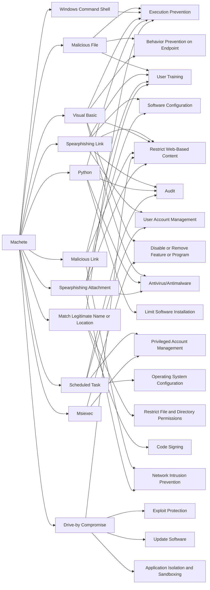

---
tags:
   - groups
---
# Machete
## ID:G0095
[Machete](groups/G0095) is a suspected Spanish-speaking cyber espionage group that has been active since at least 2010. It has primarily focused its operations within Latin America, with a particular emphasis on Venezuela, but also in the US, Europe, Russia, and parts of Asia. [Machete](groups/G0095) generally targets high-profile organizations such as government institutions, intelligence services, and military units, as well as telecommunications and power companies.(Citation: Cylance Machete Mar 2017)(Citation: Securelist Machete Aug 2014)(Citation: ESET Machete July 2019)(Citation: 360 Machete Sep 2020)
## Techniques Used By Group
* [Malicious File](techniques/T1204/002)
* [Spearphishing Link](techniques/T1566/002)
* [Windows Command Shell](techniques/T1059/003)
* [Visual Basic](techniques/T1059/005)
* [Python](techniques/T1059/006)
* [Scheduled Task](techniques/T1053/005)
* [Match Legitimate Name or Location](techniques/T1036/005)
* [Malicious Link](techniques/T1204/001)
* [Drive-by Compromise](techniques/T1189)
* [Spearphishing Attachment](techniques/T1566/001)
* [Msiexec](techniques/T1218/007)

# Summary of Techniques and Mitigations
