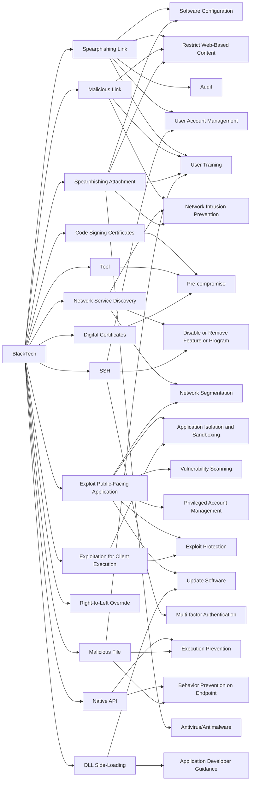

---
tags:
   - groups
---
# BlackTech
## ID:G0098
[BlackTech](/mitre/groups/G0098) is a suspected Chinese cyber espionage group that has primarily targeted organizations in East Asia--particularly Taiwan, Japan, and Hong Kong--and the US since at least 2013. [BlackTech](/mitre/groups/G0098) has used a combination of custom malware, dual-use tools, and living off the land tactics to compromise media, construction, engineering, electronics, and financial company networks.(Citation: TrendMicro BlackTech June 2017)(Citation: Symantec Palmerworm Sep 2020)(Citation: Reuters Taiwan BlackTech August 2020)
## Techniques Used By Group
* [Spearphishing Link](techniques/T1566/002)
* [Malicious Link](techniques/T1204/001)
* [Code Signing Certificates](techniques/T1588/003)
* [Network Service Discovery](techniques/T1046)
* [Tool](techniques/T1588/002)
* [Exploit Public-Facing Application](techniques/T1190)
* [SSH](techniques/T1021/004)
* [Native API](techniques/T1106)
* [Exploitation for Client Execution](techniques/T1203)
* [Spearphishing Attachment](techniques/T1566/001)
* [Right-to-Left Override](techniques/T1036/002)
* [DLL Side-Loading](techniques/T1574/002)
* [Malicious File](techniques/T1204/002)
* [Digital Certificates](techniques/T1588/004)

# Summary of Techniques and Mitigations
