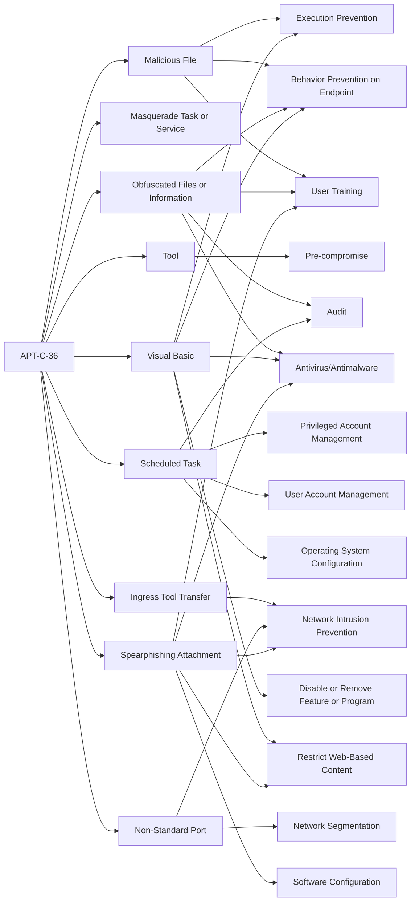

---
tags:
   - groups
---
# APT-C-36
## ID:G0099
[APT-C-36](/mitre/groups/G0099) is a suspected South America espionage group that has been active since at least 2018. The group mainly targets Colombian government institutions as well as important corporations in the financial sector, petroleum industry, and professional manufacturing.(Citation: QiAnXin APT-C-36 Feb2019)
## Techniques Used By Group
* [Malicious File](/mitre/techniques/T1204/002)
* [Masquerade Task or Service](/mitre/techniques/T1036/004)
* [Tool](/mitre/techniques/T1588/002)
* [Obfuscated Files or Information](/mitre/techniques/T1027)
* [Scheduled Task](/mitre/techniques/T1053/005)
* [Ingress Tool Transfer](/mitre/techniques/T1105)
* [Visual Basic](/mitre/techniques/T1059/005)
* [Non-Standard Port](/mitre/techniques/T1571)
* [Spearphishing Attachment](/mitre/techniques/T1566/001)

# Summary of Techniques and Mitigations
