---
tags:
   - groups
---
# Inception
## ID:G0100
[Inception](/mitre/groups/G0100) is a cyber espionage group active since at least 2014. The group has targeted multiple industries and governmental entities primarily in Russia, but has also been active in the United States and throughout Europe, Asia, Africa, and the Middle East.(Citation: Unit 42 Inception November 2018)(Citation: Symantec Inception Framework March 2018)(Citation: Kaspersky Cloud Atlas December 2014)
## Techniques Used By Group
* [Encrypted/Encoded File](/mitre/techniques/T1027/013)
* [Tool](/mitre/techniques/T1588/002)
* [Registry Run Keys / Startup Folder](/mitre/techniques/T1547/001)
* [Web Service](/mitre/techniques/T1102)
* [Multi-hop Proxy](/mitre/techniques/T1090/003)
* [Software Discovery](/mitre/techniques/T1518)
* [File and Directory Discovery](/mitre/techniques/T1083)
* [Spearphishing Attachment](/mitre/techniques/T1566/001)
* [System Information Discovery](/mitre/techniques/T1082)
* [PowerShell](/mitre/techniques/T1059/001)
* [Malicious File](/mitre/techniques/T1204/002)
* [Web Protocols](/mitre/techniques/T1071/001)
* [Data from Local System](/mitre/techniques/T1005)
* [Mshta](/mitre/techniques/T1218/005)
* [Credentials from Web Browsers](/mitre/techniques/T1555/003)
* [Exploitation for Client Execution](/mitre/techniques/T1203)
* [Domain Groups](/mitre/techniques/T1069/002)
* [Visual Basic](/mitre/techniques/T1059/005)
* [Template Injection](/mitre/techniques/T1221)
* [Regsvr32](/mitre/techniques/T1218/010)
* [Symmetric Cryptography](/mitre/techniques/T1573/001)
* [Process Discovery](/mitre/techniques/T1057)

# Summary of Techniques and Mitigations

```mermaid
flowchart LR
group[Inception] --> T1027.013[Encrypted/Encoded File]
group[Inception] --> T1588.002[Tool]
group[Inception] --> T1547.001[Registry Run Keys / Startup Folder]
group[Inception] --> T1102[Web Service]
group[Inception] --> T1090.003[Multi-hop Proxy]
group[Inception] --> T1518[Software Discovery]
group[Inception] --> T1083[File and Directory Discovery]
group[Inception] --> T1566.001[Spearphishing Attachment]
group[Inception] --> T1082[System Information Discovery]
group[Inception] --> T1059.001[PowerShell]
group[Inception] --> T1204.002[Malicious File]
group[Inception] --> T1071.001[Web Protocols]
group[Inception] --> T1005[Data from Local System]
group[Inception] --> T1218.005[Mshta]
group[Inception] --> T1555.003[Credentials from Web Browsers]
group[Inception] --> T1203[Exploitation for Client Execution]
group[Inception] --> T1069.002[Domain Groups]
group[Inception] --> T1059.005[Visual Basic]
group[Inception] --> T1221[Template Injection]
group[Inception] --> T1218.010[Regsvr32]
group[Inception] --> T1573.001[Symmetric Cryptography]
group[Inception] --> T1057[Process Discovery]
T1027.013[Encrypted/Encoded File] --> M1049[Antivirus/Antimalware]
T1027.013[Encrypted/Encoded File] --> M1040[Behavior Prevention on Endpoint]
T1588.002[Tool] --> M1056[Pre-compromise]
T1102[Web Service] --> M1031[Network Intrusion Prevention]
T1102[Web Service] --> M1021[Restrict Web-Based Content]
T1090.003[Multi-hop Proxy] --> M1037[Filter Network Traffic]
T1566.001[Spearphishing Attachment] --> M1049[Antivirus/Antimalware]
T1566.001[Spearphishing Attachment] --> M1031[Network Intrusion Prevention]
T1566.001[Spearphishing Attachment] --> M1054[Software Configuration]
T1566.001[Spearphishing Attachment] --> M1017[User Training]
T1566.001[Spearphishing Attachment] --> M1021[Restrict Web-Based Content]
T1059.001[PowerShell] --> M1042[Disable or Remove Feature or Program]
T1059.001[PowerShell] --> M1049[Antivirus/Antimalware]
T1059.001[PowerShell] --> M1045[Code Signing]
T1059.001[PowerShell] --> M1026[Privileged Account Management]
T1059.001[PowerShell] --> M1038[Execution Prevention]
T1204.002[Malicious File] --> M1038[Execution Prevention]
T1204.002[Malicious File] --> M1040[Behavior Prevention on Endpoint]
T1204.002[Malicious File] --> M1017[User Training]
T1071.001[Web Protocols] --> M1031[Network Intrusion Prevention]
T1005[Data from Local System] --> M1057[Data Loss Prevention]
T1218.005[Mshta] --> M1038[Execution Prevention]
T1218.005[Mshta] --> M1042[Disable or Remove Feature or Program]
T1555.003[Credentials from Web Browsers] --> M1027[Password Policies]
T1203[Exploitation for Client Execution] --> M1050[Exploit Protection]
T1203[Exploitation for Client Execution] --> M1048[Application Isolation and Sandboxing]
T1059.005[Visual Basic] --> M1042[Disable or Remove Feature or Program]
T1059.005[Visual Basic] --> M1049[Antivirus/Antimalware]
T1059.005[Visual Basic] --> M1038[Execution Prevention]
T1059.005[Visual Basic] --> M1040[Behavior Prevention on Endpoint]
T1059.005[Visual Basic] --> M1021[Restrict Web-Based Content]
T1221[Template Injection] --> M1049[Antivirus/Antimalware]
T1221[Template Injection] --> M1031[Network Intrusion Prevention]
T1221[Template Injection] --> M1017[User Training]
T1221[Template Injection] --> M1042[Disable or Remove Feature or Program]
T1218.010[Regsvr32] --> M1050[Exploit Protection]
T1573.001[Symmetric Cryptography] --> M1031[Network Intrusion Prevention]
```
