---
tags:
   - groups
---
# Wizard Spider
## ID:G0102
[Wizard Spider](/mitre/groups/G0102) is a Russia-based financially motivated threat group originally known for the creation and deployment of [TrickBot](/mitre/software/S0266) since at least 2016. [Wizard Spider](/mitre/groups/G0102) possesses a diverse aresenal of tools and has conducted ransomware campaigns against a variety of organizations, ranging from major corporations to hospitals.(Citation: CrowdStrike Ryuk January 2019)(Citation: DHS/CISA Ransomware Targeting Healthcare October 2020)(Citation: CrowdStrike Wizard Spider October 2020)
## Techniques Used By Group
* [Local Account](techniques/T1136/001)
* [Code Signing Certificates](techniques/T1588/003)
* [Exploitation of Remote Services](techniques/T1210)
* [Archive via Utility](techniques/T1560/001)
* [Windows Command Shell](techniques/T1059/003)
* [Windows Management Instrumentation](techniques/T1047)
* [Tool](techniques/T1588/002)
* [Windows Service](techniques/T1543/003)
* [SMB/Windows Admin Shares](techniques/T1021/002)
* [Data Staged](techniques/T1074)
* [Domain Accounts](techniques/T1078/002)
* [Process Injection](techniques/T1055)
* [Remote Services](techniques/T1021)
* [Remote Desktop Protocol](techniques/T1021/001)
* [Pass the Hash](techniques/T1550/002)
* [Windows File and Directory Permissions Modification](techniques/T1222/001)
* [Lateral Tool Transfer](techniques/T1570)
* [Malicious File](techniques/T1204/002)
* [Scheduled Task](techniques/T1053/005)
* [Command Obfuscation](techniques/T1027/010)
* [File Deletion](techniques/T1070/004)
* [Group Policy Preferences](techniques/T1552/006)
* [Exfiltration Over Unencrypted Non-C2 Protocol](techniques/T1048/003)
* [Security Software Discovery](techniques/T1518/001)
* [Rundll32](techniques/T1218/011)
* [Kerberoasting](techniques/T1558/003)
* [PowerShell](techniques/T1059/001)
* [Exfiltration to Cloud Storage](techniques/T1567/002)
* [Modify Registry](techniques/T1112)
* [Inhibit System Recovery](techniques/T1490)
* [External Remote Services](techniques/T1133)
* [Winlogon Helper DLL](techniques/T1547/004)
* [Masquerade Task or Service](techniques/T1036/004)
* [Domain Account](techniques/T1087/002)
* [Software Discovery](techniques/T1518)
* [Web Protocols](techniques/T1071/001)
* [Code Signing](techniques/T1553/002)
* [Domain Account](techniques/T1136/002)
* [Local Data Staging](techniques/T1074/001)
* [LLMNR/NBT-NS Poisoning and SMB Relay](techniques/T1557/001)
* [Ingress Tool Transfer](techniques/T1105)
* [NTDS](techniques/T1003/003)
* [System Network Configuration Discovery](techniques/T1016)
* [Email Accounts](techniques/T1585/002)
* [System Owner/User Discovery](techniques/T1033)
* [Valid Accounts](techniques/T1078)
* [Malicious Link](techniques/T1204/001)
* [LSASS Memory](techniques/T1003/001)
* [Exfiltration Over C2 Channel](techniques/T1041)
* [Spearphishing Attachment](techniques/T1566/001)
* [Security Account Manager](techniques/T1003/002)
* [Service Stop](techniques/T1489)
* [Spearphishing Link](techniques/T1566/002)
* [Disable or Modify Tools](techniques/T1562/001)
* [Remote System Discovery](techniques/T1018)
* [Data from Local System](techniques/T1005)
* [System Information Discovery](techniques/T1082)
* [Windows Credential Manager](techniques/T1555/004)
* [Network Share Discovery](techniques/T1135)
* [Service Execution](techniques/T1569/002)
* [Registry Run Keys / Startup Folder](techniques/T1547/001)
* [Windows Remote Management](techniques/T1021/006)
* [Dynamic-link Library Injection](techniques/T1055/001)
* [BITS Jobs](techniques/T1197)

# Summary of Techniques and Mitigations

```mermaid
flowchart LR
group[Wizard Spider] --> T1136.001[Local Account]
group[Wizard Spider] --> T1588.003[Code Signing Certificates]
group[Wizard Spider] --> T1210[Exploitation of Remote Services]
group[Wizard Spider] --> T1560.001[Archive via Utility]
group[Wizard Spider] --> T1059.003[Windows Command Shell]
group[Wizard Spider] --> T1047[Windows Management Instrumentation]
group[Wizard Spider] --> T1588.002[Tool]
group[Wizard Spider] --> T1543.003[Windows Service]
group[Wizard Spider] --> T1021.002[SMB/Windows Admin Shares]
group[Wizard Spider] --> T1074[Data Staged]
group[Wizard Spider] --> T1078.002[Domain Accounts]
group[Wizard Spider] --> T1055[Process Injection]
group[Wizard Spider] --> T1021[Remote Services]
group[Wizard Spider] --> T1021.001[Remote Desktop Protocol]
group[Wizard Spider] --> T1550.002[Pass the Hash]
group[Wizard Spider] --> T1222.001[Windows File and Directory Permissions Modification]
group[Wizard Spider] --> T1570[Lateral Tool Transfer]
group[Wizard Spider] --> T1204.002[Malicious File]
group[Wizard Spider] --> T1053.005[Scheduled Task]
group[Wizard Spider] --> T1027.010[Command Obfuscation]
group[Wizard Spider] --> T1070.004[File Deletion]
group[Wizard Spider] --> T1552.006[Group Policy Preferences]
group[Wizard Spider] --> T1048.003[Exfiltration Over Unencrypted Non-C2 Protocol]
group[Wizard Spider] --> T1518.001[Security Software Discovery]
group[Wizard Spider] --> T1218.011[Rundll32]
group[Wizard Spider] --> T1558.003[Kerberoasting]
group[Wizard Spider] --> T1059.001[PowerShell]
group[Wizard Spider] --> T1567.002[Exfiltration to Cloud Storage]
group[Wizard Spider] --> T1112[Modify Registry]
group[Wizard Spider] --> T1490[Inhibit System Recovery]
group[Wizard Spider] --> T1133[External Remote Services]
group[Wizard Spider] --> T1547.004[Winlogon Helper DLL]
group[Wizard Spider] --> T1036.004[Masquerade Task or Service]
group[Wizard Spider] --> T1087.002[Domain Account]
group[Wizard Spider] --> T1518[Software Discovery]
group[Wizard Spider] --> T1071.001[Web Protocols]
group[Wizard Spider] --> T1553.002[Code Signing]
group[Wizard Spider] --> T1136.002[Domain Account]
group[Wizard Spider] --> T1074.001[Local Data Staging]
group[Wizard Spider] --> T1557.001[LLMNR/NBT-NS Poisoning and SMB Relay]
group[Wizard Spider] --> T1105[Ingress Tool Transfer]
group[Wizard Spider] --> T1003.003[NTDS]
group[Wizard Spider] --> T1016[System Network Configuration Discovery]
group[Wizard Spider] --> T1585.002[Email Accounts]
group[Wizard Spider] --> T1033[System Owner/User Discovery]
group[Wizard Spider] --> T1078[Valid Accounts]
group[Wizard Spider] --> T1204.001[Malicious Link]
group[Wizard Spider] --> T1003.001[LSASS Memory]
group[Wizard Spider] --> T1041[Exfiltration Over C2 Channel]
group[Wizard Spider] --> T1566.001[Spearphishing Attachment]
group[Wizard Spider] --> T1003.002[Security Account Manager]
group[Wizard Spider] --> T1489[Service Stop]
group[Wizard Spider] --> T1566.002[Spearphishing Link]
group[Wizard Spider] --> T1562.001[Disable or Modify Tools]
group[Wizard Spider] --> T1018[Remote System Discovery]
group[Wizard Spider] --> T1005[Data from Local System]
group[Wizard Spider] --> T1082[System Information Discovery]
group[Wizard Spider] --> T1555.004[Windows Credential Manager]
group[Wizard Spider] --> T1135[Network Share Discovery]
group[Wizard Spider] --> T1569.002[Service Execution]
group[Wizard Spider] --> T1547.001[Registry Run Keys / Startup Folder]
group[Wizard Spider] --> T1021.006[Windows Remote Management]
group[Wizard Spider] --> T1055.001[Dynamic-link Library Injection]
group[Wizard Spider] --> T1197[BITS Jobs]
T1136.001[Local Account] --> M1032[Multi-factor Authentication]
T1136.001[Local Account] --> M1026[Privileged Account Management]
T1588.003[Code Signing Certificates] --> M1056[Pre-compromise]
T1210[Exploitation of Remote Services] --> M1042[Disable or Remove Feature or Program]
T1210[Exploitation of Remote Services] --> M1016[Vulnerability Scanning]
T1210[Exploitation of Remote Services] --> M1050[Exploit Protection]
T1210[Exploitation of Remote Services] --> M1030[Network Segmentation]
T1210[Exploitation of Remote Services] --> M1019[Threat Intelligence Program]
T1210[Exploitation of Remote Services] --> M1048[Application Isolation and Sandboxing]
T1210[Exploitation of Remote Services] --> M1026[Privileged Account Management]
T1210[Exploitation of Remote Services] --> M1051[Update Software]
T1560.001[Archive via Utility] --> M1047[Audit]
T1059.003[Windows Command Shell] --> M1038[Execution Prevention]
T1047[Windows Management Instrumentation] --> M1026[Privileged Account Management]
T1047[Windows Management Instrumentation] --> M1040[Behavior Prevention on Endpoint]
T1047[Windows Management Instrumentation] --> M1018[User Account Management]
T1047[Windows Management Instrumentation] --> M1038[Execution Prevention]
T1588.002[Tool] --> M1056[Pre-compromise]
T1543.003[Windows Service] --> M1040[Behavior Prevention on Endpoint]
T1543.003[Windows Service] --> M1028[Operating System Configuration]
T1543.003[Windows Service] --> M1047[Audit]
T1543.003[Windows Service] --> M1045[Code Signing]
T1543.003[Windows Service] --> M1018[User Account Management]
T1021.002[SMB/Windows Admin Shares] --> M1026[Privileged Account Management]
T1021.002[SMB/Windows Admin Shares] --> M1035[Limit Access to Resource Over Network]
T1021.002[SMB/Windows Admin Shares] --> M1037[Filter Network Traffic]
T1021.002[SMB/Windows Admin Shares] --> M1027[Password Policies]
T1078.002[Domain Accounts] --> M1032[Multi-factor Authentication]
T1078.002[Domain Accounts] --> M1026[Privileged Account Management]
T1078.002[Domain Accounts] --> M1017[User Training]
T1055[Process Injection] --> M1026[Privileged Account Management]
T1055[Process Injection] --> M1040[Behavior Prevention on Endpoint]
T1021[Remote Services] --> M1035[Limit Access to Resource Over Network]
T1021[Remote Services] --> M1047[Audit]
T1021[Remote Services] --> M1018[User Account Management]
T1021[Remote Services] --> M1042[Disable or Remove Feature or Program]
T1021[Remote Services] --> M1032[Multi-factor Authentication]
T1021[Remote Services] --> M1027[Password Policies]
T1021.001[Remote Desktop Protocol] --> M1047[Audit]
T1021.001[Remote Desktop Protocol] --> M1035[Limit Access to Resource Over Network]
T1021.001[Remote Desktop Protocol] --> M1030[Network Segmentation]
T1021.001[Remote Desktop Protocol] --> M1028[Operating System Configuration]
T1021.001[Remote Desktop Protocol] --> M1042[Disable or Remove Feature or Program]
T1021.001[Remote Desktop Protocol] --> M1018[User Account Management]
T1021.001[Remote Desktop Protocol] --> M1032[Multi-factor Authentication]
T1021.001[Remote Desktop Protocol] --> M1026[Privileged Account Management]
T1550.002[Pass the Hash] --> M1051[Update Software]
T1550.002[Pass the Hash] --> M1052[User Account Control]
T1550.002[Pass the Hash] --> M1018[User Account Management]
T1550.002[Pass the Hash] --> M1026[Privileged Account Management]
T1222.001[Windows File and Directory Permissions Modification] --> M1026[Privileged Account Management]
T1222.001[Windows File and Directory Permissions Modification] --> M1022[Restrict File and Directory Permissions]
T1570[Lateral Tool Transfer] --> M1037[Filter Network Traffic]
T1570[Lateral Tool Transfer] --> M1031[Network Intrusion Prevention]
T1204.002[Malicious File] --> M1038[Execution Prevention]
T1204.002[Malicious File] --> M1040[Behavior Prevention on Endpoint]
T1204.002[Malicious File] --> M1017[User Training]
T1053.005[Scheduled Task] --> M1026[Privileged Account Management]
T1053.005[Scheduled Task] --> M1018[User Account Management]
T1053.005[Scheduled Task] --> M1047[Audit]
T1053.005[Scheduled Task] --> M1028[Operating System Configuration]
T1027.010[Command Obfuscation] --> M1040[Behavior Prevention on Endpoint]
T1027.010[Command Obfuscation] --> M1049[Antivirus/Antimalware]
T1552.006[Group Policy Preferences] --> M1047[Audit]
T1552.006[Group Policy Preferences] --> M1051[Update Software]
T1552.006[Group Policy Preferences] --> M1015[Active Directory Configuration]
T1048.003[Exfiltration Over Unencrypted Non-C2 Protocol] --> M1031[Network Intrusion Prevention]
T1048.003[Exfiltration Over Unencrypted Non-C2 Protocol] --> M1057[Data Loss Prevention]
T1048.003[Exfiltration Over Unencrypted Non-C2 Protocol] --> M1037[Filter Network Traffic]
T1048.003[Exfiltration Over Unencrypted Non-C2 Protocol] --> M1030[Network Segmentation]
T1218.011[Rundll32] --> M1050[Exploit Protection]
T1558.003[Kerberoasting] --> M1027[Password Policies]
T1558.003[Kerberoasting] --> M1041[Encrypt Sensitive Information]
T1558.003[Kerberoasting] --> M1026[Privileged Account Management]
T1059.001[PowerShell] --> M1042[Disable or Remove Feature or Program]
T1059.001[PowerShell] --> M1049[Antivirus/Antimalware]
T1059.001[PowerShell] --> M1045[Code Signing]
T1059.001[PowerShell] --> M1026[Privileged Account Management]
T1059.001[PowerShell] --> M1038[Execution Prevention]
T1567.002[Exfiltration to Cloud Storage] --> M1021[Restrict Web-Based Content]
T1112[Modify Registry] --> M1024[Restrict Registry Permissions]
T1490[Inhibit System Recovery] --> M1038[Execution Prevention]
T1490[Inhibit System Recovery] --> M1028[Operating System Configuration]
T1490[Inhibit System Recovery] --> M1018[User Account Management]
T1490[Inhibit System Recovery] --> M1053[Data Backup]
T1133[External Remote Services] --> M1030[Network Segmentation]
T1133[External Remote Services] --> M1042[Disable or Remove Feature or Program]
T1133[External Remote Services] --> M1035[Limit Access to Resource Over Network]
T1133[External Remote Services] --> M1032[Multi-factor Authentication]
T1547.004[Winlogon Helper DLL] --> M1038[Execution Prevention]
T1547.004[Winlogon Helper DLL] --> M1018[User Account Management]
T1087.002[Domain Account] --> M1028[Operating System Configuration]
T1071.001[Web Protocols] --> M1031[Network Intrusion Prevention]
T1136.002[Domain Account] --> M1032[Multi-factor Authentication]
T1136.002[Domain Account] --> M1028[Operating System Configuration]
T1136.002[Domain Account] --> M1030[Network Segmentation]
T1136.002[Domain Account] --> M1026[Privileged Account Management]
T1557.001[LLMNR/NBT-NS Poisoning and SMB Relay] --> M1042[Disable or Remove Feature or Program]
T1557.001[LLMNR/NBT-NS Poisoning and SMB Relay] --> M1031[Network Intrusion Prevention]
T1557.001[LLMNR/NBT-NS Poisoning and SMB Relay] --> M1030[Network Segmentation]
T1557.001[LLMNR/NBT-NS Poisoning and SMB Relay] --> M1037[Filter Network Traffic]
T1105[Ingress Tool Transfer] --> M1031[Network Intrusion Prevention]
T1003.003[NTDS] --> M1027[Password Policies]
T1003.003[NTDS] --> M1026[Privileged Account Management]
T1003.003[NTDS] --> M1017[User Training]
T1003.003[NTDS] --> M1041[Encrypt Sensitive Information]
T1585.002[Email Accounts] --> M1056[Pre-compromise]
T1078[Valid Accounts] --> M1027[Password Policies]
T1078[Valid Accounts] --> M1018[User Account Management]
T1078[Valid Accounts] --> M1026[Privileged Account Management]
T1078[Valid Accounts] --> M1013[Application Developer Guidance]
T1078[Valid Accounts] --> M1017[User Training]
T1078[Valid Accounts] --> M1015[Active Directory Configuration]
T1078[Valid Accounts] --> M1036[Account Use Policies]
T1204.001[Malicious Link] --> M1031[Network Intrusion Prevention]
T1204.001[Malicious Link] --> M1017[User Training]
T1204.001[Malicious Link] --> M1021[Restrict Web-Based Content]
T1003.001[LSASS Memory] --> M1028[Operating System Configuration]
T1003.001[LSASS Memory] --> M1043[Credential Access Protection]
T1003.001[LSASS Memory] --> M1025[Privileged Process Integrity]
T1003.001[LSASS Memory] --> M1026[Privileged Account Management]
T1003.001[LSASS Memory] --> M1017[User Training]
T1003.001[LSASS Memory] --> M1040[Behavior Prevention on Endpoint]
T1003.001[LSASS Memory] --> M1027[Password Policies]
T1041[Exfiltration Over C2 Channel] --> M1031[Network Intrusion Prevention]
T1041[Exfiltration Over C2 Channel] --> M1057[Data Loss Prevention]
T1566.001[Spearphishing Attachment] --> M1049[Antivirus/Antimalware]
T1566.001[Spearphishing Attachment] --> M1031[Network Intrusion Prevention]
T1566.001[Spearphishing Attachment] --> M1054[Software Configuration]
T1566.001[Spearphishing Attachment] --> M1017[User Training]
T1566.001[Spearphishing Attachment] --> M1021[Restrict Web-Based Content]
T1003.002[Security Account Manager] --> M1027[Password Policies]
T1003.002[Security Account Manager] --> M1026[Privileged Account Management]
T1003.002[Security Account Manager] --> M1028[Operating System Configuration]
T1003.002[Security Account Manager] --> M1017[User Training]
T1489[Service Stop] --> M1030[Network Segmentation]
T1489[Service Stop] --> M1018[User Account Management]
T1489[Service Stop] --> M1024[Restrict Registry Permissions]
T1489[Service Stop] --> M1022[Restrict File and Directory Permissions]
T1566.002[Spearphishing Link] --> M1054[Software Configuration]
T1566.002[Spearphishing Link] --> M1021[Restrict Web-Based Content]
T1566.002[Spearphishing Link] --> M1047[Audit]
T1566.002[Spearphishing Link] --> M1018[User Account Management]
T1566.002[Spearphishing Link] --> M1017[User Training]
T1562.001[Disable or Modify Tools] --> M1038[Execution Prevention]
T1562.001[Disable or Modify Tools] --> M1024[Restrict Registry Permissions]
T1562.001[Disable or Modify Tools] --> M1018[User Account Management]
T1562.001[Disable or Modify Tools] --> M1022[Restrict File and Directory Permissions]
T1005[Data from Local System] --> M1057[Data Loss Prevention]
T1555.004[Windows Credential Manager] --> M1042[Disable or Remove Feature or Program]
T1135[Network Share Discovery] --> M1028[Operating System Configuration]
T1569.002[Service Execution] --> M1026[Privileged Account Management]
T1569.002[Service Execution] --> M1040[Behavior Prevention on Endpoint]
T1569.002[Service Execution] --> M1022[Restrict File and Directory Permissions]
T1021.006[Windows Remote Management] --> M1042[Disable or Remove Feature or Program]
T1021.006[Windows Remote Management] --> M1026[Privileged Account Management]
T1021.006[Windows Remote Management] --> M1030[Network Segmentation]
T1055.001[Dynamic-link Library Injection] --> M1040[Behavior Prevention on Endpoint]
T1197[BITS Jobs] --> M1018[User Account Management]
T1197[BITS Jobs] --> M1037[Filter Network Traffic]
T1197[BITS Jobs] --> M1028[Operating System Configuration]
```
