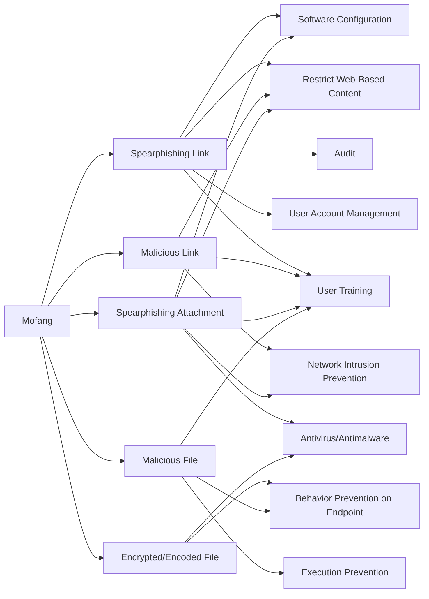

---
tags:
   - groups
---
# Mofang
## ID:G0103
[Mofang](/mitre/groups/G0103) is a likely China-based cyber espionage group, named for its frequent practice of imitating a victim's infrastructure. This adversary has been observed since at least May 2012 conducting focused attacks against government and critical infrastructure in Myanmar, as well as several other countries and sectors including military, automobile, and weapons industries.(Citation: FOX-IT May 2016 Mofang)
## Techniques Used By Group
* [Spearphishing Link](techniques/T1566/002)
* [Malicious Link](techniques/T1204/001)
* [Spearphishing Attachment](techniques/T1566/001)
* [Encrypted/Encoded File](techniques/T1027/013)
* [Malicious File](techniques/T1204/002)

# Summary of Techniques and Mitigations
