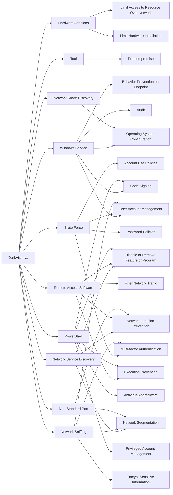

---
tags:
   - groups
---
# DarkVishnya
## ID:G0105
[DarkVishnya](groups/G0105) is a financially motivated threat actor targeting financial institutions in Eastern Europe. In 2017-2018 the group attacked at least 8 banks in this region.(Citation: Securelist DarkVishnya Dec 2018)
## Techniques Used By Group
* [Hardware Additions](techniques/T1200)
* [Tool](techniques/T1588/002)
* [Windows Service](techniques/T1543/003)
* [Network Service Discovery](techniques/T1046)
* [Network Share Discovery](techniques/T1135)
* [Brute Force](techniques/T1110)
* [Remote Access Software](techniques/T1219)
* [PowerShell](techniques/T1059/001)
* [Network Sniffing](techniques/T1040)
* [Non-Standard Port](techniques/T1571)

# Summary of Techniques and Mitigations
