---
tags:
   - groups
---
# Rocke
## ID:G0106
[Rocke](/mitre/groups/G0106) is an alleged Chinese-speaking adversary whose primary objective appeared to be cryptojacking, or stealing victim system resources for the purposes of mining cryptocurrency. The name [Rocke](/mitre/groups/G0106) comes from the email address "rocke@live.cn" used to create the wallet which held collected cryptocurrency. Researchers have detected overlaps between [Rocke](/mitre/groups/G0106) and the Iron Cybercrime Group, though this attribution has not been confirmed.(Citation: Talos Rocke August 2018)
## Techniques Used By Group
* [Exploit Public-Facing Application](techniques/T1190)
* [Rootkit](techniques/T1014)
* [Obfuscated Files or Information](techniques/T1027)
* [Web Service](techniques/T1102)
* [Disable or Modify System Firewall](techniques/T1562/004)
* [Unix Shell](techniques/T1059/004)
* [System Information Discovery](techniques/T1082)
* [Application Layer Protocol](techniques/T1071)
* [Ingress Tool Transfer](techniques/T1105)
* [Resource Hijacking](techniques/T1496)
* [Compile After Delivery](techniques/T1027/004)
* [Dynamic Linker Hijacking](techniques/T1574/006)
* [Hidden Files and Directories](techniques/T1564/001)
* [Cron](techniques/T1053/003)
* [Python](techniques/T1059/006)
* [Network Service Discovery](techniques/T1046)
* [Portable Executable Injection](techniques/T1055/002)
* [Dead Drop Resolver](techniques/T1102/001)
* [Boot or Logon Initialization Scripts](techniques/T1037)
* [Software Packing](techniques/T1027/002)
* [Clear Linux or Mac System Logs](techniques/T1070/002)
* [Registry Run Keys / Startup Folder](techniques/T1547/001)
* [Linux and Mac File and Directory Permissions Modification](techniques/T1222/002)
* [Process Discovery](techniques/T1057)
* [Systemd Service](techniques/T1543/002)
* [Remote System Discovery](techniques/T1018)
* [Deobfuscate/Decode Files or Information](techniques/T1140)
* [Disable or Modify Tools](techniques/T1562/001)
* [Private Keys](techniques/T1552/004)
* [File Deletion](techniques/T1070/004)
* [Web Protocols](techniques/T1071/001)
* [Non-Standard Port](techniques/T1571)
* [SSH](techniques/T1021/004)
* [Timestomp](techniques/T1070/006)
* [Match Legitimate Name or Location](techniques/T1036/005)
* [Security Software Discovery](techniques/T1518/001)

# Summary of Techniques and Mitigations

```mermaid
flowchart LR
group[Rocke] --> T1190[Exploit Public-Facing Application]
group[Rocke] --> T1014[Rootkit]
group[Rocke] --> T1027[Obfuscated Files or Information]
group[Rocke] --> T1102[Web Service]
group[Rocke] --> T1562.004[Disable or Modify System Firewall]
group[Rocke] --> T1059.004[Unix Shell]
group[Rocke] --> T1082[System Information Discovery]
group[Rocke] --> T1071[Application Layer Protocol]
group[Rocke] --> T1105[Ingress Tool Transfer]
group[Rocke] --> T1496[Resource Hijacking]
group[Rocke] --> T1027.004[Compile After Delivery]
group[Rocke] --> T1574.006[Dynamic Linker Hijacking]
group[Rocke] --> T1564.001[Hidden Files and Directories]
group[Rocke] --> T1053.003[Cron]
group[Rocke] --> T1059.006[Python]
group[Rocke] --> T1046[Network Service Discovery]
group[Rocke] --> T1055.002[Portable Executable Injection]
group[Rocke] --> T1102.001[Dead Drop Resolver]
group[Rocke] --> T1037[Boot or Logon Initialization Scripts]
group[Rocke] --> T1027.002[Software Packing]
group[Rocke] --> T1070.002[Clear Linux or Mac System Logs]
group[Rocke] --> T1547.001[Registry Run Keys / Startup Folder]
group[Rocke] --> T1222.002[Linux and Mac File and Directory Permissions Modification]
group[Rocke] --> T1057[Process Discovery]
group[Rocke] --> T1543.002[Systemd Service]
group[Rocke] --> T1018[Remote System Discovery]
group[Rocke] --> T1140[Deobfuscate/Decode Files or Information]
group[Rocke] --> T1562.001[Disable or Modify Tools]
group[Rocke] --> T1552.004[Private Keys]
group[Rocke] --> T1070.004[File Deletion]
group[Rocke] --> T1071.001[Web Protocols]
group[Rocke] --> T1571[Non-Standard Port]
group[Rocke] --> T1021.004[SSH]
group[Rocke] --> T1070.006[Timestomp]
group[Rocke] --> T1036.005[Match Legitimate Name or Location]
group[Rocke] --> T1518.001[Security Software Discovery]
T1190[Exploit Public-Facing Application] --> M1048[Application Isolation and Sandboxing]
T1190[Exploit Public-Facing Application] --> M1030[Network Segmentation]
T1190[Exploit Public-Facing Application] --> M1016[Vulnerability Scanning]
T1190[Exploit Public-Facing Application] --> M1026[Privileged Account Management]
T1190[Exploit Public-Facing Application] --> M1050[Exploit Protection]
T1190[Exploit Public-Facing Application] --> M1051[Update Software]
T1027[Obfuscated Files or Information] --> M1047[Audit]
T1027[Obfuscated Files or Information] --> M1040[Behavior Prevention on Endpoint]
T1027[Obfuscated Files or Information] --> M1017[User Training]
T1027[Obfuscated Files or Information] --> M1049[Antivirus/Antimalware]
T1102[Web Service] --> M1031[Network Intrusion Prevention]
T1102[Web Service] --> M1021[Restrict Web-Based Content]
T1562.004[Disable or Modify System Firewall] --> M1047[Audit]
T1562.004[Disable or Modify System Firewall] --> M1018[User Account Management]
T1562.004[Disable or Modify System Firewall] --> M1024[Restrict Registry Permissions]
T1562.004[Disable or Modify System Firewall] --> M1022[Restrict File and Directory Permissions]
T1059.004[Unix Shell] --> M1038[Execution Prevention]
T1071[Application Layer Protocol] --> M1031[Network Intrusion Prevention]
T1071[Application Layer Protocol] --> M1037[Filter Network Traffic]
T1105[Ingress Tool Transfer] --> M1031[Network Intrusion Prevention]
T1574.006[Dynamic Linker Hijacking] --> M1028[Operating System Configuration]
T1574.006[Dynamic Linker Hijacking] --> M1038[Execution Prevention]
T1053.003[Cron] --> M1047[Audit]
T1053.003[Cron] --> M1018[User Account Management]
T1059.006[Python] --> M1047[Audit]
T1059.006[Python] --> M1049[Antivirus/Antimalware]
T1059.006[Python] --> M1033[Limit Software Installation]
T1059.006[Python] --> M1038[Execution Prevention]
T1046[Network Service Discovery] --> M1042[Disable or Remove Feature or Program]
T1046[Network Service Discovery] --> M1031[Network Intrusion Prevention]
T1046[Network Service Discovery] --> M1030[Network Segmentation]
T1055.002[Portable Executable Injection] --> M1040[Behavior Prevention on Endpoint]
T1102.001[Dead Drop Resolver] --> M1021[Restrict Web-Based Content]
T1102.001[Dead Drop Resolver] --> M1031[Network Intrusion Prevention]
T1037[Boot or Logon Initialization Scripts] --> M1024[Restrict Registry Permissions]
T1037[Boot or Logon Initialization Scripts] --> M1022[Restrict File and Directory Permissions]
T1027.002[Software Packing] --> M1049[Antivirus/Antimalware]
T1070.002[Clear Linux or Mac System Logs] --> M1029[Remote Data Storage]
T1070.002[Clear Linux or Mac System Logs] --> M1022[Restrict File and Directory Permissions]
T1070.002[Clear Linux or Mac System Logs] --> M1041[Encrypt Sensitive Information]
T1222.002[Linux and Mac File and Directory Permissions Modification] --> M1022[Restrict File and Directory Permissions]
T1222.002[Linux and Mac File and Directory Permissions Modification] --> M1026[Privileged Account Management]
T1543.002[Systemd Service] --> M1018[User Account Management]
T1543.002[Systemd Service] --> M1022[Restrict File and Directory Permissions]
T1543.002[Systemd Service] --> M1026[Privileged Account Management]
T1543.002[Systemd Service] --> M1033[Limit Software Installation]
T1562.001[Disable or Modify Tools] --> M1038[Execution Prevention]
T1562.001[Disable or Modify Tools] --> M1024[Restrict Registry Permissions]
T1562.001[Disable or Modify Tools] --> M1018[User Account Management]
T1562.001[Disable or Modify Tools] --> M1022[Restrict File and Directory Permissions]
T1552.004[Private Keys] --> M1027[Password Policies]
T1552.004[Private Keys] --> M1022[Restrict File and Directory Permissions]
T1552.004[Private Keys] --> M1047[Audit]
T1552.004[Private Keys] --> M1041[Encrypt Sensitive Information]
T1071.001[Web Protocols] --> M1031[Network Intrusion Prevention]
T1571[Non-Standard Port] --> M1030[Network Segmentation]
T1571[Non-Standard Port] --> M1031[Network Intrusion Prevention]
T1021.004[SSH] --> M1042[Disable or Remove Feature or Program]
T1021.004[SSH] --> M1032[Multi-factor Authentication]
T1021.004[SSH] --> M1018[User Account Management]
T1036.005[Match Legitimate Name or Location] --> M1022[Restrict File and Directory Permissions]
T1036.005[Match Legitimate Name or Location] --> M1038[Execution Prevention]
T1036.005[Match Legitimate Name or Location] --> M1045[Code Signing]
```
