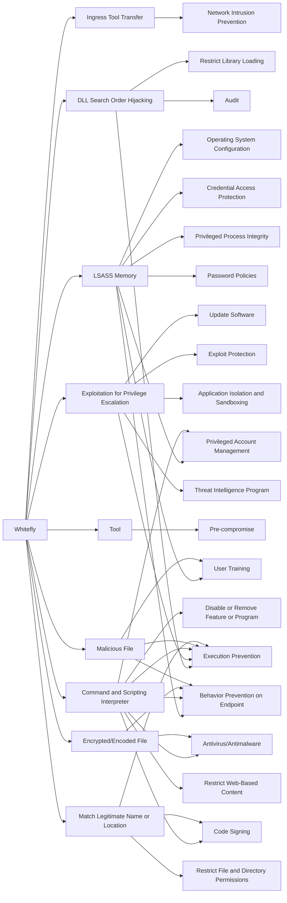

---
tags:
   - groups
---
# Whitefly
## ID:G0107
[Whitefly](/mitre/groups/G0107) is a cyber espionage group that has been operating since at least 2017. The group has targeted organizations based mostly in Singapore across a wide variety of sectors, and is primarily interested in stealing large amounts of sensitive information. The group has been linked to an attack against Singapore’s largest public health organization, SingHealth.(Citation: Symantec Whitefly March 2019)
## Techniques Used By Group
* [Ingress Tool Transfer](/mitre/techniques/T1105)
* [DLL Search Order Hijacking](/mitre/techniques/T1574/001)
* [LSASS Memory](/mitre/techniques/T1003/001)
* [Exploitation for Privilege Escalation](/mitre/techniques/T1068)
* [Tool](/mitre/techniques/T1588/002)
* [Command and Scripting Interpreter](/mitre/techniques/T1059)
* [Encrypted/Encoded File](/mitre/techniques/T1027/013)
* [Malicious File](/mitre/techniques/T1204/002)
* [Match Legitimate Name or Location](/mitre/techniques/T1036/005)

# Summary of Techniques and Mitigations
