---
tags:
   - groups
---
# Blue Mockingbird
## ID:G0108
[Blue Mockingbird](groups/G0108) is a cluster of observed activity involving Monero cryptocurrency-mining payloads in dynamic-link library (DLL) form on Windows systems. The earliest observed Blue Mockingbird tools were created in December 2019.(Citation: RedCanary Mockingbird May 2020)
## Techniques Used By Group
* [PowerShell](techniques/T1059/001)
* [COR_PROFILER](techniques/T1574/012)
* [Windows Management Instrumentation Event Subscription](techniques/T1546/003)
* [System Information Discovery](techniques/T1082)
* [Windows Service](techniques/T1543/003)
* [Scheduled Task](techniques/T1053/005)
* [Proxy](techniques/T1090)
* [Windows Management Instrumentation](techniques/T1047)
* [Windows Command Shell](techniques/T1059/003)
* [LSASS Memory](techniques/T1003/001)
* [Rundll32](techniques/T1218/011)
* [Access Token Manipulation](techniques/T1134)
* [Resource Hijacking](techniques/T1496)
* [Encrypted/Encoded File](techniques/T1027/013)
* [Modify Registry](techniques/T1112)
* [Service Execution](techniques/T1569/002)
* [Exploit Public-Facing Application](techniques/T1190)
* [Remote Desktop Protocol](techniques/T1021/001)
* [Regsvr32](techniques/T1218/010)
* [SMB/Windows Admin Shares](techniques/T1021/002)
* [Match Legitimate Name or Location](techniques/T1036/005)
* [Tool](techniques/T1588/002)

# Summary of Techniques and Mitigations

```mermaid
flowchart LR
group[Blue Mockingbird] --> T1059.001[PowerShell]
group[Blue Mockingbird] --> T1574.012[COR_PROFILER]
group[Blue Mockingbird] --> T1546.003[Windows Management Instrumentation Event Subscription]
group[Blue Mockingbird] --> T1082[System Information Discovery]
group[Blue Mockingbird] --> T1543.003[Windows Service]
group[Blue Mockingbird] --> T1053.005[Scheduled Task]
group[Blue Mockingbird] --> T1090[Proxy]
group[Blue Mockingbird] --> T1047[Windows Management Instrumentation]
group[Blue Mockingbird] --> T1059.003[Windows Command Shell]
group[Blue Mockingbird] --> T1003.001[LSASS Memory]
group[Blue Mockingbird] --> T1218.011[Rundll32]
group[Blue Mockingbird] --> T1134[Access Token Manipulation]
group[Blue Mockingbird] --> T1496[Resource Hijacking]
group[Blue Mockingbird] --> T1027.013[Encrypted/Encoded File]
group[Blue Mockingbird] --> T1112[Modify Registry]
group[Blue Mockingbird] --> T1569.002[Service Execution]
group[Blue Mockingbird] --> T1190[Exploit Public-Facing Application]
group[Blue Mockingbird] --> T1021.001[Remote Desktop Protocol]
group[Blue Mockingbird] --> T1218.010[Regsvr32]
group[Blue Mockingbird] --> T1021.002[SMB/Windows Admin Shares]
group[Blue Mockingbird] --> T1036.005[Match Legitimate Name or Location]
group[Blue Mockingbird] --> T1588.002[Tool]
T1059.001[PowerShell] --> M1042[Disable or Remove Feature or Program]
T1059.001[PowerShell] --> M1049[Antivirus/Antimalware]
T1059.001[PowerShell] --> M1045[Code Signing]
T1059.001[PowerShell] --> M1026[Privileged Account Management]
T1059.001[PowerShell] --> M1038[Execution Prevention]
T1574.012[COR_PROFILER] --> M1024[Restrict Registry Permissions]
T1574.012[COR_PROFILER] --> M1038[Execution Prevention]
T1574.012[COR_PROFILER] --> M1018[User Account Management]
T1546.003[Windows Management Instrumentation Event Subscription] --> M1018[User Account Management]
T1546.003[Windows Management Instrumentation Event Subscription] --> M1026[Privileged Account Management]
T1546.003[Windows Management Instrumentation Event Subscription] --> M1040[Behavior Prevention on Endpoint]
T1543.003[Windows Service] --> M1040[Behavior Prevention on Endpoint]
T1543.003[Windows Service] --> M1028[Operating System Configuration]
T1543.003[Windows Service] --> M1047[Audit]
T1543.003[Windows Service] --> M1045[Code Signing]
T1543.003[Windows Service] --> M1018[User Account Management]
T1053.005[Scheduled Task] --> M1026[Privileged Account Management]
T1053.005[Scheduled Task] --> M1018[User Account Management]
T1053.005[Scheduled Task] --> M1047[Audit]
T1053.005[Scheduled Task] --> M1028[Operating System Configuration]
T1090[Proxy] --> M1037[Filter Network Traffic]
T1090[Proxy] --> M1031[Network Intrusion Prevention]
T1090[Proxy] --> M1020[SSL/TLS Inspection]
T1047[Windows Management Instrumentation] --> M1026[Privileged Account Management]
T1047[Windows Management Instrumentation] --> M1040[Behavior Prevention on Endpoint]
T1047[Windows Management Instrumentation] --> M1018[User Account Management]
T1047[Windows Management Instrumentation] --> M1038[Execution Prevention]
T1059.003[Windows Command Shell] --> M1038[Execution Prevention]
T1003.001[LSASS Memory] --> M1028[Operating System Configuration]
T1003.001[LSASS Memory] --> M1043[Credential Access Protection]
T1003.001[LSASS Memory] --> M1025[Privileged Process Integrity]
T1003.001[LSASS Memory] --> M1026[Privileged Account Management]
T1003.001[LSASS Memory] --> M1017[User Training]
T1003.001[LSASS Memory] --> M1040[Behavior Prevention on Endpoint]
T1003.001[LSASS Memory] --> M1027[Password Policies]
T1218.011[Rundll32] --> M1050[Exploit Protection]
T1134[Access Token Manipulation] --> M1018[User Account Management]
T1134[Access Token Manipulation] --> M1026[Privileged Account Management]
T1027.013[Encrypted/Encoded File] --> M1049[Antivirus/Antimalware]
T1027.013[Encrypted/Encoded File] --> M1040[Behavior Prevention on Endpoint]
T1112[Modify Registry] --> M1024[Restrict Registry Permissions]
T1569.002[Service Execution] --> M1026[Privileged Account Management]
T1569.002[Service Execution] --> M1040[Behavior Prevention on Endpoint]
T1569.002[Service Execution] --> M1022[Restrict File and Directory Permissions]
T1190[Exploit Public-Facing Application] --> M1048[Application Isolation and Sandboxing]
T1190[Exploit Public-Facing Application] --> M1030[Network Segmentation]
T1190[Exploit Public-Facing Application] --> M1016[Vulnerability Scanning]
T1190[Exploit Public-Facing Application] --> M1026[Privileged Account Management]
T1190[Exploit Public-Facing Application] --> M1050[Exploit Protection]
T1190[Exploit Public-Facing Application] --> M1051[Update Software]
T1021.001[Remote Desktop Protocol] --> M1047[Audit]
T1021.001[Remote Desktop Protocol] --> M1035[Limit Access to Resource Over Network]
T1021.001[Remote Desktop Protocol] --> M1030[Network Segmentation]
T1021.001[Remote Desktop Protocol] --> M1028[Operating System Configuration]
T1021.001[Remote Desktop Protocol] --> M1042[Disable or Remove Feature or Program]
T1021.001[Remote Desktop Protocol] --> M1018[User Account Management]
T1021.001[Remote Desktop Protocol] --> M1032[Multi-factor Authentication]
T1021.001[Remote Desktop Protocol] --> M1026[Privileged Account Management]
T1218.010[Regsvr32] --> M1050[Exploit Protection]
T1021.002[SMB/Windows Admin Shares] --> M1026[Privileged Account Management]
T1021.002[SMB/Windows Admin Shares] --> M1035[Limit Access to Resource Over Network]
T1021.002[SMB/Windows Admin Shares] --> M1037[Filter Network Traffic]
T1021.002[SMB/Windows Admin Shares] --> M1027[Password Policies]
T1036.005[Match Legitimate Name or Location] --> M1022[Restrict File and Directory Permissions]
T1036.005[Match Legitimate Name or Location] --> M1038[Execution Prevention]
T1036.005[Match Legitimate Name or Location] --> M1045[Code Signing]
T1588.002[Tool] --> M1056[Pre-compromise]
```
