---
tags:
   - groups
---
# Windshift
## ID:G0112
[Windshift](/mitre/groups/G0112) is a threat group that has been active since at least 2017, targeting specific individuals for surveillance in government departments and critical infrastructure across the Middle East.(Citation: SANS Windshift August 2018)(Citation: objective-see windtail1 dec 2018)(Citation: objective-see windtail2 jan 2019)
## Techniques Used By Group
* [Process Discovery](/mitre/techniques/T1057)
* [Drive-by Compromise](/mitre/techniques/T1189)
* [Visual Basic](/mitre/techniques/T1059/005)
* [Security Software Discovery](/mitre/techniques/T1518/001)
* [Spearphishing Attachment](/mitre/techniques/T1566/001)
* [Malicious Link](/mitre/techniques/T1204/001)
* [Spearphishing via Service](/mitre/techniques/T1566/003)
* [Registry Run Keys / Startup Folder](/mitre/techniques/T1547/001)
* [Software Discovery](/mitre/techniques/T1518)
* [Spearphishing Link](/mitre/techniques/T1566/002)
* [Invalid Code Signature](/mitre/techniques/T1036/001)
* [Obfuscated Files or Information](/mitre/techniques/T1027)
* [Web Protocols](/mitre/techniques/T1071/001)
* [Masquerading](/mitre/techniques/T1036)
* [Ingress Tool Transfer](/mitre/techniques/T1105)
* [Windows Management Instrumentation](/mitre/techniques/T1047)
* [System Owner/User Discovery](/mitre/techniques/T1033)
* [System Information Discovery](/mitre/techniques/T1082)
* [Malicious File](/mitre/techniques/T1204/002)

# Summary of Techniques and Mitigations

```mermaid
flowchart LR
group[Windshift] --> T1057[Process Discovery]
group[Windshift] --> T1189[Drive-by Compromise]
group[Windshift] --> T1059.005[Visual Basic]
group[Windshift] --> T1518.001[Security Software Discovery]
group[Windshift] --> T1566.001[Spearphishing Attachment]
group[Windshift] --> T1204.001[Malicious Link]
group[Windshift] --> T1566.003[Spearphishing via Service]
group[Windshift] --> T1547.001[Registry Run Keys / Startup Folder]
group[Windshift] --> T1518[Software Discovery]
group[Windshift] --> T1566.002[Spearphishing Link]
group[Windshift] --> T1036.001[Invalid Code Signature]
group[Windshift] --> T1027[Obfuscated Files or Information]
group[Windshift] --> T1071.001[Web Protocols]
group[Windshift] --> T1036[Masquerading]
group[Windshift] --> T1105[Ingress Tool Transfer]
group[Windshift] --> T1047[Windows Management Instrumentation]
group[Windshift] --> T1033[System Owner/User Discovery]
group[Windshift] --> T1082[System Information Discovery]
group[Windshift] --> T1204.002[Malicious File]
T1189[Drive-by Compromise] --> M1050[Exploit Protection]
T1189[Drive-by Compromise] --> M1051[Update Software]
T1189[Drive-by Compromise] --> M1048[Application Isolation and Sandboxing]
T1189[Drive-by Compromise] --> M1021[Restrict Web-Based Content]
T1059.005[Visual Basic] --> M1042[Disable or Remove Feature or Program]
T1059.005[Visual Basic] --> M1049[Antivirus/Antimalware]
T1059.005[Visual Basic] --> M1038[Execution Prevention]
T1059.005[Visual Basic] --> M1040[Behavior Prevention on Endpoint]
T1059.005[Visual Basic] --> M1021[Restrict Web-Based Content]
T1566.001[Spearphishing Attachment] --> M1049[Antivirus/Antimalware]
T1566.001[Spearphishing Attachment] --> M1031[Network Intrusion Prevention]
T1566.001[Spearphishing Attachment] --> M1054[Software Configuration]
T1566.001[Spearphishing Attachment] --> M1017[User Training]
T1566.001[Spearphishing Attachment] --> M1021[Restrict Web-Based Content]
T1204.001[Malicious Link] --> M1031[Network Intrusion Prevention]
T1204.001[Malicious Link] --> M1017[User Training]
T1204.001[Malicious Link] --> M1021[Restrict Web-Based Content]
T1566.003[Spearphishing via Service] --> M1017[User Training]
T1566.003[Spearphishing via Service] --> M1049[Antivirus/Antimalware]
T1566.003[Spearphishing via Service] --> M1021[Restrict Web-Based Content]
T1566.002[Spearphishing Link] --> M1054[Software Configuration]
T1566.002[Spearphishing Link] --> M1021[Restrict Web-Based Content]
T1566.002[Spearphishing Link] --> M1047[Audit]
T1566.002[Spearphishing Link] --> M1018[User Account Management]
T1566.002[Spearphishing Link] --> M1017[User Training]
T1036.001[Invalid Code Signature] --> M1045[Code Signing]
T1027[Obfuscated Files or Information] --> M1047[Audit]
T1027[Obfuscated Files or Information] --> M1040[Behavior Prevention on Endpoint]
T1027[Obfuscated Files or Information] --> M1017[User Training]
T1027[Obfuscated Files or Information] --> M1049[Antivirus/Antimalware]
T1071.001[Web Protocols] --> M1031[Network Intrusion Prevention]
T1036[Masquerading] --> M1017[User Training]
T1036[Masquerading] --> M1045[Code Signing]
T1036[Masquerading] --> M1040[Behavior Prevention on Endpoint]
T1036[Masquerading] --> M1022[Restrict File and Directory Permissions]
T1036[Masquerading] --> M1049[Antivirus/Antimalware]
T1036[Masquerading] --> M1038[Execution Prevention]
T1105[Ingress Tool Transfer] --> M1031[Network Intrusion Prevention]
T1047[Windows Management Instrumentation] --> M1026[Privileged Account Management]
T1047[Windows Management Instrumentation] --> M1040[Behavior Prevention on Endpoint]
T1047[Windows Management Instrumentation] --> M1018[User Account Management]
T1047[Windows Management Instrumentation] --> M1038[Execution Prevention]
T1204.002[Malicious File] --> M1038[Execution Prevention]
T1204.002[Malicious File] --> M1040[Behavior Prevention on Endpoint]
T1204.002[Malicious File] --> M1017[User Training]
```
