---
tags:
   - groups
---
# Chimera
## ID:G0114
[Chimera](/mitre/groups/G0114) is a suspected China-based threat group that has been active since at least 2018 targeting the semiconductor industry in Taiwan as well as data from the airline industry.(Citation: Cycraft Chimera April 2020)(Citation: NCC Group Chimera January 2021)
## Techniques Used By Group
* [DLL Side-Loading](techniques/T1574/002)
* [Remote Data Staging](techniques/T1074/002)
* [Scheduled Task](techniques/T1053/005)
* [Service Execution](techniques/T1569/002)
* [Exfiltration Over C2 Channel](techniques/T1041)
* [Valid Accounts](techniques/T1078)
* [Pass the Hash](techniques/T1550/002)
* [Web Protocols](techniques/T1071/001)
* [Native API](techniques/T1106)
* [Domain Controller Authentication](techniques/T1556/001)
* [Clear Windows Event Logs](techniques/T1070/001)
* [DNS](techniques/T1071/004)
* [Domain Trust Discovery](techniques/T1482)
* [Archive via Utility](techniques/T1560/001)
* [Windows Remote Management](techniques/T1021/006)
* [File and Directory Discovery](techniques/T1083)
* [Domain Account](techniques/T1087/002)
* [Process Discovery](techniques/T1057)
* [SMB/Windows Admin Shares](techniques/T1021/002)
* [PowerShell](techniques/T1059/001)
* [NTDS](techniques/T1003/003)
* [Local Data Staging](techniques/T1074/001)
* [Sharepoint](techniques/T1213/002)
* [Network Share Discovery](techniques/T1135)
* [Match Legitimate Name or Location](techniques/T1036/005)
* [Lateral Tool Transfer](techniques/T1570)
* [System Service Discovery](techniques/T1007)
* [Command Obfuscation](techniques/T1027/010)
* [System Network Configuration Discovery](techniques/T1016)
* [Network Service Discovery](techniques/T1046)
* [System Owner/User Discovery](techniques/T1033)
* [Local Account](techniques/T1087/001)
* [Protocol Tunneling](techniques/T1572)
* [Domain Accounts](techniques/T1078/002)
* [Local Groups](techniques/T1069/001)
* [System Time Discovery](techniques/T1124)
* [Password Policy Discovery](techniques/T1201)
* [System Network Connections Discovery](techniques/T1049)
* [Windows Command Shell](techniques/T1059/003)
* [File Deletion](techniques/T1070/004)
* [Password Spraying](techniques/T1110/003)
* [Local Email Collection](techniques/T1114/001)
* [Data from Network Shared Drive](techniques/T1039)
* [Automated Collection](techniques/T1119)
* [External Remote Services](techniques/T1133)
* [Credential Stuffing](techniques/T1110/004)
* [System Information Discovery](techniques/T1082)
* [Remote Email Collection](techniques/T1114/002)
* [Query Registry](techniques/T1012)
* [Tool](techniques/T1588/002)
* [Exfiltration to Cloud Storage](techniques/T1567/002)
* [Timestomp](techniques/T1070/006)
* [Remote System Discovery](techniques/T1018)
* [Credentials](techniques/T1589/001)
* [Windows Management Instrumentation](techniques/T1047)
* [Remote Desktop Protocol](techniques/T1021/001)
* [Multi-Factor Authentication Interception](techniques/T1111)
* [Browser Information Discovery](techniques/T1217)
* [Ingress Tool Transfer](techniques/T1105)

# Summary of Techniques and Mitigations

```mermaid
flowchart LR
group[Chimera] --> T1574.002[DLL Side-Loading]
group[Chimera] --> T1074.002[Remote Data Staging]
group[Chimera] --> T1053.005[Scheduled Task]
group[Chimera] --> T1569.002[Service Execution]
group[Chimera] --> T1041[Exfiltration Over C2 Channel]
group[Chimera] --> T1078[Valid Accounts]
group[Chimera] --> T1550.002[Pass the Hash]
group[Chimera] --> T1071.001[Web Protocols]
group[Chimera] --> T1106[Native API]
group[Chimera] --> T1556.001[Domain Controller Authentication]
group[Chimera] --> T1070.001[Clear Windows Event Logs]
group[Chimera] --> T1071.004[DNS]
group[Chimera] --> T1482[Domain Trust Discovery]
group[Chimera] --> T1560.001[Archive via Utility]
group[Chimera] --> T1021.006[Windows Remote Management]
group[Chimera] --> T1083[File and Directory Discovery]
group[Chimera] --> T1087.002[Domain Account]
group[Chimera] --> T1057[Process Discovery]
group[Chimera] --> T1021.002[SMB/Windows Admin Shares]
group[Chimera] --> T1059.001[PowerShell]
group[Chimera] --> T1003.003[NTDS]
group[Chimera] --> T1074.001[Local Data Staging]
group[Chimera] --> T1213.002[Sharepoint]
group[Chimera] --> T1135[Network Share Discovery]
group[Chimera] --> T1036.005[Match Legitimate Name or Location]
group[Chimera] --> T1570[Lateral Tool Transfer]
group[Chimera] --> T1007[System Service Discovery]
group[Chimera] --> T1027.010[Command Obfuscation]
group[Chimera] --> T1016[System Network Configuration Discovery]
group[Chimera] --> T1046[Network Service Discovery]
group[Chimera] --> T1033[System Owner/User Discovery]
group[Chimera] --> T1087.001[Local Account]
group[Chimera] --> T1572[Protocol Tunneling]
group[Chimera] --> T1078.002[Domain Accounts]
group[Chimera] --> T1069.001[Local Groups]
group[Chimera] --> T1124[System Time Discovery]
group[Chimera] --> T1201[Password Policy Discovery]
group[Chimera] --> T1049[System Network Connections Discovery]
group[Chimera] --> T1059.003[Windows Command Shell]
group[Chimera] --> T1070.004[File Deletion]
group[Chimera] --> T1110.003[Password Spraying]
group[Chimera] --> T1114.001[Local Email Collection]
group[Chimera] --> T1039[Data from Network Shared Drive]
group[Chimera] --> T1119[Automated Collection]
group[Chimera] --> T1133[External Remote Services]
group[Chimera] --> T1110.004[Credential Stuffing]
group[Chimera] --> T1082[System Information Discovery]
group[Chimera] --> T1114.002[Remote Email Collection]
group[Chimera] --> T1012[Query Registry]
group[Chimera] --> T1588.002[Tool]
group[Chimera] --> T1567.002[Exfiltration to Cloud Storage]
group[Chimera] --> T1070.006[Timestomp]
group[Chimera] --> T1018[Remote System Discovery]
group[Chimera] --> T1589.001[Credentials]
group[Chimera] --> T1047[Windows Management Instrumentation]
group[Chimera] --> T1021.001[Remote Desktop Protocol]
group[Chimera] --> T1111[Multi-Factor Authentication Interception]
group[Chimera] --> T1217[Browser Information Discovery]
group[Chimera] --> T1105[Ingress Tool Transfer]
T1574.002[DLL Side-Loading] --> M1051[Update Software]
T1574.002[DLL Side-Loading] --> M1013[Application Developer Guidance]
T1053.005[Scheduled Task] --> M1026[Privileged Account Management]
T1053.005[Scheduled Task] --> M1018[User Account Management]
T1053.005[Scheduled Task] --> M1047[Audit]
T1053.005[Scheduled Task] --> M1028[Operating System Configuration]
T1569.002[Service Execution] --> M1026[Privileged Account Management]
T1569.002[Service Execution] --> M1040[Behavior Prevention on Endpoint]
T1569.002[Service Execution] --> M1022[Restrict File and Directory Permissions]
T1041[Exfiltration Over C2 Channel] --> M1031[Network Intrusion Prevention]
T1041[Exfiltration Over C2 Channel] --> M1057[Data Loss Prevention]
T1078[Valid Accounts] --> M1027[Password Policies]
T1078[Valid Accounts] --> M1018[User Account Management]
T1078[Valid Accounts] --> M1026[Privileged Account Management]
T1078[Valid Accounts] --> M1013[Application Developer Guidance]
T1078[Valid Accounts] --> M1017[User Training]
T1078[Valid Accounts] --> M1015[Active Directory Configuration]
T1078[Valid Accounts] --> M1036[Account Use Policies]
T1550.002[Pass the Hash] --> M1051[Update Software]
T1550.002[Pass the Hash] --> M1052[User Account Control]
T1550.002[Pass the Hash] --> M1018[User Account Management]
T1550.002[Pass the Hash] --> M1026[Privileged Account Management]
T1071.001[Web Protocols] --> M1031[Network Intrusion Prevention]
T1106[Native API] --> M1038[Execution Prevention]
T1106[Native API] --> M1040[Behavior Prevention on Endpoint]
T1556.001[Domain Controller Authentication] --> M1026[Privileged Account Management]
T1556.001[Domain Controller Authentication] --> M1025[Privileged Process Integrity]
T1556.001[Domain Controller Authentication] --> M1032[Multi-factor Authentication]
T1070.001[Clear Windows Event Logs] --> M1022[Restrict File and Directory Permissions]
T1070.001[Clear Windows Event Logs] --> M1029[Remote Data Storage]
T1070.001[Clear Windows Event Logs] --> M1041[Encrypt Sensitive Information]
T1071.004[DNS] --> M1037[Filter Network Traffic]
T1071.004[DNS] --> M1031[Network Intrusion Prevention]
T1482[Domain Trust Discovery] --> M1047[Audit]
T1482[Domain Trust Discovery] --> M1030[Network Segmentation]
T1560.001[Archive via Utility] --> M1047[Audit]
T1021.006[Windows Remote Management] --> M1042[Disable or Remove Feature or Program]
T1021.006[Windows Remote Management] --> M1026[Privileged Account Management]
T1021.006[Windows Remote Management] --> M1030[Network Segmentation]
T1087.002[Domain Account] --> M1028[Operating System Configuration]
T1021.002[SMB/Windows Admin Shares] --> M1026[Privileged Account Management]
T1021.002[SMB/Windows Admin Shares] --> M1035[Limit Access to Resource Over Network]
T1021.002[SMB/Windows Admin Shares] --> M1037[Filter Network Traffic]
T1021.002[SMB/Windows Admin Shares] --> M1027[Password Policies]
T1059.001[PowerShell] --> M1042[Disable or Remove Feature or Program]
T1059.001[PowerShell] --> M1049[Antivirus/Antimalware]
T1059.001[PowerShell] --> M1045[Code Signing]
T1059.001[PowerShell] --> M1026[Privileged Account Management]
T1059.001[PowerShell] --> M1038[Execution Prevention]
T1003.003[NTDS] --> M1027[Password Policies]
T1003.003[NTDS] --> M1026[Privileged Account Management]
T1003.003[NTDS] --> M1017[User Training]
T1003.003[NTDS] --> M1041[Encrypt Sensitive Information]
T1213.002[Sharepoint] --> M1047[Audit]
T1213.002[Sharepoint] --> M1018[User Account Management]
T1213.002[Sharepoint] --> M1017[User Training]
T1135[Network Share Discovery] --> M1028[Operating System Configuration]
T1036.005[Match Legitimate Name or Location] --> M1022[Restrict File and Directory Permissions]
T1036.005[Match Legitimate Name or Location] --> M1038[Execution Prevention]
T1036.005[Match Legitimate Name or Location] --> M1045[Code Signing]
T1570[Lateral Tool Transfer] --> M1037[Filter Network Traffic]
T1570[Lateral Tool Transfer] --> M1031[Network Intrusion Prevention]
T1027.010[Command Obfuscation] --> M1040[Behavior Prevention on Endpoint]
T1027.010[Command Obfuscation] --> M1049[Antivirus/Antimalware]
T1046[Network Service Discovery] --> M1042[Disable or Remove Feature or Program]
T1046[Network Service Discovery] --> M1031[Network Intrusion Prevention]
T1046[Network Service Discovery] --> M1030[Network Segmentation]
T1087.001[Local Account] --> M1028[Operating System Configuration]
T1572[Protocol Tunneling] --> M1037[Filter Network Traffic]
T1572[Protocol Tunneling] --> M1031[Network Intrusion Prevention]
T1078.002[Domain Accounts] --> M1032[Multi-factor Authentication]
T1078.002[Domain Accounts] --> M1026[Privileged Account Management]
T1078.002[Domain Accounts] --> M1017[User Training]
T1201[Password Policy Discovery] --> M1027[Password Policies]
T1059.003[Windows Command Shell] --> M1038[Execution Prevention]
T1110.003[Password Spraying] --> M1032[Multi-factor Authentication]
T1110.003[Password Spraying] --> M1027[Password Policies]
T1110.003[Password Spraying] --> M1036[Account Use Policies]
T1114.001[Local Email Collection] --> M1041[Encrypt Sensitive Information]
T1119[Automated Collection] --> M1029[Remote Data Storage]
T1119[Automated Collection] --> M1041[Encrypt Sensitive Information]
T1133[External Remote Services] --> M1030[Network Segmentation]
T1133[External Remote Services] --> M1042[Disable or Remove Feature or Program]
T1133[External Remote Services] --> M1035[Limit Access to Resource Over Network]
T1133[External Remote Services] --> M1032[Multi-factor Authentication]
T1110.004[Credential Stuffing] --> M1036[Account Use Policies]
T1110.004[Credential Stuffing] --> M1027[Password Policies]
T1110.004[Credential Stuffing] --> M1018[User Account Management]
T1110.004[Credential Stuffing] --> M1032[Multi-factor Authentication]
T1114.002[Remote Email Collection] --> M1041[Encrypt Sensitive Information]
T1114.002[Remote Email Collection] --> M1032[Multi-factor Authentication]
T1588.002[Tool] --> M1056[Pre-compromise]
T1567.002[Exfiltration to Cloud Storage] --> M1021[Restrict Web-Based Content]
T1589.001[Credentials] --> M1056[Pre-compromise]
T1047[Windows Management Instrumentation] --> M1026[Privileged Account Management]
T1047[Windows Management Instrumentation] --> M1040[Behavior Prevention on Endpoint]
T1047[Windows Management Instrumentation] --> M1018[User Account Management]
T1047[Windows Management Instrumentation] --> M1038[Execution Prevention]
T1021.001[Remote Desktop Protocol] --> M1047[Audit]
T1021.001[Remote Desktop Protocol] --> M1035[Limit Access to Resource Over Network]
T1021.001[Remote Desktop Protocol] --> M1030[Network Segmentation]
T1021.001[Remote Desktop Protocol] --> M1028[Operating System Configuration]
T1021.001[Remote Desktop Protocol] --> M1042[Disable or Remove Feature or Program]
T1021.001[Remote Desktop Protocol] --> M1018[User Account Management]
T1021.001[Remote Desktop Protocol] --> M1032[Multi-factor Authentication]
T1021.001[Remote Desktop Protocol] --> M1026[Privileged Account Management]
T1111[Multi-Factor Authentication Interception] --> M1017[User Training]
T1105[Ingress Tool Transfer] --> M1031[Network Intrusion Prevention]
```
