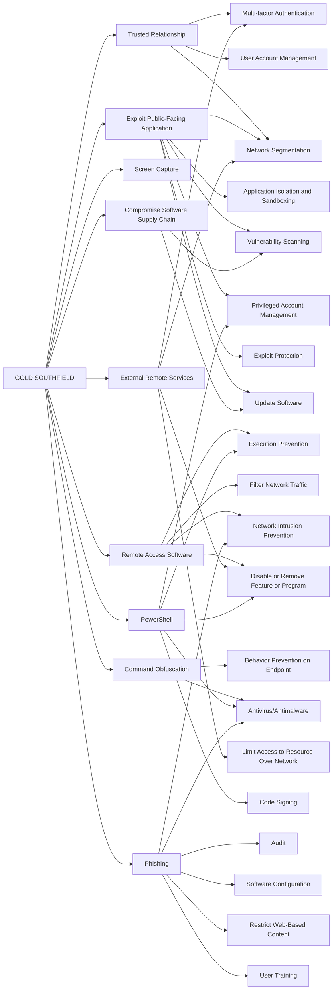

---
tags:
   - groups
---
# GOLD SOUTHFIELD
## ID:G0115
[GOLD SOUTHFIELD](/mitre/groups/G0115) is a financially motivated threat group active since at least 2018 that operates the [REvil](/mitre/software/S0496) Ransomware-as-a Service (RaaS). [GOLD SOUTHFIELD](/mitre/groups/G0115) provides backend infrastructure for affiliates recruited on underground forums to perpetrate high value deployments. By early 2020, [GOLD SOUTHFIELD](/mitre/groups/G0115) started capitalizing on the new trend of stealing data and further extorting the victim to pay for their data to not get publicly leaked.(Citation: Secureworks REvil September 2019)(Citation: Secureworks GandCrab and REvil September 2019)(Citation: Secureworks GOLD SOUTHFIELD)(Citation: CrowdStrike Evolution of Pinchy Spider July 2021)
## Techniques Used By Group
* [Trusted Relationship](/mitre/techniques/T1199)
* [Exploit Public-Facing Application](/mitre/techniques/T1190)
* [Screen Capture](/mitre/techniques/T1113)
* [Remote Access Software](/mitre/techniques/T1219)
* [Compromise Software Supply Chain](/mitre/techniques/T1195/002)
* [Command Obfuscation](/mitre/techniques/T1027/010)
* [External Remote Services](/mitre/techniques/T1133)
* [PowerShell](/mitre/techniques/T1059/001)
* [Phishing](/mitre/techniques/T1566)

# Summary of Techniques and Mitigations
