---
tags:
   - groups
---
# Fox Kitten
## ID:G0117
[Fox Kitten](groups/G0117) is threat actor with a suspected nexus to the Iranian government that has been active since at least 2017 against entities in the Middle East, North Africa, Europe, Australia, and North America. [Fox Kitten](groups/G0117) has targeted multiple industrial verticals including oil and gas, technology, government, defense, healthcare, manufacturing, and engineering.(Citation: ClearkSky Fox Kitten February 2020)(Citation: CrowdStrike PIONEER KITTEN August 2020)(Citation: Dragos PARISITE )(Citation: ClearSky Pay2Kitten December 2020)
## Techniques Used By Group
* [Ingress Tool Transfer](techniques/T1105)
* [Command and Scripting Interpreter](techniques/T1059)
* [Data from Cloud Storage](techniques/T1530)
* [Remote System Discovery](techniques/T1018)
* [Brute Force](techniques/T1110)
* [Exploitation of Remote Services](techniques/T1210)
* [Local Account](techniques/T1136/001)
* [Archive via Utility](techniques/T1560/001)
* [Command Obfuscation](techniques/T1027/010)
* [Data from Local System](techniques/T1005)
* [Establish Accounts](techniques/T1585)
* [VNC](techniques/T1021/005)
* [Credentials In Files](techniques/T1552/001)
* [Browser Information Discovery](techniques/T1217)
* [Windows Command Shell](techniques/T1059/003)
* [Encrypted/Encoded File](techniques/T1027/013)
* [Data from Information Repositories](techniques/T1213)
* [SMB/Windows Admin Shares](techniques/T1021/002)
* [Exploit Public-Facing Application](techniques/T1190)
* [Password Managers](techniques/T1555/005)
* [NTDS](techniques/T1003/003)
* [Local Account](techniques/T1087/001)
* [Domain Account](techniques/T1087/002)
* [SSH](techniques/T1021/004)
* [Web Shell](techniques/T1505/003)
* [Scheduled Task](techniques/T1053/005)
* [Masquerade Task or Service](techniques/T1036/004)
* [LSASS Memory](techniques/T1003/001)
* [Proxy](techniques/T1090)
* [Query Registry](techniques/T1012)
* [Protocol Tunneling](techniques/T1572)
* [Remote Desktop Protocol](techniques/T1021/001)
* [Web Service](techniques/T1102)
* [Data from Network Shared Drive](techniques/T1039)
* [Valid Accounts](techniques/T1078)
* [Network Service Discovery](techniques/T1046)
* [Accessibility Features](techniques/T1546/008)
* [Social Media Accounts](techniques/T1585/001)
* [Match Legitimate Name or Location](techniques/T1036/005)
* [PowerShell](techniques/T1059/001)
* [File and Directory Discovery](techniques/T1083)

# Summary of Techniques and Mitigations

```mermaid
flowchart LR
group[Fox Kitten] --> T1105[Ingress Tool Transfer]
group[Fox Kitten] --> T1059[Command and Scripting Interpreter]
group[Fox Kitten] --> T1530[Data from Cloud Storage]
group[Fox Kitten] --> T1018[Remote System Discovery]
group[Fox Kitten] --> T1110[Brute Force]
group[Fox Kitten] --> T1210[Exploitation of Remote Services]
group[Fox Kitten] --> T1136.001[Local Account]
group[Fox Kitten] --> T1560.001[Archive via Utility]
group[Fox Kitten] --> T1027.010[Command Obfuscation]
group[Fox Kitten] --> T1005[Data from Local System]
group[Fox Kitten] --> T1585[Establish Accounts]
group[Fox Kitten] --> T1021.005[VNC]
group[Fox Kitten] --> T1552.001[Credentials In Files]
group[Fox Kitten] --> T1217[Browser Information Discovery]
group[Fox Kitten] --> T1059.003[Windows Command Shell]
group[Fox Kitten] --> T1027.013[Encrypted/Encoded File]
group[Fox Kitten] --> T1213[Data from Information Repositories]
group[Fox Kitten] --> T1021.002[SMB/Windows Admin Shares]
group[Fox Kitten] --> T1190[Exploit Public-Facing Application]
group[Fox Kitten] --> T1555.005[Password Managers]
group[Fox Kitten] --> T1003.003[NTDS]
group[Fox Kitten] --> T1087.001[Local Account]
group[Fox Kitten] --> T1087.002[Domain Account]
group[Fox Kitten] --> T1021.004[SSH]
group[Fox Kitten] --> T1505.003[Web Shell]
group[Fox Kitten] --> T1053.005[Scheduled Task]
group[Fox Kitten] --> T1036.004[Masquerade Task or Service]
group[Fox Kitten] --> T1003.001[LSASS Memory]
group[Fox Kitten] --> T1090[Proxy]
group[Fox Kitten] --> T1012[Query Registry]
group[Fox Kitten] --> T1572[Protocol Tunneling]
group[Fox Kitten] --> T1021.001[Remote Desktop Protocol]
group[Fox Kitten] --> T1102[Web Service]
group[Fox Kitten] --> T1039[Data from Network Shared Drive]
group[Fox Kitten] --> T1078[Valid Accounts]
group[Fox Kitten] --> T1046[Network Service Discovery]
group[Fox Kitten] --> T1546.008[Accessibility Features]
group[Fox Kitten] --> T1585.001[Social Media Accounts]
group[Fox Kitten] --> T1036.005[Match Legitimate Name or Location]
group[Fox Kitten] --> T1059.001[PowerShell]
group[Fox Kitten] --> T1083[File and Directory Discovery]
T1105[Ingress Tool Transfer] --> M1031[Network Intrusion Prevention]
T1059[Command and Scripting Interpreter] --> M1045[Code Signing]
T1059[Command and Scripting Interpreter] --> M1042[Disable or Remove Feature or Program]
T1059[Command and Scripting Interpreter] --> M1038[Execution Prevention]
T1059[Command and Scripting Interpreter] --> M1049[Antivirus/Antimalware]
T1059[Command and Scripting Interpreter] --> M1026[Privileged Account Management]
T1059[Command and Scripting Interpreter] --> M1021[Restrict Web-Based Content]
T1059[Command and Scripting Interpreter] --> M1040[Behavior Prevention on Endpoint]
T1530[Data from Cloud Storage] --> M1018[User Account Management]
T1530[Data from Cloud Storage] --> M1041[Encrypt Sensitive Information]
T1530[Data from Cloud Storage] --> M1022[Restrict File and Directory Permissions]
T1530[Data from Cloud Storage] --> M1037[Filter Network Traffic]
T1530[Data from Cloud Storage] --> M1047[Audit]
T1530[Data from Cloud Storage] --> M1032[Multi-factor Authentication]
T1110[Brute Force] --> M1018[User Account Management]
T1110[Brute Force] --> M1036[Account Use Policies]
T1110[Brute Force] --> M1032[Multi-factor Authentication]
T1110[Brute Force] --> M1027[Password Policies]
T1210[Exploitation of Remote Services] --> M1042[Disable or Remove Feature or Program]
T1210[Exploitation of Remote Services] --> M1016[Vulnerability Scanning]
T1210[Exploitation of Remote Services] --> M1050[Exploit Protection]
T1210[Exploitation of Remote Services] --> M1030[Network Segmentation]
T1210[Exploitation of Remote Services] --> M1019[Threat Intelligence Program]
T1210[Exploitation of Remote Services] --> M1048[Application Isolation and Sandboxing]
T1210[Exploitation of Remote Services] --> M1026[Privileged Account Management]
T1210[Exploitation of Remote Services] --> M1051[Update Software]
T1136.001[Local Account] --> M1032[Multi-factor Authentication]
T1136.001[Local Account] --> M1026[Privileged Account Management]
T1560.001[Archive via Utility] --> M1047[Audit]
T1027.010[Command Obfuscation] --> M1040[Behavior Prevention on Endpoint]
T1027.010[Command Obfuscation] --> M1049[Antivirus/Antimalware]
T1005[Data from Local System] --> M1057[Data Loss Prevention]
T1585[Establish Accounts] --> M1056[Pre-compromise]
T1021.005[VNC] --> M1042[Disable or Remove Feature or Program]
T1021.005[VNC] --> M1037[Filter Network Traffic]
T1021.005[VNC] --> M1047[Audit]
T1021.005[VNC] --> M1033[Limit Software Installation]
T1552.001[Credentials In Files] --> M1017[User Training]
T1552.001[Credentials In Files] --> M1047[Audit]
T1552.001[Credentials In Files] --> M1022[Restrict File and Directory Permissions]
T1552.001[Credentials In Files] --> M1027[Password Policies]
T1059.003[Windows Command Shell] --> M1038[Execution Prevention]
T1027.013[Encrypted/Encoded File] --> M1049[Antivirus/Antimalware]
T1027.013[Encrypted/Encoded File] --> M1040[Behavior Prevention on Endpoint]
T1213[Data from Information Repositories] --> M1032[Multi-factor Authentication]
T1213[Data from Information Repositories] --> M1017[User Training]
T1213[Data from Information Repositories] --> M1018[User Account Management]
T1213[Data from Information Repositories] --> M1047[Audit]
T1021.002[SMB/Windows Admin Shares] --> M1026[Privileged Account Management]
T1021.002[SMB/Windows Admin Shares] --> M1035[Limit Access to Resource Over Network]
T1021.002[SMB/Windows Admin Shares] --> M1037[Filter Network Traffic]
T1021.002[SMB/Windows Admin Shares] --> M1027[Password Policies]
T1190[Exploit Public-Facing Application] --> M1048[Application Isolation and Sandboxing]
T1190[Exploit Public-Facing Application] --> M1030[Network Segmentation]
T1190[Exploit Public-Facing Application] --> M1016[Vulnerability Scanning]
T1190[Exploit Public-Facing Application] --> M1026[Privileged Account Management]
T1190[Exploit Public-Facing Application] --> M1050[Exploit Protection]
T1190[Exploit Public-Facing Application] --> M1051[Update Software]
T1555.005[Password Managers] --> M1051[Update Software]
T1555.005[Password Managers] --> M1054[Software Configuration]
T1555.005[Password Managers] --> M1027[Password Policies]
T1003.003[NTDS] --> M1027[Password Policies]
T1003.003[NTDS] --> M1026[Privileged Account Management]
T1003.003[NTDS] --> M1017[User Training]
T1003.003[NTDS] --> M1041[Encrypt Sensitive Information]
T1087.001[Local Account] --> M1028[Operating System Configuration]
T1087.002[Domain Account] --> M1028[Operating System Configuration]
T1021.004[SSH] --> M1042[Disable or Remove Feature or Program]
T1021.004[SSH] --> M1032[Multi-factor Authentication]
T1021.004[SSH] --> M1018[User Account Management]
T1505.003[Web Shell] --> M1042[Disable or Remove Feature or Program]
T1505.003[Web Shell] --> M1018[User Account Management]
T1053.005[Scheduled Task] --> M1026[Privileged Account Management]
T1053.005[Scheduled Task] --> M1018[User Account Management]
T1053.005[Scheduled Task] --> M1047[Audit]
T1053.005[Scheduled Task] --> M1028[Operating System Configuration]
T1003.001[LSASS Memory] --> M1028[Operating System Configuration]
T1003.001[LSASS Memory] --> M1043[Credential Access Protection]
T1003.001[LSASS Memory] --> M1025[Privileged Process Integrity]
T1003.001[LSASS Memory] --> M1026[Privileged Account Management]
T1003.001[LSASS Memory] --> M1017[User Training]
T1003.001[LSASS Memory] --> M1040[Behavior Prevention on Endpoint]
T1003.001[LSASS Memory] --> M1027[Password Policies]
T1090[Proxy] --> M1037[Filter Network Traffic]
T1090[Proxy] --> M1031[Network Intrusion Prevention]
T1090[Proxy] --> M1020[SSL/TLS Inspection]
T1572[Protocol Tunneling] --> M1037[Filter Network Traffic]
T1572[Protocol Tunneling] --> M1031[Network Intrusion Prevention]
T1021.001[Remote Desktop Protocol] --> M1047[Audit]
T1021.001[Remote Desktop Protocol] --> M1035[Limit Access to Resource Over Network]
T1021.001[Remote Desktop Protocol] --> M1030[Network Segmentation]
T1021.001[Remote Desktop Protocol] --> M1028[Operating System Configuration]
T1021.001[Remote Desktop Protocol] --> M1042[Disable or Remove Feature or Program]
T1021.001[Remote Desktop Protocol] --> M1018[User Account Management]
T1021.001[Remote Desktop Protocol] --> M1032[Multi-factor Authentication]
T1021.001[Remote Desktop Protocol] --> M1026[Privileged Account Management]
T1102[Web Service] --> M1031[Network Intrusion Prevention]
T1102[Web Service] --> M1021[Restrict Web-Based Content]
T1078[Valid Accounts] --> M1027[Password Policies]
T1078[Valid Accounts] --> M1018[User Account Management]
T1078[Valid Accounts] --> M1026[Privileged Account Management]
T1078[Valid Accounts] --> M1013[Application Developer Guidance]
T1078[Valid Accounts] --> M1017[User Training]
T1078[Valid Accounts] --> M1015[Active Directory Configuration]
T1078[Valid Accounts] --> M1036[Account Use Policies]
T1046[Network Service Discovery] --> M1042[Disable or Remove Feature or Program]
T1046[Network Service Discovery] --> M1031[Network Intrusion Prevention]
T1046[Network Service Discovery] --> M1030[Network Segmentation]
T1546.008[Accessibility Features] --> M1035[Limit Access to Resource Over Network]
T1546.008[Accessibility Features] --> M1028[Operating System Configuration]
T1546.008[Accessibility Features] --> M1038[Execution Prevention]
T1585.001[Social Media Accounts] --> M1056[Pre-compromise]
T1036.005[Match Legitimate Name or Location] --> M1022[Restrict File and Directory Permissions]
T1036.005[Match Legitimate Name or Location] --> M1038[Execution Prevention]
T1036.005[Match Legitimate Name or Location] --> M1045[Code Signing]
T1059.001[PowerShell] --> M1042[Disable or Remove Feature or Program]
T1059.001[PowerShell] --> M1049[Antivirus/Antimalware]
T1059.001[PowerShell] --> M1045[Code Signing]
T1059.001[PowerShell] --> M1026[Privileged Account Management]
T1059.001[PowerShell] --> M1038[Execution Prevention]
```
