---
tags:
   - groups
---
# Indrik Spider
## ID:G0119
[Indrik Spider](/mitre/groups/G0119) is a Russia-based cybercriminal group that has been active since at least 2014. [Indrik Spider](/mitre/groups/G0119) initially started with the [Dridex](/mitre/software/S0384) banking Trojan, and then by 2017 they began running ransomware operations using [BitPaymer](/mitre/software/S0570), [WastedLocker](/mitre/software/S0612), and Hades ransomware. Following U.S. sanctions and an indictment in 2019, [Indrik Spider](/mitre/groups/G0119) changed their tactics and diversified their toolset.(Citation: Crowdstrike Indrik November 2018)(Citation: Crowdstrike EvilCorp March 2021)(Citation: Treasury EvilCorp Dec 2019)
## Techniques Used By Group
* [LSASS Memory](techniques/T1003/001)
* [Malware](techniques/T1587/001)
* [Create Account](techniques/T1136)
* [Match Legitimate Name or Location](techniques/T1036/005)
* [System Service Discovery](techniques/T1007)
* [Clear Windows Event Logs](techniques/T1070/001)
* [Disable or Modify Tools](techniques/T1562/001)
* [Local Data Staging](techniques/T1074/001)
* [PowerShell](techniques/T1059/001)
* [Domain Accounts](techniques/T1078/002)
* [Windows Command Shell](techniques/T1059/003)
* [Group Policy Modification](techniques/T1484/001)
* [Windows Management Instrumentation](techniques/T1047)
* [Data Encrypted for Impact](techniques/T1486)
* [Remote System Discovery](techniques/T1018)
* [JavaScript](techniques/T1059/007)
* [Email Accounts](techniques/T1585/002)
* [Ingress Tool Transfer](techniques/T1105)
* [Service Stop](techniques/T1489)
* [Malicious File](techniques/T1204/002)
* [Server](techniques/T1584/004)

# Summary of Techniques and Mitigations

```mermaid
flowchart LR
group[Indrik Spider] --> T1003.001[LSASS Memory]
group[Indrik Spider] --> T1587.001[Malware]
group[Indrik Spider] --> T1136[Create Account]
group[Indrik Spider] --> T1036.005[Match Legitimate Name or Location]
group[Indrik Spider] --> T1007[System Service Discovery]
group[Indrik Spider] --> T1070.001[Clear Windows Event Logs]
group[Indrik Spider] --> T1562.001[Disable or Modify Tools]
group[Indrik Spider] --> T1074.001[Local Data Staging]
group[Indrik Spider] --> T1059.001[PowerShell]
group[Indrik Spider] --> T1078.002[Domain Accounts]
group[Indrik Spider] --> T1059.003[Windows Command Shell]
group[Indrik Spider] --> T1484.001[Group Policy Modification]
group[Indrik Spider] --> T1047[Windows Management Instrumentation]
group[Indrik Spider] --> T1486[Data Encrypted for Impact]
group[Indrik Spider] --> T1018[Remote System Discovery]
group[Indrik Spider] --> T1059.007[JavaScript]
group[Indrik Spider] --> T1585.002[Email Accounts]
group[Indrik Spider] --> T1105[Ingress Tool Transfer]
group[Indrik Spider] --> T1489[Service Stop]
group[Indrik Spider] --> T1204.002[Malicious File]
group[Indrik Spider] --> T1584.004[Server]
T1003.001[LSASS Memory] --> M1028[Operating System Configuration]
T1003.001[LSASS Memory] --> M1043[Credential Access Protection]
T1003.001[LSASS Memory] --> M1025[Privileged Process Integrity]
T1003.001[LSASS Memory] --> M1026[Privileged Account Management]
T1003.001[LSASS Memory] --> M1017[User Training]
T1003.001[LSASS Memory] --> M1040[Behavior Prevention on Endpoint]
T1003.001[LSASS Memory] --> M1027[Password Policies]
T1587.001[Malware] --> M1056[Pre-compromise]
T1136[Create Account] --> M1030[Network Segmentation]
T1136[Create Account] --> M1028[Operating System Configuration]
T1136[Create Account] --> M1032[Multi-factor Authentication]
T1136[Create Account] --> M1026[Privileged Account Management]
T1036.005[Match Legitimate Name or Location] --> M1022[Restrict File and Directory Permissions]
T1036.005[Match Legitimate Name or Location] --> M1038[Execution Prevention]
T1036.005[Match Legitimate Name or Location] --> M1045[Code Signing]
T1070.001[Clear Windows Event Logs] --> M1022[Restrict File and Directory Permissions]
T1070.001[Clear Windows Event Logs] --> M1029[Remote Data Storage]
T1070.001[Clear Windows Event Logs] --> M1041[Encrypt Sensitive Information]
T1562.001[Disable or Modify Tools] --> M1038[Execution Prevention]
T1562.001[Disable or Modify Tools] --> M1024[Restrict Registry Permissions]
T1562.001[Disable or Modify Tools] --> M1018[User Account Management]
T1562.001[Disable or Modify Tools] --> M1022[Restrict File and Directory Permissions]
T1059.001[PowerShell] --> M1042[Disable or Remove Feature or Program]
T1059.001[PowerShell] --> M1049[Antivirus/Antimalware]
T1059.001[PowerShell] --> M1045[Code Signing]
T1059.001[PowerShell] --> M1026[Privileged Account Management]
T1059.001[PowerShell] --> M1038[Execution Prevention]
T1078.002[Domain Accounts] --> M1032[Multi-factor Authentication]
T1078.002[Domain Accounts] --> M1026[Privileged Account Management]
T1078.002[Domain Accounts] --> M1017[User Training]
T1059.003[Windows Command Shell] --> M1038[Execution Prevention]
T1484.001[Group Policy Modification] --> M1047[Audit]
T1484.001[Group Policy Modification] --> M1018[User Account Management]
T1047[Windows Management Instrumentation] --> M1026[Privileged Account Management]
T1047[Windows Management Instrumentation] --> M1040[Behavior Prevention on Endpoint]
T1047[Windows Management Instrumentation] --> M1018[User Account Management]
T1047[Windows Management Instrumentation] --> M1038[Execution Prevention]
T1486[Data Encrypted for Impact] --> M1040[Behavior Prevention on Endpoint]
T1486[Data Encrypted for Impact] --> M1053[Data Backup]
T1059.007[JavaScript] --> M1040[Behavior Prevention on Endpoint]
T1059.007[JavaScript] --> M1038[Execution Prevention]
T1059.007[JavaScript] --> M1042[Disable or Remove Feature or Program]
T1059.007[JavaScript] --> M1021[Restrict Web-Based Content]
T1585.002[Email Accounts] --> M1056[Pre-compromise]
T1105[Ingress Tool Transfer] --> M1031[Network Intrusion Prevention]
T1489[Service Stop] --> M1030[Network Segmentation]
T1489[Service Stop] --> M1018[User Account Management]
T1489[Service Stop] --> M1024[Restrict Registry Permissions]
T1489[Service Stop] --> M1022[Restrict File and Directory Permissions]
T1204.002[Malicious File] --> M1038[Execution Prevention]
T1204.002[Malicious File] --> M1040[Behavior Prevention on Endpoint]
T1204.002[Malicious File] --> M1017[User Training]
T1584.004[Server] --> M1056[Pre-compromise]
```
