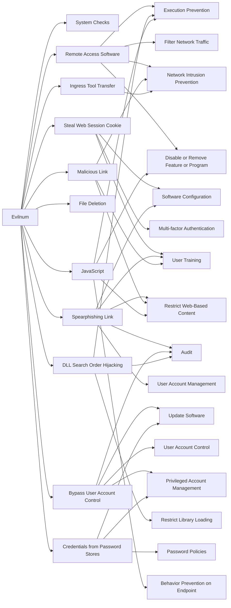

---
tags:
   - groups
---
# Evilnum
## ID:G0120
[Evilnum](groups/G0120) is a financially motivated threat group that has been active since at least 2018.(Citation: ESET EvilNum July 2020)
## Techniques Used By Group
* [System Checks](techniques/T1497/001)
* [Remote Access Software](techniques/T1219)
* [Steal Web Session Cookie](techniques/T1539)
* [Spearphishing Link](techniques/T1566/002)
* [Bypass User Account Control](techniques/T1548/002)
* [File Deletion](techniques/T1070/004)
* [DLL Search Order Hijacking](techniques/T1574/001)
* [Malicious Link](techniques/T1204/001)
* [Credentials from Password Stores](techniques/T1555)
* [Ingress Tool Transfer](techniques/T1105)
* [JavaScript](techniques/T1059/007)

# Summary of Techniques and Mitigations
