---
tags:
   - groups
---
# Sidewinder
## ID:G0121
[Sidewinder](/mitre/groups/G0121) is a suspected Indian threat actor group that has been active since at least 2012. They have been observed targeting government, military, and business entities throughout Asia, primarily focusing on Pakistan, China, Nepal, and Afghanistan.(Citation: ATT Sidewinder January 2021)(Citation: Securelist APT Trends April 2018)(Citation: Cyble Sidewinder September 2020)
## Techniques Used By Group
* [Exploitation for Client Execution](techniques/T1203)
* [Security Software Discovery](techniques/T1518/001)
* [Mshta](techniques/T1218/005)
* [Spearphishing Link](techniques/T1598/003)
* [System Time Discovery](techniques/T1124)
* [Spearphishing Link](techniques/T1566/002)
* [Local Data Staging](techniques/T1074/001)
* [Process Discovery](techniques/T1057)
* [JavaScript](techniques/T1059/007)
* [Encrypted/Encoded File](techniques/T1027/013)
* [Automated Exfiltration](techniques/T1020)
* [Ingress Tool Transfer](techniques/T1105)
* [Registry Run Keys / Startup Folder](techniques/T1547/001)
* [Web Protocols](techniques/T1071/001)
* [Dynamic Data Exchange](techniques/T1559/002)
* [File and Directory Discovery](techniques/T1083)
* [System Network Configuration Discovery](techniques/T1016)
* [Spearphishing Attachment](techniques/T1598/002)
* [Command Obfuscation](techniques/T1027/010)
* [PowerShell](techniques/T1059/001)
* [Software Discovery](techniques/T1518)
* [Visual Basic](techniques/T1059/005)
* [System Information Discovery](techniques/T1082)
* [Automated Collection](techniques/T1119)
* [Spearphishing Attachment](techniques/T1566/001)
* [Match Legitimate Name or Location](techniques/T1036/005)
* [Malicious Link](techniques/T1204/001)
* [Malicious File](techniques/T1204/002)
* [System Owner/User Discovery](techniques/T1033)
* [DLL Side-Loading](techniques/T1574/002)

# Summary of Techniques and Mitigations

```mermaid
flowchart LR
group[Sidewinder] --> T1203[Exploitation for Client Execution]
group[Sidewinder] --> T1518.001[Security Software Discovery]
group[Sidewinder] --> T1218.005[Mshta]
group[Sidewinder] --> T1598.003[Spearphishing Link]
group[Sidewinder] --> T1124[System Time Discovery]
group[Sidewinder] --> T1566.002[Spearphishing Link]
group[Sidewinder] --> T1074.001[Local Data Staging]
group[Sidewinder] --> T1057[Process Discovery]
group[Sidewinder] --> T1059.007[JavaScript]
group[Sidewinder] --> T1027.013[Encrypted/Encoded File]
group[Sidewinder] --> T1020[Automated Exfiltration]
group[Sidewinder] --> T1105[Ingress Tool Transfer]
group[Sidewinder] --> T1547.001[Registry Run Keys / Startup Folder]
group[Sidewinder] --> T1071.001[Web Protocols]
group[Sidewinder] --> T1559.002[Dynamic Data Exchange]
group[Sidewinder] --> T1083[File and Directory Discovery]
group[Sidewinder] --> T1016[System Network Configuration Discovery]
group[Sidewinder] --> T1598.002[Spearphishing Attachment]
group[Sidewinder] --> T1027.010[Command Obfuscation]
group[Sidewinder] --> T1059.001[PowerShell]
group[Sidewinder] --> T1518[Software Discovery]
group[Sidewinder] --> T1059.005[Visual Basic]
group[Sidewinder] --> T1082[System Information Discovery]
group[Sidewinder] --> T1119[Automated Collection]
group[Sidewinder] --> T1566.001[Spearphishing Attachment]
group[Sidewinder] --> T1036.005[Match Legitimate Name or Location]
group[Sidewinder] --> T1204.001[Malicious Link]
group[Sidewinder] --> T1204.002[Malicious File]
group[Sidewinder] --> T1033[System Owner/User Discovery]
group[Sidewinder] --> T1574.002[DLL Side-Loading]
T1203[Exploitation for Client Execution] --> M1050[Exploit Protection]
T1203[Exploitation for Client Execution] --> M1048[Application Isolation and Sandboxing]
T1218.005[Mshta] --> M1038[Execution Prevention]
T1218.005[Mshta] --> M1042[Disable or Remove Feature or Program]
T1598.003[Spearphishing Link] --> M1017[User Training]
T1598.003[Spearphishing Link] --> M1054[Software Configuration]
T1566.002[Spearphishing Link] --> M1054[Software Configuration]
T1566.002[Spearphishing Link] --> M1021[Restrict Web-Based Content]
T1566.002[Spearphishing Link] --> M1047[Audit]
T1566.002[Spearphishing Link] --> M1018[User Account Management]
T1566.002[Spearphishing Link] --> M1017[User Training]
T1059.007[JavaScript] --> M1040[Behavior Prevention on Endpoint]
T1059.007[JavaScript] --> M1038[Execution Prevention]
T1059.007[JavaScript] --> M1042[Disable or Remove Feature or Program]
T1059.007[JavaScript] --> M1021[Restrict Web-Based Content]
T1027.013[Encrypted/Encoded File] --> M1049[Antivirus/Antimalware]
T1027.013[Encrypted/Encoded File] --> M1040[Behavior Prevention on Endpoint]
T1105[Ingress Tool Transfer] --> M1031[Network Intrusion Prevention]
T1071.001[Web Protocols] --> M1031[Network Intrusion Prevention]
T1559.002[Dynamic Data Exchange] --> M1040[Behavior Prevention on Endpoint]
T1559.002[Dynamic Data Exchange] --> M1048[Application Isolation and Sandboxing]
T1559.002[Dynamic Data Exchange] --> M1054[Software Configuration]
T1559.002[Dynamic Data Exchange] --> M1042[Disable or Remove Feature or Program]
T1598.002[Spearphishing Attachment] --> M1017[User Training]
T1598.002[Spearphishing Attachment] --> M1054[Software Configuration]
T1027.010[Command Obfuscation] --> M1040[Behavior Prevention on Endpoint]
T1027.010[Command Obfuscation] --> M1049[Antivirus/Antimalware]
T1059.001[PowerShell] --> M1042[Disable or Remove Feature or Program]
T1059.001[PowerShell] --> M1049[Antivirus/Antimalware]
T1059.001[PowerShell] --> M1045[Code Signing]
T1059.001[PowerShell] --> M1026[Privileged Account Management]
T1059.001[PowerShell] --> M1038[Execution Prevention]
T1059.005[Visual Basic] --> M1042[Disable or Remove Feature or Program]
T1059.005[Visual Basic] --> M1049[Antivirus/Antimalware]
T1059.005[Visual Basic] --> M1038[Execution Prevention]
T1059.005[Visual Basic] --> M1040[Behavior Prevention on Endpoint]
T1059.005[Visual Basic] --> M1021[Restrict Web-Based Content]
T1119[Automated Collection] --> M1029[Remote Data Storage]
T1119[Automated Collection] --> M1041[Encrypt Sensitive Information]
T1566.001[Spearphishing Attachment] --> M1049[Antivirus/Antimalware]
T1566.001[Spearphishing Attachment] --> M1031[Network Intrusion Prevention]
T1566.001[Spearphishing Attachment] --> M1054[Software Configuration]
T1566.001[Spearphishing Attachment] --> M1017[User Training]
T1566.001[Spearphishing Attachment] --> M1021[Restrict Web-Based Content]
T1036.005[Match Legitimate Name or Location] --> M1022[Restrict File and Directory Permissions]
T1036.005[Match Legitimate Name or Location] --> M1038[Execution Prevention]
T1036.005[Match Legitimate Name or Location] --> M1045[Code Signing]
T1204.001[Malicious Link] --> M1031[Network Intrusion Prevention]
T1204.001[Malicious Link] --> M1017[User Training]
T1204.001[Malicious Link] --> M1021[Restrict Web-Based Content]
T1204.002[Malicious File] --> M1038[Execution Prevention]
T1204.002[Malicious File] --> M1040[Behavior Prevention on Endpoint]
T1204.002[Malicious File] --> M1017[User Training]
T1574.002[DLL Side-Loading] --> M1051[Update Software]
T1574.002[DLL Side-Loading] --> M1013[Application Developer Guidance]
```
