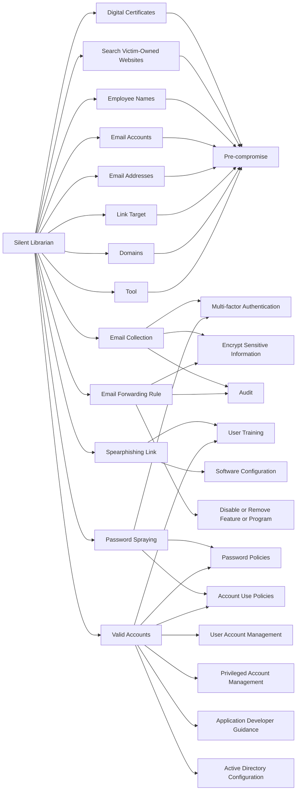

---
tags:
   - groups
---
# Silent Librarian
## ID:G0122
[Silent Librarian](/mitre/groups/G0122) is a group that has targeted research and proprietary data at universities, government agencies, and private sector companies worldwide since at least 2013. Members of  [Silent Librarian](/mitre/groups/G0122) are known to have been affiliated with the Iran-based Mabna Institute which has conducted cyber intrusions at the behest of the government of Iran, specifically the Islamic Revolutionary Guard Corps (IRGC).(Citation: DOJ Iran Indictments March 2018)(Citation: Phish Labs Silent Librarian)(Citation: Malwarebytes Silent Librarian October 2020)
## Techniques Used By Group
* [Digital Certificates](/mitre/techniques/T1588/004)
* [Search Victim-Owned Websites](/mitre/techniques/T1594)
* [Email Collection](/mitre/techniques/T1114)
* [Spearphishing Link](/mitre/techniques/T1598/003)
* [Employee Names](/mitre/techniques/T1589/003)
* [Email Forwarding Rule](/mitre/techniques/T1114/003)
* [Email Accounts](/mitre/techniques/T1585/002)
* [Email Addresses](/mitre/techniques/T1589/002)
* [Link Target](/mitre/techniques/T1608/005)
* [Password Spraying](/mitre/techniques/T1110/003)
* [Domains](/mitre/techniques/T1583/001)
* [Tool](/mitre/techniques/T1588/002)
* [Valid Accounts](/mitre/techniques/T1078)

# Summary of Techniques and Mitigations
