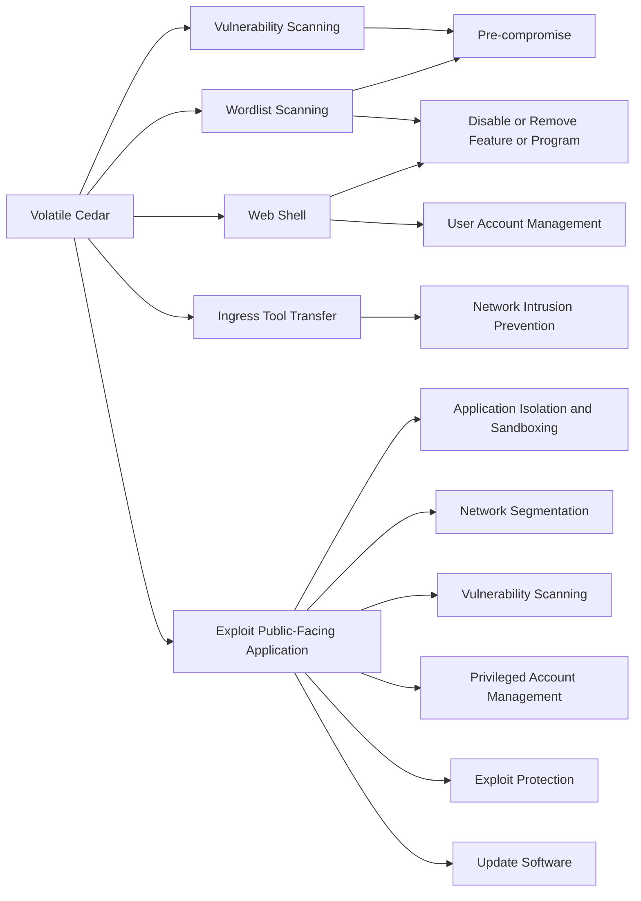

---
tags:
   - groups
---
# Volatile Cedar
## ID:G0123
[Volatile Cedar](groups/G0123) is a Lebanese threat group that has targeted individuals, companies, and institutions worldwide. [Volatile Cedar](groups/G0123) has been operating since 2012 and is motivated by political and ideological interests.(Citation: CheckPoint Volatile Cedar March 2015)(Citation: ClearSky Lebanese Cedar Jan 2021)
## Techniques Used By Group
* [Vulnerability Scanning](techniques/T1595/002)
* [Wordlist Scanning](techniques/T1595/003)
* [Web Shell](techniques/T1505/003)
* [Ingress Tool Transfer](techniques/T1105)
* [Exploit Public-Facing Application](techniques/T1190)

# Summary of Techniques and Mitigations
