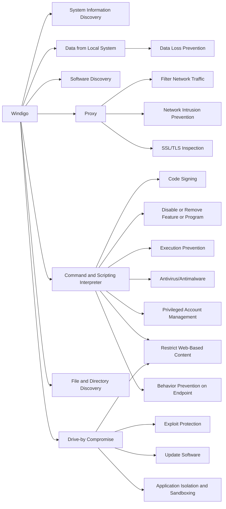

---
tags:
   - groups
---
# Windigo
## ID:G0124
The [Windigo](groups/G0124) group has been operating since at least 2011, compromising thousands of Linux and Unix servers using the [Ebury](software/S0377) SSH backdoor to create a spam botnet. Despite law enforcement intervention against the creators, [Windigo](groups/G0124) operators continued updating [Ebury](software/S0377) through 2019.(Citation: ESET Windigo Mar 2014)(Citation: CERN Windigo June 2019)
## Techniques Used By Group
* [System Information Discovery](techniques/T1082)
* [Data from Local System](techniques/T1005)
* [Software Discovery](techniques/T1518)
* [Proxy](techniques/T1090)
* [Command and Scripting Interpreter](techniques/T1059)
* [File and Directory Discovery](techniques/T1083)
* [Drive-by Compromise](techniques/T1189)

# Summary of Techniques and Mitigations
