---
tags:
   - groups
---
# HAFNIUM
## ID:G0125
[HAFNIUM](/mitre/groups/G0125) is a likely state-sponsored cyber espionage group operating out of China that has been active since at least January 2021. [HAFNIUM](/mitre/groups/G0125) primarily targets entities in the US across a number of industry sectors, including infectious disease researchers, law firms, higher education institutions, defense contractors, policy think tanks, and NGOs.(Citation: Microsoft HAFNIUM March 2020)(Citation: Volexity Exchange Marauder March 2021)
## Techniques Used By Group
* [Client Configurations](/mitre/techniques/T1592/004)
* [Ingress Tool Transfer](/mitre/techniques/T1105)
* [Web Services](/mitre/techniques/T1583/006)
* [Archive via Utility](/mitre/techniques/T1560/001)
* [Data from Local System](/mitre/techniques/T1005)
* [System Owner/User Discovery](/mitre/techniques/T1033)
* [Windows Command Shell](/mitre/techniques/T1059/003)
* [Process Discovery](/mitre/techniques/T1057)
* [LSASS Memory](/mitre/techniques/T1003/001)
* [Gather Victim Network Information](/mitre/techniques/T1590)
* [Web Shell](/mitre/techniques/T1505/003)
* [Email Addresses](/mitre/techniques/T1589/002)
* [Exfiltration to Cloud Storage](/mitre/techniques/T1567/002)
* [Remote Email Collection](/mitre/techniques/T1114/002)
* [Rundll32](/mitre/techniques/T1218/011)
* [Local Accounts](/mitre/techniques/T1078/003)
* [PowerShell](/mitre/techniques/T1059/001)
* [Hidden Files and Directories](/mitre/techniques/T1564/001)
* [Internet Connection Discovery](/mitre/techniques/T1016/001)
* [System Network Configuration Discovery](/mitre/techniques/T1016)
* [IP Addresses](/mitre/techniques/T1590/005)
* [File and Directory Discovery](/mitre/techniques/T1083)
* [NTDS](/mitre/techniques/T1003/003)
* [Account Manipulation](/mitre/techniques/T1098)
* [Domain Account](/mitre/techniques/T1136/002)
* [Web Protocols](/mitre/techniques/T1071/001)
* [Remote System Discovery](/mitre/techniques/T1018)
* [Exploit Public-Facing Application](/mitre/techniques/T1190)
* [Non-Application Layer Protocol](/mitre/techniques/T1095)
* [Standard Encoding](/mitre/techniques/T1132/001)
* [Virtual Private Server](/mitre/techniques/T1583/003)

# Summary of Techniques and Mitigations

```mermaid
flowchart LR
group[HAFNIUM] --> T1592.004[Client Configurations]
group[HAFNIUM] --> T1105[Ingress Tool Transfer]
group[HAFNIUM] --> T1583.006[Web Services]
group[HAFNIUM] --> T1560.001[Archive via Utility]
group[HAFNIUM] --> T1005[Data from Local System]
group[HAFNIUM] --> T1033[System Owner/User Discovery]
group[HAFNIUM] --> T1059.003[Windows Command Shell]
group[HAFNIUM] --> T1057[Process Discovery]
group[HAFNIUM] --> T1003.001[LSASS Memory]
group[HAFNIUM] --> T1590[Gather Victim Network Information]
group[HAFNIUM] --> T1505.003[Web Shell]
group[HAFNIUM] --> T1589.002[Email Addresses]
group[HAFNIUM] --> T1567.002[Exfiltration to Cloud Storage]
group[HAFNIUM] --> T1114.002[Remote Email Collection]
group[HAFNIUM] --> T1218.011[Rundll32]
group[HAFNIUM] --> T1078.003[Local Accounts]
group[HAFNIUM] --> T1059.001[PowerShell]
group[HAFNIUM] --> T1564.001[Hidden Files and Directories]
group[HAFNIUM] --> T1016.001[Internet Connection Discovery]
group[HAFNIUM] --> T1016[System Network Configuration Discovery]
group[HAFNIUM] --> T1590.005[IP Addresses]
group[HAFNIUM] --> T1083[File and Directory Discovery]
group[HAFNIUM] --> T1003.003[NTDS]
group[HAFNIUM] --> T1098[Account Manipulation]
group[HAFNIUM] --> T1136.002[Domain Account]
group[HAFNIUM] --> T1071.001[Web Protocols]
group[HAFNIUM] --> T1018[Remote System Discovery]
group[HAFNIUM] --> T1190[Exploit Public-Facing Application]
group[HAFNIUM] --> T1095[Non-Application Layer Protocol]
group[HAFNIUM] --> T1132.001[Standard Encoding]
group[HAFNIUM] --> T1583.003[Virtual Private Server]
T1592.004[Client Configurations] --> M1056[Pre-compromise]
T1105[Ingress Tool Transfer] --> M1031[Network Intrusion Prevention]
T1583.006[Web Services] --> M1056[Pre-compromise]
T1560.001[Archive via Utility] --> M1047[Audit]
T1005[Data from Local System] --> M1057[Data Loss Prevention]
T1059.003[Windows Command Shell] --> M1038[Execution Prevention]
T1003.001[LSASS Memory] --> M1028[Operating System Configuration]
T1003.001[LSASS Memory] --> M1043[Credential Access Protection]
T1003.001[LSASS Memory] --> M1025[Privileged Process Integrity]
T1003.001[LSASS Memory] --> M1026[Privileged Account Management]
T1003.001[LSASS Memory] --> M1017[User Training]
T1003.001[LSASS Memory] --> M1040[Behavior Prevention on Endpoint]
T1003.001[LSASS Memory] --> M1027[Password Policies]
T1590[Gather Victim Network Information] --> M1056[Pre-compromise]
T1505.003[Web Shell] --> M1042[Disable or Remove Feature or Program]
T1505.003[Web Shell] --> M1018[User Account Management]
T1589.002[Email Addresses] --> M1056[Pre-compromise]
T1567.002[Exfiltration to Cloud Storage] --> M1021[Restrict Web-Based Content]
T1114.002[Remote Email Collection] --> M1041[Encrypt Sensitive Information]
T1114.002[Remote Email Collection] --> M1032[Multi-factor Authentication]
T1218.011[Rundll32] --> M1050[Exploit Protection]
T1078.003[Local Accounts] --> M1026[Privileged Account Management]
T1078.003[Local Accounts] --> M1027[Password Policies]
T1059.001[PowerShell] --> M1042[Disable or Remove Feature or Program]
T1059.001[PowerShell] --> M1049[Antivirus/Antimalware]
T1059.001[PowerShell] --> M1045[Code Signing]
T1059.001[PowerShell] --> M1026[Privileged Account Management]
T1059.001[PowerShell] --> M1038[Execution Prevention]
T1590.005[IP Addresses] --> M1056[Pre-compromise]
T1003.003[NTDS] --> M1027[Password Policies]
T1003.003[NTDS] --> M1026[Privileged Account Management]
T1003.003[NTDS] --> M1017[User Training]
T1003.003[NTDS] --> M1041[Encrypt Sensitive Information]
T1098[Account Manipulation] --> M1030[Network Segmentation]
T1098[Account Manipulation] --> M1018[User Account Management]
T1098[Account Manipulation] --> M1032[Multi-factor Authentication]
T1098[Account Manipulation] --> M1026[Privileged Account Management]
T1098[Account Manipulation] --> M1028[Operating System Configuration]
T1136.002[Domain Account] --> M1032[Multi-factor Authentication]
T1136.002[Domain Account] --> M1028[Operating System Configuration]
T1136.002[Domain Account] --> M1030[Network Segmentation]
T1136.002[Domain Account] --> M1026[Privileged Account Management]
T1071.001[Web Protocols] --> M1031[Network Intrusion Prevention]
T1190[Exploit Public-Facing Application] --> M1048[Application Isolation and Sandboxing]
T1190[Exploit Public-Facing Application] --> M1030[Network Segmentation]
T1190[Exploit Public-Facing Application] --> M1016[Vulnerability Scanning]
T1190[Exploit Public-Facing Application] --> M1026[Privileged Account Management]
T1190[Exploit Public-Facing Application] --> M1050[Exploit Protection]
T1190[Exploit Public-Facing Application] --> M1051[Update Software]
T1095[Non-Application Layer Protocol] --> M1031[Network Intrusion Prevention]
T1095[Non-Application Layer Protocol] --> M1037[Filter Network Traffic]
T1095[Non-Application Layer Protocol] --> M1030[Network Segmentation]
T1132.001[Standard Encoding] --> M1031[Network Intrusion Prevention]
T1583.003[Virtual Private Server] --> M1056[Pre-compromise]
```
