---
tags:
   - groups
---
# Higaisa
## ID:G0126
[Higaisa](/mitre/groups/G0126) is a threat group suspected to have South Korean origins. [Higaisa](/mitre/groups/G0126) has targeted government, public, and trade organizations in North Korea; however, they have also carried out attacks in China, Japan, Russia, Poland, and other nations. [Higaisa](/mitre/groups/G0126) was first disclosed in early 2019 but is assessed to have operated as early as 2009.(Citation: Malwarebytes Higaisa 2020)(Citation: Zscaler Higaisa 2020)(Citation: PTSecurity Higaisa 2020)
## Techniques Used By Group
* [Visual Basic](techniques/T1059/005)
* [Native API](techniques/T1106)
* [Exfiltration Over C2 Channel](techniques/T1041)
* [DLL Side-Loading](techniques/T1574/002)
* [System Time Discovery](techniques/T1124)
* [Internal Proxy](techniques/T1090/001)
* [Malicious File](techniques/T1204/002)
* [Encrypted/Encoded File](techniques/T1027/013)
* [Scheduled Task](techniques/T1053/005)
* [System Information Discovery](techniques/T1082)
* [Spearphishing Attachment](techniques/T1566/001)
* [Web Protocols](techniques/T1071/001)
* [Protocol Impersonation](techniques/T1001/003)
* [Exploitation for Client Execution](techniques/T1203)
* [Scheduled Transfer](techniques/T1029)
* [JavaScript](techniques/T1059/007)
* [Binary Padding](techniques/T1027/001)
* [XSL Script Processing](techniques/T1220)
* [Hidden Window](techniques/T1564/003)
* [Symmetric Cryptography](techniques/T1573/001)
* [Registry Run Keys / Startup Folder](techniques/T1547/001)
* [Process Discovery](techniques/T1057)
* [Masquerade Task or Service](techniques/T1036/004)
* [System Network Configuration Discovery](techniques/T1016)
* [Windows Command Shell](techniques/T1059/003)
* [Deobfuscate/Decode Files or Information](techniques/T1140)

# Summary of Techniques and Mitigations

```mermaid
flowchart LR
group[Higaisa] --> T1059.005[Visual Basic]
group[Higaisa] --> T1106[Native API]
group[Higaisa] --> T1041[Exfiltration Over C2 Channel]
group[Higaisa] --> T1574.002[DLL Side-Loading]
group[Higaisa] --> T1124[System Time Discovery]
group[Higaisa] --> T1090.001[Internal Proxy]
group[Higaisa] --> T1204.002[Malicious File]
group[Higaisa] --> T1027.013[Encrypted/Encoded File]
group[Higaisa] --> T1053.005[Scheduled Task]
group[Higaisa] --> T1082[System Information Discovery]
group[Higaisa] --> T1566.001[Spearphishing Attachment]
group[Higaisa] --> T1071.001[Web Protocols]
group[Higaisa] --> T1001.003[Protocol Impersonation]
group[Higaisa] --> T1203[Exploitation for Client Execution]
group[Higaisa] --> T1029[Scheduled Transfer]
group[Higaisa] --> T1059.007[JavaScript]
group[Higaisa] --> T1027.001[Binary Padding]
group[Higaisa] --> T1220[XSL Script Processing]
group[Higaisa] --> T1564.003[Hidden Window]
group[Higaisa] --> T1573.001[Symmetric Cryptography]
group[Higaisa] --> T1547.001[Registry Run Keys / Startup Folder]
group[Higaisa] --> T1057[Process Discovery]
group[Higaisa] --> T1036.004[Masquerade Task or Service]
group[Higaisa] --> T1016[System Network Configuration Discovery]
group[Higaisa] --> T1059.003[Windows Command Shell]
group[Higaisa] --> T1140[Deobfuscate/Decode Files or Information]
T1059.005[Visual Basic] --> M1042[Disable or Remove Feature or Program]
T1059.005[Visual Basic] --> M1049[Antivirus/Antimalware]
T1059.005[Visual Basic] --> M1038[Execution Prevention]
T1059.005[Visual Basic] --> M1040[Behavior Prevention on Endpoint]
T1059.005[Visual Basic] --> M1021[Restrict Web-Based Content]
T1106[Native API] --> M1038[Execution Prevention]
T1106[Native API] --> M1040[Behavior Prevention on Endpoint]
T1041[Exfiltration Over C2 Channel] --> M1031[Network Intrusion Prevention]
T1041[Exfiltration Over C2 Channel] --> M1057[Data Loss Prevention]
T1574.002[DLL Side-Loading] --> M1051[Update Software]
T1574.002[DLL Side-Loading] --> M1013[Application Developer Guidance]
T1090.001[Internal Proxy] --> M1031[Network Intrusion Prevention]
T1204.002[Malicious File] --> M1038[Execution Prevention]
T1204.002[Malicious File] --> M1040[Behavior Prevention on Endpoint]
T1204.002[Malicious File] --> M1017[User Training]
T1027.013[Encrypted/Encoded File] --> M1049[Antivirus/Antimalware]
T1027.013[Encrypted/Encoded File] --> M1040[Behavior Prevention on Endpoint]
T1053.005[Scheduled Task] --> M1026[Privileged Account Management]
T1053.005[Scheduled Task] --> M1018[User Account Management]
T1053.005[Scheduled Task] --> M1047[Audit]
T1053.005[Scheduled Task] --> M1028[Operating System Configuration]
T1566.001[Spearphishing Attachment] --> M1049[Antivirus/Antimalware]
T1566.001[Spearphishing Attachment] --> M1031[Network Intrusion Prevention]
T1566.001[Spearphishing Attachment] --> M1054[Software Configuration]
T1566.001[Spearphishing Attachment] --> M1017[User Training]
T1566.001[Spearphishing Attachment] --> M1021[Restrict Web-Based Content]
T1071.001[Web Protocols] --> M1031[Network Intrusion Prevention]
T1001.003[Protocol Impersonation] --> M1031[Network Intrusion Prevention]
T1203[Exploitation for Client Execution] --> M1050[Exploit Protection]
T1203[Exploitation for Client Execution] --> M1048[Application Isolation and Sandboxing]
T1029[Scheduled Transfer] --> M1031[Network Intrusion Prevention]
T1059.007[JavaScript] --> M1040[Behavior Prevention on Endpoint]
T1059.007[JavaScript] --> M1038[Execution Prevention]
T1059.007[JavaScript] --> M1042[Disable or Remove Feature or Program]
T1059.007[JavaScript] --> M1021[Restrict Web-Based Content]
T1220[XSL Script Processing] --> M1038[Execution Prevention]
T1564.003[Hidden Window] --> M1038[Execution Prevention]
T1564.003[Hidden Window] --> M1033[Limit Software Installation]
T1573.001[Symmetric Cryptography] --> M1031[Network Intrusion Prevention]
T1059.003[Windows Command Shell] --> M1038[Execution Prevention]
```
