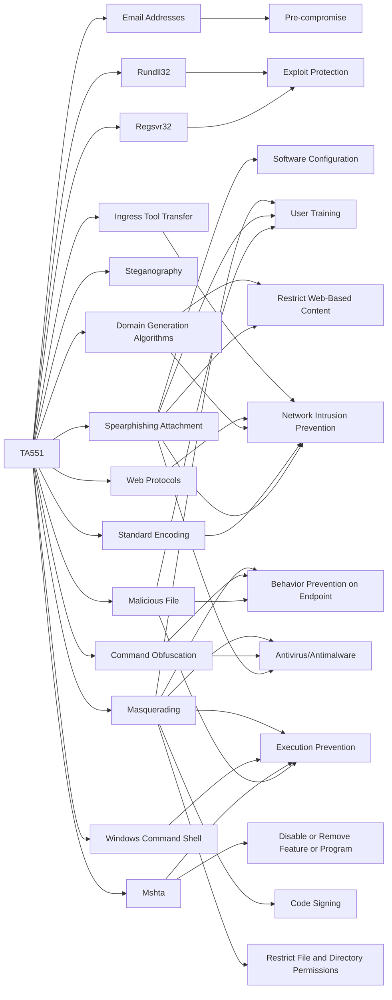

---
tags:
   - groups
---
# TA551
## ID:G0127
[TA551](/mitre/groups/G0127) is a financially-motivated threat group that has been active since at least 2018. (Citation: Secureworks GOLD CABIN) The group has primarily targeted English, German, Italian, and Japanese speakers through email-based malware distribution campaigns. (Citation: Unit 42 TA551 Jan 2021)
## Techniques Used By Group
* [Regsvr32](techniques/T1218/010)
* [Email Addresses](techniques/T1589/002)
* [Malicious File](techniques/T1204/002)
* [Rundll32](techniques/T1218/011)
* [Steganography](techniques/T1027/003)
* [Spearphishing Attachment](techniques/T1566/001)
* [Standard Encoding](techniques/T1132/001)
* [Domain Generation Algorithms](techniques/T1568/002)
* [Command Obfuscation](techniques/T1027/010)
* [Web Protocols](techniques/T1071/001)
* [Ingress Tool Transfer](techniques/T1105)
* [Mshta](techniques/T1218/005)
* [Windows Command Shell](techniques/T1059/003)
* [Masquerading](techniques/T1036)

# Summary of Techniques and Mitigations
