---
tags:
   - groups
---
# ZIRCONIUM
## ID:G0128
[ZIRCONIUM](/mitre/groups/G0128) is a threat group operating out of China, active since at least 2017, that has targeted individuals associated with the 2020 US presidential election and prominent leaders in the international affairs community.(Citation: Microsoft Targeting Elections September 2020)(Citation: Check Point APT31 February 2021)
## Techniques Used By Group
* [System Information Discovery](/mitre/techniques/T1082)
* [Phishing for Information](/mitre/techniques/T1598)
* [Query Registry](/mitre/techniques/T1012)
* [Windows Command Shell](/mitre/techniques/T1059/003)
* [Web Services](/mitre/techniques/T1583/006)
* [Credentials from Web Browsers](/mitre/techniques/T1555/003)
* [Python](/mitre/techniques/T1059/006)
* [Registry Run Keys / Startup Folder](/mitre/techniques/T1547/001)
* [Symmetric Cryptography](/mitre/techniques/T1573/001)
* [System Time Discovery](/mitre/techniques/T1124)
* [Deobfuscate/Decode Files or Information](/mitre/techniques/T1140)
* [Spearphishing Link](/mitre/techniques/T1598/003)
* [Spearphishing Link](/mitre/techniques/T1566/002)
* [Domains](/mitre/techniques/T1583/001)
* [System Owner/User Discovery](/mitre/techniques/T1033)
* [Exfiltration Over C2 Channel](/mitre/techniques/T1041)
* [Masquerading](/mitre/techniques/T1036)
* [Exfiltration to Cloud Storage](/mitre/techniques/T1567/002)
* [Software Packing](/mitre/techniques/T1027/002)
* [Malicious Link](/mitre/techniques/T1204/001)
* [Masquerade Task or Service](/mitre/techniques/T1036/004)
* [Exploitation for Privilege Escalation](/mitre/techniques/T1068)
* [Msiexec](/mitre/techniques/T1218/007)
* [Ingress Tool Transfer](/mitre/techniques/T1105)
* [System Network Configuration Discovery](/mitre/techniques/T1016)
* [Bidirectional Communication](/mitre/techniques/T1102/002)

# Summary of Techniques and Mitigations

```mermaid
flowchart LR
group[ZIRCONIUM] --> T1082[System Information Discovery]
group[ZIRCONIUM] --> T1598[Phishing for Information]
group[ZIRCONIUM] --> T1012[Query Registry]
group[ZIRCONIUM] --> T1059.003[Windows Command Shell]
group[ZIRCONIUM] --> T1583.006[Web Services]
group[ZIRCONIUM] --> T1555.003[Credentials from Web Browsers]
group[ZIRCONIUM] --> T1059.006[Python]
group[ZIRCONIUM] --> T1547.001[Registry Run Keys / Startup Folder]
group[ZIRCONIUM] --> T1573.001[Symmetric Cryptography]
group[ZIRCONIUM] --> T1124[System Time Discovery]
group[ZIRCONIUM] --> T1140[Deobfuscate/Decode Files or Information]
group[ZIRCONIUM] --> T1598.003[Spearphishing Link]
group[ZIRCONIUM] --> T1566.002[Spearphishing Link]
group[ZIRCONIUM] --> T1583.001[Domains]
group[ZIRCONIUM] --> T1033[System Owner/User Discovery]
group[ZIRCONIUM] --> T1041[Exfiltration Over C2 Channel]
group[ZIRCONIUM] --> T1036[Masquerading]
group[ZIRCONIUM] --> T1567.002[Exfiltration to Cloud Storage]
group[ZIRCONIUM] --> T1027.002[Software Packing]
group[ZIRCONIUM] --> T1204.001[Malicious Link]
group[ZIRCONIUM] --> T1036.004[Masquerade Task or Service]
group[ZIRCONIUM] --> T1068[Exploitation for Privilege Escalation]
group[ZIRCONIUM] --> T1218.007[Msiexec]
group[ZIRCONIUM] --> T1105[Ingress Tool Transfer]
group[ZIRCONIUM] --> T1016[System Network Configuration Discovery]
group[ZIRCONIUM] --> T1102.002[Bidirectional Communication]
T1598[Phishing for Information] --> M1017[User Training]
T1598[Phishing for Information] --> M1054[Software Configuration]
T1059.003[Windows Command Shell] --> M1038[Execution Prevention]
T1583.006[Web Services] --> M1056[Pre-compromise]
T1555.003[Credentials from Web Browsers] --> M1027[Password Policies]
T1059.006[Python] --> M1047[Audit]
T1059.006[Python] --> M1049[Antivirus/Antimalware]
T1059.006[Python] --> M1033[Limit Software Installation]
T1059.006[Python] --> M1038[Execution Prevention]
T1573.001[Symmetric Cryptography] --> M1031[Network Intrusion Prevention]
T1598.003[Spearphishing Link] --> M1017[User Training]
T1598.003[Spearphishing Link] --> M1054[Software Configuration]
T1566.002[Spearphishing Link] --> M1054[Software Configuration]
T1566.002[Spearphishing Link] --> M1021[Restrict Web-Based Content]
T1566.002[Spearphishing Link] --> M1047[Audit]
T1566.002[Spearphishing Link] --> M1018[User Account Management]
T1566.002[Spearphishing Link] --> M1017[User Training]
T1583.001[Domains] --> M1056[Pre-compromise]
T1041[Exfiltration Over C2 Channel] --> M1031[Network Intrusion Prevention]
T1041[Exfiltration Over C2 Channel] --> M1057[Data Loss Prevention]
T1036[Masquerading] --> M1017[User Training]
T1036[Masquerading] --> M1045[Code Signing]
T1036[Masquerading] --> M1040[Behavior Prevention on Endpoint]
T1036[Masquerading] --> M1022[Restrict File and Directory Permissions]
T1036[Masquerading] --> M1049[Antivirus/Antimalware]
T1036[Masquerading] --> M1038[Execution Prevention]
T1567.002[Exfiltration to Cloud Storage] --> M1021[Restrict Web-Based Content]
T1027.002[Software Packing] --> M1049[Antivirus/Antimalware]
T1204.001[Malicious Link] --> M1031[Network Intrusion Prevention]
T1204.001[Malicious Link] --> M1017[User Training]
T1204.001[Malicious Link] --> M1021[Restrict Web-Based Content]
T1068[Exploitation for Privilege Escalation] --> M1051[Update Software]
T1068[Exploitation for Privilege Escalation] --> M1050[Exploit Protection]
T1068[Exploitation for Privilege Escalation] --> M1048[Application Isolation and Sandboxing]
T1068[Exploitation for Privilege Escalation] --> M1019[Threat Intelligence Program]
T1068[Exploitation for Privilege Escalation] --> M1038[Execution Prevention]
T1218.007[Msiexec] --> M1042[Disable or Remove Feature or Program]
T1218.007[Msiexec] --> M1026[Privileged Account Management]
T1105[Ingress Tool Transfer] --> M1031[Network Intrusion Prevention]
T1102.002[Bidirectional Communication] --> M1021[Restrict Web-Based Content]
T1102.002[Bidirectional Communication] --> M1031[Network Intrusion Prevention]
```
