---
tags:
   - groups
---
# Mustang Panda
## ID:G0129
[Mustang Panda](/mitre/groups/G0129) is a China-based cyber espionage threat actor that was first observed in 2017 but may have been conducting operations since at least 2014. [Mustang Panda](/mitre/groups/G0129) has targeted government entities, nonprofits, religious, and other non-governmental organizations in the U.S., Europe, Mongolia, Myanmar, Pakistan, and Vietnam, among others.(Citation: Crowdstrike MUSTANG PANDA June 2018)(Citation: Anomali MUSTANG PANDA October 2019)(Citation: Secureworks BRONZE PRESIDENT December 2019) 
## Techniques Used By Group
* [System Network Configuration Discovery](techniques/T1016)
* [Upload Malware](techniques/T1608/001)
* [Windows Management Instrumentation](techniques/T1047)
* [Symmetric Cryptography](techniques/T1573/001)
* [Malicious Link](techniques/T1204/001)
* [System Network Connections Discovery](techniques/T1049)
* [Visual Basic](techniques/T1059/005)
* [Scheduled Task](techniques/T1053/005)
* [Spearphishing Link](techniques/T1598/003)
* [Hidden Files and Directories](techniques/T1564/001)
* [Mshta](techniques/T1218/005)
* [Email Accounts](techniques/T1585/002)
* [Remote Access Software](techniques/T1219)
* [InstallUtil](techniques/T1218/004)
* [Archive via Utility](techniques/T1560/001)
* [Web Protocols](techniques/T1071/001)
* [Spearphishing Link](techniques/T1566/002)
* [Replication Through Removable Media](techniques/T1091)
* [Windows Command Shell](techniques/T1059/003)
* [Exfiltration over USB](techniques/T1052/001)
* [Archive via Custom Method](techniques/T1560/003)
* [File Deletion](techniques/T1070/004)
* [Process Discovery](techniques/T1057)
* [System Information Discovery](techniques/T1082)
* [Exploitation for Client Execution](techniques/T1203)
* [Stage Capabilities](techniques/T1608)
* [Spearphishing Attachment](techniques/T1566/001)
* [File and Directory Discovery](techniques/T1083)
* [Software Discovery](techniques/T1518)
* [Domains](techniques/T1583/001)
* [DLL Side-Loading](techniques/T1574/002)
* [Windows Management Instrumentation Event Subscription](techniques/T1546/003)
* [NTDS](techniques/T1003/003)
* [Obfuscated Files or Information](techniques/T1027)
* [Registry Run Keys / Startup Folder](techniques/T1547/001)
* [Automated Collection](techniques/T1119)
* [Ingress Tool Transfer](techniques/T1105)
* [Local Data Staging](techniques/T1074/001)
* [PowerShell](techniques/T1059/001)
* [Binary Padding](techniques/T1027/001)
* [Malicious File](techniques/T1204/002)
* [Double File Extension](techniques/T1036/007)
* [Web Service](techniques/T1102)
* [Match Legitimate Name or Location](techniques/T1036/005)

# Summary of Techniques and Mitigations

```mermaid
flowchart LR
group[Mustang Panda] --> T1016[System Network Configuration Discovery]
group[Mustang Panda] --> T1608.001[Upload Malware]
group[Mustang Panda] --> T1047[Windows Management Instrumentation]
group[Mustang Panda] --> T1573.001[Symmetric Cryptography]
group[Mustang Panda] --> T1204.001[Malicious Link]
group[Mustang Panda] --> T1049[System Network Connections Discovery]
group[Mustang Panda] --> T1059.005[Visual Basic]
group[Mustang Panda] --> T1053.005[Scheduled Task]
group[Mustang Panda] --> T1598.003[Spearphishing Link]
group[Mustang Panda] --> T1564.001[Hidden Files and Directories]
group[Mustang Panda] --> T1218.005[Mshta]
group[Mustang Panda] --> T1585.002[Email Accounts]
group[Mustang Panda] --> T1219[Remote Access Software]
group[Mustang Panda] --> T1218.004[InstallUtil]
group[Mustang Panda] --> T1560.001[Archive via Utility]
group[Mustang Panda] --> T1071.001[Web Protocols]
group[Mustang Panda] --> T1566.002[Spearphishing Link]
group[Mustang Panda] --> T1091[Replication Through Removable Media]
group[Mustang Panda] --> T1059.003[Windows Command Shell]
group[Mustang Panda] --> T1052.001[Exfiltration over USB]
group[Mustang Panda] --> T1560.003[Archive via Custom Method]
group[Mustang Panda] --> T1070.004[File Deletion]
group[Mustang Panda] --> T1057[Process Discovery]
group[Mustang Panda] --> T1082[System Information Discovery]
group[Mustang Panda] --> T1203[Exploitation for Client Execution]
group[Mustang Panda] --> T1608[Stage Capabilities]
group[Mustang Panda] --> T1566.001[Spearphishing Attachment]
group[Mustang Panda] --> T1083[File and Directory Discovery]
group[Mustang Panda] --> T1518[Software Discovery]
group[Mustang Panda] --> T1583.001[Domains]
group[Mustang Panda] --> T1574.002[DLL Side-Loading]
group[Mustang Panda] --> T1546.003[Windows Management Instrumentation Event Subscription]
group[Mustang Panda] --> T1003.003[NTDS]
group[Mustang Panda] --> T1027[Obfuscated Files or Information]
group[Mustang Panda] --> T1547.001[Registry Run Keys / Startup Folder]
group[Mustang Panda] --> T1119[Automated Collection]
group[Mustang Panda] --> T1105[Ingress Tool Transfer]
group[Mustang Panda] --> T1074.001[Local Data Staging]
group[Mustang Panda] --> T1059.001[PowerShell]
group[Mustang Panda] --> T1027.001[Binary Padding]
group[Mustang Panda] --> T1204.002[Malicious File]
group[Mustang Panda] --> T1036.007[Double File Extension]
group[Mustang Panda] --> T1102[Web Service]
group[Mustang Panda] --> T1036.005[Match Legitimate Name or Location]
T1608.001[Upload Malware] --> M1056[Pre-compromise]
T1047[Windows Management Instrumentation] --> M1026[Privileged Account Management]
T1047[Windows Management Instrumentation] --> M1040[Behavior Prevention on Endpoint]
T1047[Windows Management Instrumentation] --> M1018[User Account Management]
T1047[Windows Management Instrumentation] --> M1038[Execution Prevention]
T1573.001[Symmetric Cryptography] --> M1031[Network Intrusion Prevention]
T1204.001[Malicious Link] --> M1031[Network Intrusion Prevention]
T1204.001[Malicious Link] --> M1017[User Training]
T1204.001[Malicious Link] --> M1021[Restrict Web-Based Content]
T1059.005[Visual Basic] --> M1042[Disable or Remove Feature or Program]
T1059.005[Visual Basic] --> M1049[Antivirus/Antimalware]
T1059.005[Visual Basic] --> M1038[Execution Prevention]
T1059.005[Visual Basic] --> M1040[Behavior Prevention on Endpoint]
T1059.005[Visual Basic] --> M1021[Restrict Web-Based Content]
T1053.005[Scheduled Task] --> M1026[Privileged Account Management]
T1053.005[Scheduled Task] --> M1018[User Account Management]
T1053.005[Scheduled Task] --> M1047[Audit]
T1053.005[Scheduled Task] --> M1028[Operating System Configuration]
T1598.003[Spearphishing Link] --> M1017[User Training]
T1598.003[Spearphishing Link] --> M1054[Software Configuration]
T1218.005[Mshta] --> M1038[Execution Prevention]
T1218.005[Mshta] --> M1042[Disable or Remove Feature or Program]
T1585.002[Email Accounts] --> M1056[Pre-compromise]
T1219[Remote Access Software] --> M1038[Execution Prevention]
T1219[Remote Access Software] --> M1037[Filter Network Traffic]
T1219[Remote Access Software] --> M1031[Network Intrusion Prevention]
T1219[Remote Access Software] --> M1042[Disable or Remove Feature or Program]
T1218.004[InstallUtil] --> M1038[Execution Prevention]
T1218.004[InstallUtil] --> M1042[Disable or Remove Feature or Program]
T1560.001[Archive via Utility] --> M1047[Audit]
T1071.001[Web Protocols] --> M1031[Network Intrusion Prevention]
T1566.002[Spearphishing Link] --> M1054[Software Configuration]
T1566.002[Spearphishing Link] --> M1021[Restrict Web-Based Content]
T1566.002[Spearphishing Link] --> M1047[Audit]
T1566.002[Spearphishing Link] --> M1018[User Account Management]
T1566.002[Spearphishing Link] --> M1017[User Training]
T1091[Replication Through Removable Media] --> M1042[Disable or Remove Feature or Program]
T1091[Replication Through Removable Media] --> M1034[Limit Hardware Installation]
T1091[Replication Through Removable Media] --> M1040[Behavior Prevention on Endpoint]
T1059.003[Windows Command Shell] --> M1038[Execution Prevention]
T1052.001[Exfiltration over USB] --> M1042[Disable or Remove Feature or Program]
T1052.001[Exfiltration over USB] --> M1034[Limit Hardware Installation]
T1052.001[Exfiltration over USB] --> M1057[Data Loss Prevention]
T1203[Exploitation for Client Execution] --> M1050[Exploit Protection]
T1203[Exploitation for Client Execution] --> M1048[Application Isolation and Sandboxing]
T1608[Stage Capabilities] --> M1056[Pre-compromise]
T1566.001[Spearphishing Attachment] --> M1049[Antivirus/Antimalware]
T1566.001[Spearphishing Attachment] --> M1031[Network Intrusion Prevention]
T1566.001[Spearphishing Attachment] --> M1054[Software Configuration]
T1566.001[Spearphishing Attachment] --> M1017[User Training]
T1566.001[Spearphishing Attachment] --> M1021[Restrict Web-Based Content]
T1583.001[Domains] --> M1056[Pre-compromise]
T1574.002[DLL Side-Loading] --> M1051[Update Software]
T1574.002[DLL Side-Loading] --> M1013[Application Developer Guidance]
T1546.003[Windows Management Instrumentation Event Subscription] --> M1018[User Account Management]
T1546.003[Windows Management Instrumentation Event Subscription] --> M1026[Privileged Account Management]
T1546.003[Windows Management Instrumentation Event Subscription] --> M1040[Behavior Prevention on Endpoint]
T1003.003[NTDS] --> M1027[Password Policies]
T1003.003[NTDS] --> M1026[Privileged Account Management]
T1003.003[NTDS] --> M1017[User Training]
T1003.003[NTDS] --> M1041[Encrypt Sensitive Information]
T1027[Obfuscated Files or Information] --> M1047[Audit]
T1027[Obfuscated Files or Information] --> M1040[Behavior Prevention on Endpoint]
T1027[Obfuscated Files or Information] --> M1017[User Training]
T1027[Obfuscated Files or Information] --> M1049[Antivirus/Antimalware]
T1119[Automated Collection] --> M1029[Remote Data Storage]
T1119[Automated Collection] --> M1041[Encrypt Sensitive Information]
T1105[Ingress Tool Transfer] --> M1031[Network Intrusion Prevention]
T1059.001[PowerShell] --> M1042[Disable or Remove Feature or Program]
T1059.001[PowerShell] --> M1049[Antivirus/Antimalware]
T1059.001[PowerShell] --> M1045[Code Signing]
T1059.001[PowerShell] --> M1026[Privileged Account Management]
T1059.001[PowerShell] --> M1038[Execution Prevention]
T1204.002[Malicious File] --> M1038[Execution Prevention]
T1204.002[Malicious File] --> M1040[Behavior Prevention on Endpoint]
T1204.002[Malicious File] --> M1017[User Training]
T1036.007[Double File Extension] --> M1017[User Training]
T1036.007[Double File Extension] --> M1028[Operating System Configuration]
T1102[Web Service] --> M1031[Network Intrusion Prevention]
T1102[Web Service] --> M1021[Restrict Web-Based Content]
T1036.005[Match Legitimate Name or Location] --> M1022[Restrict File and Directory Permissions]
T1036.005[Match Legitimate Name or Location] --> M1038[Execution Prevention]
T1036.005[Match Legitimate Name or Location] --> M1045[Code Signing]
```
