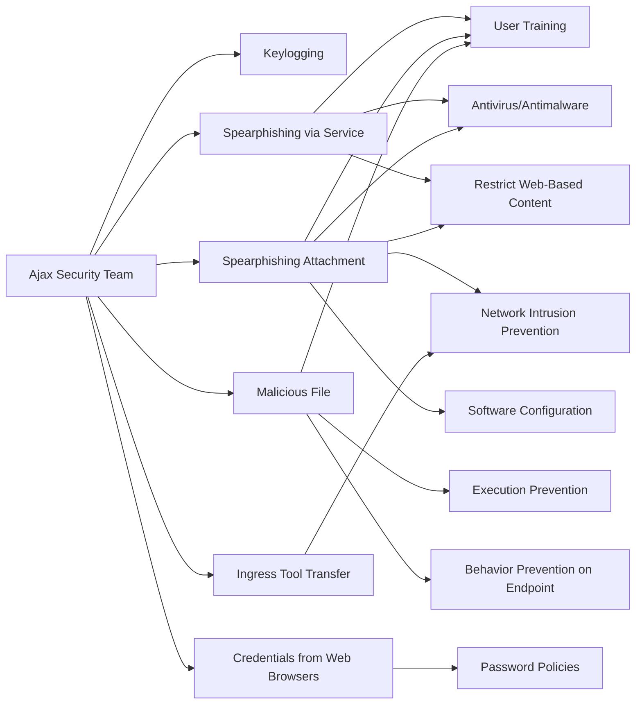

---
tags:
   - groups
---
# Ajax Security Team
## ID:G0130
[Ajax Security Team](/mitre/groups/G0130) is a group that has been active since at least 2010 and believed to be operating out of Iran. By 2014 [Ajax Security Team](/mitre/groups/G0130) transitioned from website defacement operations to malware-based cyber espionage campaigns targeting the US defense industrial base and Iranian users of anti-censorship technologies.(Citation: FireEye Operation Saffron Rose 2013)
## Techniques Used By Group
* [Keylogging](/mitre/techniques/T1056/001)
* [Spearphishing via Service](/mitre/techniques/T1566/003)
* [Spearphishing Attachment](/mitre/techniques/T1566/001)
* [Malicious File](/mitre/techniques/T1204/002)
* [Credentials from Web Browsers](/mitre/techniques/T1555/003)
* [Ingress Tool Transfer](/mitre/techniques/T1105)

# Summary of Techniques and Mitigations
