---
tags:
   - groups
---
# Tonto Team
## ID:G0131
[Tonto Team](groups/G0131) is a suspected Chinese state-sponsored cyber espionage threat group that has primarily targeted South Korea, Japan, Taiwan, and the United States since at least 2009; by 2020 they expanded operations to include other Asian as well as Eastern European countries. [Tonto Team](groups/G0131) has targeted government, military, energy, mining, financial, education, healthcare, and technology organizations, including through the Heartbeat Campaign (2009-2012) and Operation Bitter Biscuit (2017).(Citation: Kaspersky CactusPete Aug 2020)(Citation: ESET Exchange Mar 2021)(Citation: FireEye Chinese Espionage October 2019)(Citation: ARS Technica China Hack SK April 2017)(Citation: Trend Micro HeartBeat Campaign January 2013)(Citation: Talos Bisonal 10 Years March 2020)
## Techniques Used By Group
* [Network Share Discovery](techniques/T1135)
* [DLL Search Order Hijacking](techniques/T1574/001)
* [External Proxy](techniques/T1090/002)
* [Python](techniques/T1059/006)
* [Local Groups](techniques/T1069/001)
* [Keylogging](techniques/T1056/001)
* [OS Credential Dumping](techniques/T1003)
* [Web Shell](techniques/T1505/003)
* [Exploitation for Client Execution](techniques/T1203)
* [Malicious File](techniques/T1204/002)
* [Spearphishing Attachment](techniques/T1566/001)
* [Exploitation of Remote Services](techniques/T1210)
* [PowerShell](techniques/T1059/001)
* [Exploitation for Privilege Escalation](techniques/T1068)
* [Ingress Tool Transfer](techniques/T1105)

# Summary of Techniques and Mitigations

```mermaid
flowchart LR
group[Tonto Team] --> T1135[Network Share Discovery]
group[Tonto Team] --> T1574.001[DLL Search Order Hijacking]
group[Tonto Team] --> T1090.002[External Proxy]
group[Tonto Team] --> T1059.006[Python]
group[Tonto Team] --> T1069.001[Local Groups]
group[Tonto Team] --> T1056.001[Keylogging]
group[Tonto Team] --> T1003[OS Credential Dumping]
group[Tonto Team] --> T1505.003[Web Shell]
group[Tonto Team] --> T1203[Exploitation for Client Execution]
group[Tonto Team] --> T1204.002[Malicious File]
group[Tonto Team] --> T1566.001[Spearphishing Attachment]
group[Tonto Team] --> T1210[Exploitation of Remote Services]
group[Tonto Team] --> T1059.001[PowerShell]
group[Tonto Team] --> T1068[Exploitation for Privilege Escalation]
group[Tonto Team] --> T1105[Ingress Tool Transfer]
T1135[Network Share Discovery] --> M1028[Operating System Configuration]
T1574.001[DLL Search Order Hijacking] --> M1038[Execution Prevention]
T1574.001[DLL Search Order Hijacking] --> M1044[Restrict Library Loading]
T1574.001[DLL Search Order Hijacking] --> M1047[Audit]
T1090.002[External Proxy] --> M1031[Network Intrusion Prevention]
T1059.006[Python] --> M1047[Audit]
T1059.006[Python] --> M1049[Antivirus/Antimalware]
T1059.006[Python] --> M1033[Limit Software Installation]
T1059.006[Python] --> M1038[Execution Prevention]
T1003[OS Credential Dumping] --> M1041[Encrypt Sensitive Information]
T1003[OS Credential Dumping] --> M1040[Behavior Prevention on Endpoint]
T1003[OS Credential Dumping] --> M1027[Password Policies]
T1003[OS Credential Dumping] --> M1017[User Training]
T1003[OS Credential Dumping] --> M1026[Privileged Account Management]
T1003[OS Credential Dumping] --> M1025[Privileged Process Integrity]
T1003[OS Credential Dumping] --> M1043[Credential Access Protection]
T1003[OS Credential Dumping] --> M1015[Active Directory Configuration]
T1003[OS Credential Dumping] --> M1028[Operating System Configuration]
T1505.003[Web Shell] --> M1042[Disable or Remove Feature or Program]
T1505.003[Web Shell] --> M1018[User Account Management]
T1203[Exploitation for Client Execution] --> M1050[Exploit Protection]
T1203[Exploitation for Client Execution] --> M1048[Application Isolation and Sandboxing]
T1204.002[Malicious File] --> M1038[Execution Prevention]
T1204.002[Malicious File] --> M1040[Behavior Prevention on Endpoint]
T1204.002[Malicious File] --> M1017[User Training]
T1566.001[Spearphishing Attachment] --> M1049[Antivirus/Antimalware]
T1566.001[Spearphishing Attachment] --> M1031[Network Intrusion Prevention]
T1566.001[Spearphishing Attachment] --> M1054[Software Configuration]
T1566.001[Spearphishing Attachment] --> M1017[User Training]
T1566.001[Spearphishing Attachment] --> M1021[Restrict Web-Based Content]
T1210[Exploitation of Remote Services] --> M1042[Disable or Remove Feature or Program]
T1210[Exploitation of Remote Services] --> M1016[Vulnerability Scanning]
T1210[Exploitation of Remote Services] --> M1050[Exploit Protection]
T1210[Exploitation of Remote Services] --> M1030[Network Segmentation]
T1210[Exploitation of Remote Services] --> M1019[Threat Intelligence Program]
T1210[Exploitation of Remote Services] --> M1048[Application Isolation and Sandboxing]
T1210[Exploitation of Remote Services] --> M1026[Privileged Account Management]
T1210[Exploitation of Remote Services] --> M1051[Update Software]
T1059.001[PowerShell] --> M1042[Disable or Remove Feature or Program]
T1059.001[PowerShell] --> M1049[Antivirus/Antimalware]
T1059.001[PowerShell] --> M1045[Code Signing]
T1059.001[PowerShell] --> M1026[Privileged Account Management]
T1059.001[PowerShell] --> M1038[Execution Prevention]
T1068[Exploitation for Privilege Escalation] --> M1051[Update Software]
T1068[Exploitation for Privilege Escalation] --> M1050[Exploit Protection]
T1068[Exploitation for Privilege Escalation] --> M1048[Application Isolation and Sandboxing]
T1068[Exploitation for Privilege Escalation] --> M1019[Threat Intelligence Program]
T1068[Exploitation for Privilege Escalation] --> M1038[Execution Prevention]
T1105[Ingress Tool Transfer] --> M1031[Network Intrusion Prevention]
```
