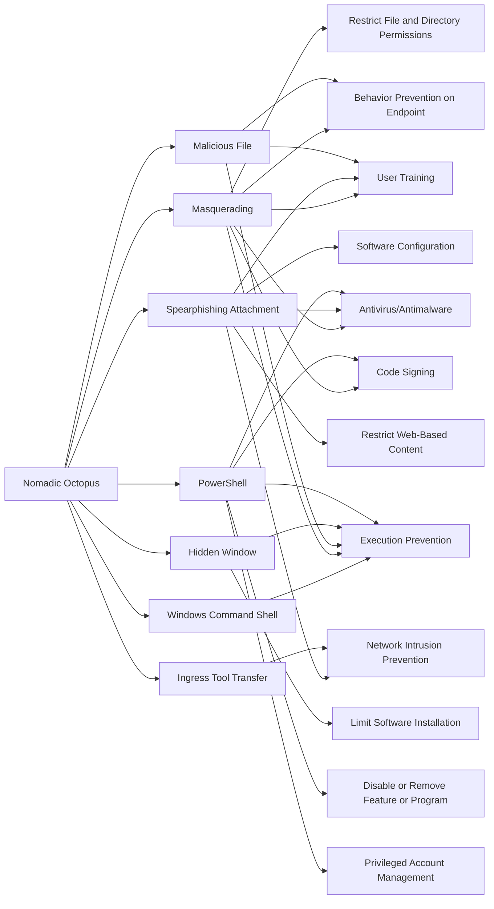

---
tags:
   - groups
---
# Nomadic Octopus
## ID:G0133

[Nomadic Octopus](/mitre/groups/G0133) is a Russian-speaking cyber espionage threat group that has primarily targeted Central Asia, including local governments, diplomatic missions, and individuals, since at least 2014. [Nomadic Octopus](/mitre/groups/G0133) has been observed conducting campaigns involving Android and Windows malware, mainly using the Delphi programming language, and building custom variants.(Citation: Security Affairs DustSquad Oct 2018)(Citation: Securelist Octopus Oct 2018)(Citation: ESET Nomadic Octopus 2018)
## Techniques Used By Group
* [Windows Command Shell](techniques/T1059/003)
* [Masquerading](techniques/T1036)
* [Spearphishing Attachment](techniques/T1566/001)
* [Malicious File](techniques/T1204/002)
* [Ingress Tool Transfer](techniques/T1105)
* [Hidden Window](techniques/T1564/003)
* [PowerShell](techniques/T1059/001)

# Summary of Techniques and Mitigations
