---
tags:
   - groups
---
# Transparent Tribe
## ID:G0134
[Transparent Tribe](/mitre/groups/G0134) is a suspected Pakistan-based threat group that has been active since at least 2013, primarily targeting diplomatic, defense, and research organizations in India and Afghanistan.(Citation: Proofpoint Operation Transparent Tribe March 2016)(Citation: Kaspersky Transparent Tribe August 2020)(Citation: Talos Transparent Tribe May 2021)
## Techniques Used By Group
* [Drive-by Compromise](/mitre/techniques/T1189)
* [Drive-by Target](/mitre/techniques/T1608/004)
* [Malicious File](/mitre/techniques/T1204/002)
* [Encrypted/Encoded File](/mitre/techniques/T1027/013)
* [Dynamic Resolution](/mitre/techniques/T1568)
* [Domains](/mitre/techniques/T1584/001)
* [Visual Basic](/mitre/techniques/T1059/005)
* [Spearphishing Link](/mitre/techniques/T1566/002)
* [Match Legitimate Name or Location](/mitre/techniques/T1036/005)
* [Domains](/mitre/techniques/T1583/001)
* [Hidden Files and Directories](/mitre/techniques/T1564/001)
* [Exploitation for Client Execution](/mitre/techniques/T1203)
* [Spearphishing Attachment](/mitre/techniques/T1566/001)
* [Malicious Link](/mitre/techniques/T1204/001)
* [Upload Malware](/mitre/techniques/T1608/001)
* [Digital Certificates](/mitre/techniques/T1587/003)

# Summary of Techniques and Mitigations

```mermaid
flowchart LR
group[Transparent Tribe] --> T1189[Drive-by Compromise]
group[Transparent Tribe] --> T1608.004[Drive-by Target]
group[Transparent Tribe] --> T1204.002[Malicious File]
group[Transparent Tribe] --> T1027.013[Encrypted/Encoded File]
group[Transparent Tribe] --> T1568[Dynamic Resolution]
group[Transparent Tribe] --> T1584.001[Domains]
group[Transparent Tribe] --> T1059.005[Visual Basic]
group[Transparent Tribe] --> T1566.002[Spearphishing Link]
group[Transparent Tribe] --> T1036.005[Match Legitimate Name or Location]
group[Transparent Tribe] --> T1583.001[Domains]
group[Transparent Tribe] --> T1564.001[Hidden Files and Directories]
group[Transparent Tribe] --> T1203[Exploitation for Client Execution]
group[Transparent Tribe] --> T1566.001[Spearphishing Attachment]
group[Transparent Tribe] --> T1204.001[Malicious Link]
group[Transparent Tribe] --> T1608.001[Upload Malware]
group[Transparent Tribe] --> T1587.003[Digital Certificates]
T1189[Drive-by Compromise] --> M1050[Exploit Protection]
T1189[Drive-by Compromise] --> M1051[Update Software]
T1189[Drive-by Compromise] --> M1048[Application Isolation and Sandboxing]
T1189[Drive-by Compromise] --> M1021[Restrict Web-Based Content]
T1608.004[Drive-by Target] --> M1056[Pre-compromise]
T1204.002[Malicious File] --> M1038[Execution Prevention]
T1204.002[Malicious File] --> M1040[Behavior Prevention on Endpoint]
T1204.002[Malicious File] --> M1017[User Training]
T1027.013[Encrypted/Encoded File] --> M1049[Antivirus/Antimalware]
T1027.013[Encrypted/Encoded File] --> M1040[Behavior Prevention on Endpoint]
T1568[Dynamic Resolution] --> M1031[Network Intrusion Prevention]
T1568[Dynamic Resolution] --> M1021[Restrict Web-Based Content]
T1584.001[Domains] --> M1056[Pre-compromise]
T1059.005[Visual Basic] --> M1042[Disable or Remove Feature or Program]
T1059.005[Visual Basic] --> M1049[Antivirus/Antimalware]
T1059.005[Visual Basic] --> M1038[Execution Prevention]
T1059.005[Visual Basic] --> M1040[Behavior Prevention on Endpoint]
T1059.005[Visual Basic] --> M1021[Restrict Web-Based Content]
T1566.002[Spearphishing Link] --> M1054[Software Configuration]
T1566.002[Spearphishing Link] --> M1021[Restrict Web-Based Content]
T1566.002[Spearphishing Link] --> M1047[Audit]
T1566.002[Spearphishing Link] --> M1018[User Account Management]
T1566.002[Spearphishing Link] --> M1017[User Training]
T1036.005[Match Legitimate Name or Location] --> M1022[Restrict File and Directory Permissions]
T1036.005[Match Legitimate Name or Location] --> M1038[Execution Prevention]
T1036.005[Match Legitimate Name or Location] --> M1045[Code Signing]
T1583.001[Domains] --> M1056[Pre-compromise]
T1203[Exploitation for Client Execution] --> M1050[Exploit Protection]
T1203[Exploitation for Client Execution] --> M1048[Application Isolation and Sandboxing]
T1566.001[Spearphishing Attachment] --> M1049[Antivirus/Antimalware]
T1566.001[Spearphishing Attachment] --> M1031[Network Intrusion Prevention]
T1566.001[Spearphishing Attachment] --> M1054[Software Configuration]
T1566.001[Spearphishing Attachment] --> M1017[User Training]
T1566.001[Spearphishing Attachment] --> M1021[Restrict Web-Based Content]
T1204.001[Malicious Link] --> M1031[Network Intrusion Prevention]
T1204.001[Malicious Link] --> M1017[User Training]
T1204.001[Malicious Link] --> M1021[Restrict Web-Based Content]
T1608.001[Upload Malware] --> M1056[Pre-compromise]
T1587.003[Digital Certificates] --> M1056[Pre-compromise]
```
