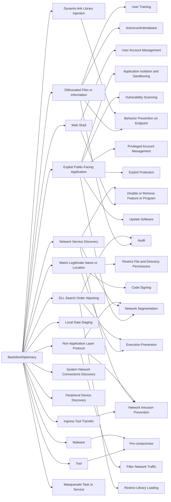

---
tags:
   - groups
---
# BackdoorDiplomacy
## ID:G0135
[BackdoorDiplomacy](/mitre/groups/G0135) is a cyber espionage threat group that has been active since at least 2017. [BackdoorDiplomacy](/mitre/groups/G0135) has targeted Ministries of Foreign Affairs and telecommunication companies in Africa, Europe, the Middle East, and Asia.(Citation: ESET BackdoorDiplomacy Jun 2021)
## Techniques Used By Group
* [Obfuscated Files or Information](/mitre/techniques/T1027)
* [Web Shell](/mitre/techniques/T1505/003)
* [Exploit Public-Facing Application](/mitre/techniques/T1190)
* [Tool](/mitre/techniques/T1588/002)
* [Match Legitimate Name or Location](/mitre/techniques/T1036/005)
* [Dynamic-link Library Injection](/mitre/techniques/T1055/001)
* [Ingress Tool Transfer](/mitre/techniques/T1105)
* [Local Data Staging](/mitre/techniques/T1074/001)
* [Network Service Discovery](/mitre/techniques/T1046)
* [System Network Connections Discovery](/mitre/techniques/T1049)
* [Peripheral Device Discovery](/mitre/techniques/T1120)
* [Non-Application Layer Protocol](/mitre/techniques/T1095)
* [DLL Search Order Hijacking](/mitre/techniques/T1574/001)
* [Malware](/mitre/techniques/T1588/001)
* [Masquerade Task or Service](/mitre/techniques/T1036/004)

# Summary of Techniques and Mitigations
