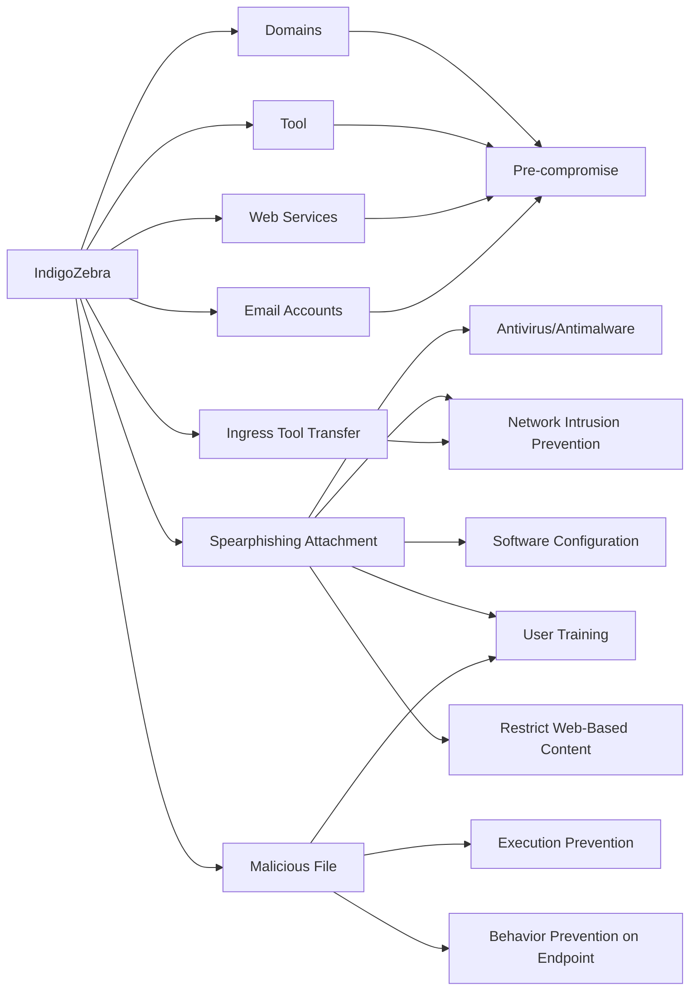

---
tags:
   - groups
---
# IndigoZebra
## ID:G0136
[IndigoZebra](groups/G0136) is a suspected Chinese cyber espionage group that has been targeting Central Asian governments since at least 2014.(Citation: HackerNews IndigoZebra July 2021)(Citation: Checkpoint IndigoZebra July 2021)(Citation: Securelist APT Trends Q2 2017)
## Techniques Used By Group
* [Domains](techniques/T1583/001)
* [Tool](techniques/T1588/002)
* [Web Services](techniques/T1583/006)
* [Email Accounts](techniques/T1586/002)
* [Spearphishing Attachment](techniques/T1566/001)
* [Malicious File](techniques/T1204/002)
* [Ingress Tool Transfer](techniques/T1105)

# Summary of Techniques and Mitigations
