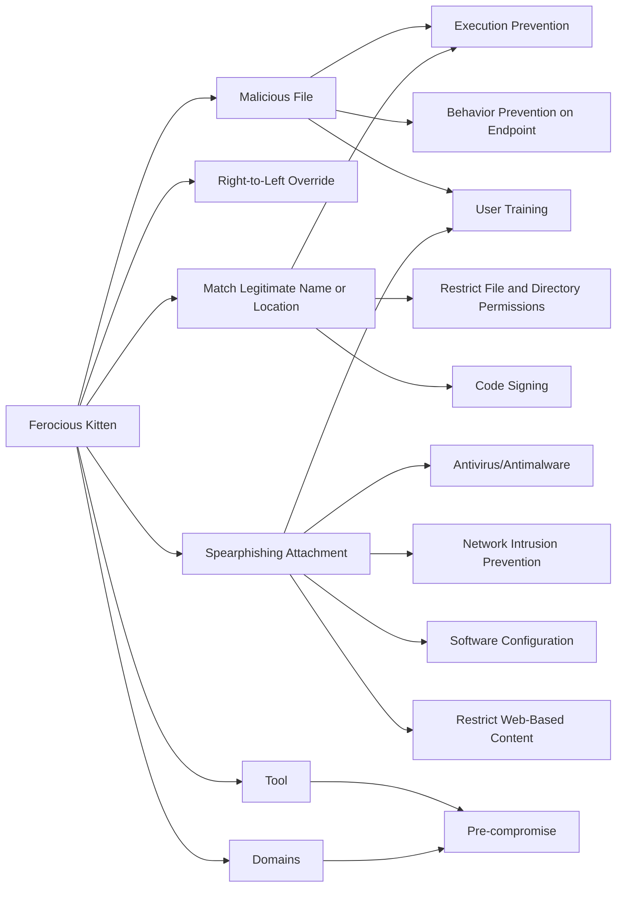

---
tags:
   - groups
---
# Ferocious Kitten
## ID:G0137
[Ferocious Kitten](/mitre/groups/G0137) is a threat group that has primarily targeted Persian-speaking individuals in Iran since at least 2015.(Citation: Kaspersky Ferocious Kitten Jun 2021)
## Techniques Used By Group
* [Malicious File](/mitre/techniques/T1204/002)
* [Right-to-Left Override](/mitre/techniques/T1036/002)
* [Match Legitimate Name or Location](/mitre/techniques/T1036/005)
* [Spearphishing Attachment](/mitre/techniques/T1566/001)
* [Tool](/mitre/techniques/T1588/002)
* [Domains](/mitre/techniques/T1583/001)

# Summary of Techniques and Mitigations
