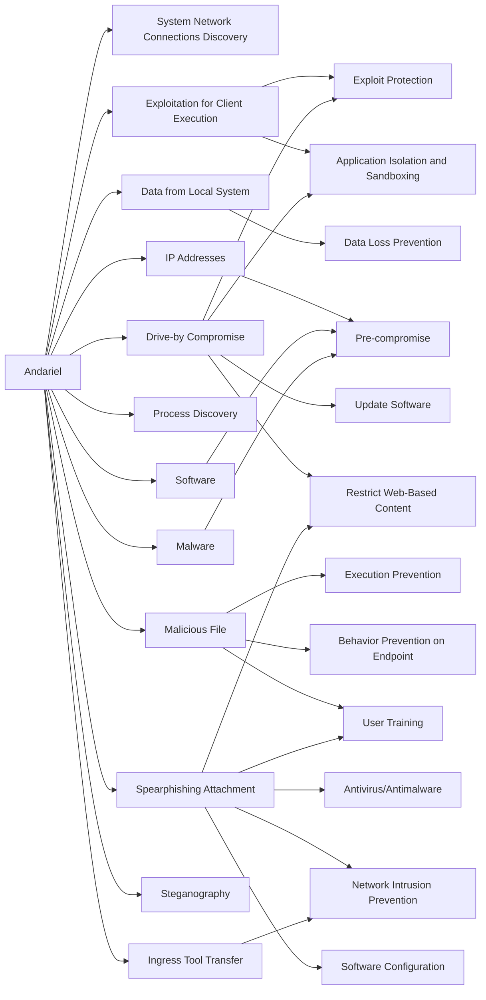

---
tags:
   - groups
---
# Andariel
## ID:G0138
[Andariel](/mitre/groups/G0138) is a North Korean state-sponsored threat group that has been active since at least 2009. [Andariel](/mitre/groups/G0138) has primarily focused its operations--which have included destructive attacks--against South Korean government agencies, military organizations, and a variety of domestic companies; they have also conducted cyber financial operations against ATMs, banks, and cryptocurrency exchanges. [Andariel](/mitre/groups/G0138)'s notable activity includes Operation Black Mine, Operation GoldenAxe, and Campaign Rifle.(Citation: FSI Andariel Campaign Rifle July 2017)(Citation: IssueMakersLab Andariel GoldenAxe May 2017)(Citation: AhnLab Andariel Subgroup of Lazarus June 2018)(Citation: TrendMicro New Andariel Tactics July 2018)(Citation: CrowdStrike Silent Chollima Adversary September 2021)

[Andariel](/mitre/groups/G0138) is considered a sub-set of [Lazarus Group](/mitre/groups/G0032), and has been attributed to North Korea's Reconnaissance General Bureau.(Citation: Treasury North Korean Cyber Groups September 2019)

North Korean group definitions are known to have significant overlap, and some security researchers report all North Korean state-sponsored cyber activity under the name [Lazarus Group](/mitre/groups/G0032) instead of tracking clusters or subgroups.
## Techniques Used By Group
* [System Network Connections Discovery](techniques/T1049)
* [Exploitation for Client Execution](techniques/T1203)
* [Data from Local System](techniques/T1005)
* [IP Addresses](techniques/T1590/005)
* [Drive-by Compromise](techniques/T1189)
* [Process Discovery](techniques/T1057)
* [Software](techniques/T1592/002)
* [Malware](techniques/T1588/001)
* [Malicious File](techniques/T1204/002)
* [Spearphishing Attachment](techniques/T1566/001)
* [Steganography](techniques/T1027/003)
* [Ingress Tool Transfer](techniques/T1105)

# Summary of Techniques and Mitigations
