---
tags:
   - groups
---
# TeamTNT
## ID:G0139
[TeamTNT](/mitre/groups/G0139) is a threat group that has primarily targeted cloud and containerized environments. The group as been active since at least October 2019 and has mainly focused its efforts on leveraging cloud and container resources to deploy cryptocurrency miners in victim environments.(Citation: Palo Alto Black-T October 2020)(Citation: Lacework TeamTNT May 2021)(Citation: Intezer TeamTNT September 2020)(Citation: Cado Security TeamTNT Worm August 2020)(Citation: Unit 42 Hildegard Malware)(Citation: Trend Micro TeamTNT)(Citation: ATT TeamTNT Chimaera September 2020)(Citation: Aqua TeamTNT August 2020)(Citation: Intezer TeamTNT Explosion September 2021)
## Techniques Used By Group
* [External Remote Services](techniques/T1133)
* [Remote Access Software](techniques/T1219)
* [System Services](techniques/T1569)
* [Match Legitimate Name or Location](techniques/T1036/005)
* [Linux and Mac File and Directory Permissions Modification](techniques/T1222/002)
* [File Deletion](techniques/T1070/004)
* [Container Administration Command](techniques/T1609)
* [Unix Shell](techniques/T1059/004)
* [Registry Run Keys / Startup Folder](techniques/T1547/001)
* [Systemd Service](techniques/T1543/002)
* [Local Account](techniques/T1136/001)
* [System Service Discovery](techniques/T1007)
* [System Network Connections Discovery](techniques/T1049)
* [Disable or Modify System Firewall](techniques/T1562/004)
* [Windows Service](techniques/T1543/003)
* [Upload Malware](techniques/T1608/001)
* [Windows Command Shell](techniques/T1059/003)
* [Deploy Container](techniques/T1610)
* [Container and Resource Discovery](techniques/T1613)
* [Exfiltration Over Alternative Protocol](techniques/T1048)
* [Process Discovery](techniques/T1057)
* [PowerShell](techniques/T1059/001)
* [Cloud Instance Metadata API](techniques/T1552/005)
* [Clear Command History](techniques/T1070/003)
* [Local Data Staging](techniques/T1074/001)
* [Vulnerability Scanning](techniques/T1595/002)
* [Software Packing](techniques/T1027/002)
* [Malicious Image](techniques/T1204/003)
* [Rootkit](techniques/T1014)
* [Private Keys](techniques/T1552/004)
* [Disable or Modify Tools](techniques/T1562/001)
* [Escape to Host](techniques/T1611)
* [Clear Linux or Mac System Logs](techniques/T1070/002)
* [Scanning IP Blocks](techniques/T1595/001)
* [Ingress Tool Transfer](techniques/T1105)
* [Security Software Discovery](techniques/T1518/001)
* [Resource Hijacking](techniques/T1496)
* [File and Directory Discovery](techniques/T1083)
* [SSH](techniques/T1021/004)
* [Masquerading](techniques/T1036)
* [Deobfuscate/Decode Files or Information](techniques/T1140)
* [System Information Discovery](techniques/T1082)
* [Encrypted/Encoded File](techniques/T1027/013)
* [System Network Configuration Discovery](techniques/T1016)
* [Network Service Discovery](techniques/T1046)
* [Peripheral Device Discovery](techniques/T1120)
* [Application Layer Protocol](techniques/T1071)
* [SSH Authorized Keys](techniques/T1098/004)
* [Domains](techniques/T1583/001)
* [Cloud API](techniques/T1059/009)
* [Web Protocols](techniques/T1071/001)
* [Credentials In Files](techniques/T1552/001)
* [Malware](techniques/T1587/001)
* [Web Service](techniques/T1102)

# Summary of Techniques and Mitigations

```mermaid
flowchart LR
group[TeamTNT] --> T1133[External Remote Services]
group[TeamTNT] --> T1219[Remote Access Software]
group[TeamTNT] --> T1569[System Services]
group[TeamTNT] --> T1036.005[Match Legitimate Name or Location]
group[TeamTNT] --> T1222.002[Linux and Mac File and Directory Permissions Modification]
group[TeamTNT] --> T1070.004[File Deletion]
group[TeamTNT] --> T1609[Container Administration Command]
group[TeamTNT] --> T1059.004[Unix Shell]
group[TeamTNT] --> T1547.001[Registry Run Keys / Startup Folder]
group[TeamTNT] --> T1543.002[Systemd Service]
group[TeamTNT] --> T1136.001[Local Account]
group[TeamTNT] --> T1007[System Service Discovery]
group[TeamTNT] --> T1049[System Network Connections Discovery]
group[TeamTNT] --> T1562.004[Disable or Modify System Firewall]
group[TeamTNT] --> T1543.003[Windows Service]
group[TeamTNT] --> T1608.001[Upload Malware]
group[TeamTNT] --> T1059.003[Windows Command Shell]
group[TeamTNT] --> T1610[Deploy Container]
group[TeamTNT] --> T1613[Container and Resource Discovery]
group[TeamTNT] --> T1048[Exfiltration Over Alternative Protocol]
group[TeamTNT] --> T1057[Process Discovery]
group[TeamTNT] --> T1059.001[PowerShell]
group[TeamTNT] --> T1552.005[Cloud Instance Metadata API]
group[TeamTNT] --> T1070.003[Clear Command History]
group[TeamTNT] --> T1074.001[Local Data Staging]
group[TeamTNT] --> T1595.002[Vulnerability Scanning]
group[TeamTNT] --> T1027.002[Software Packing]
group[TeamTNT] --> T1204.003[Malicious Image]
group[TeamTNT] --> T1014[Rootkit]
group[TeamTNT] --> T1552.004[Private Keys]
group[TeamTNT] --> T1562.001[Disable or Modify Tools]
group[TeamTNT] --> T1611[Escape to Host]
group[TeamTNT] --> T1070.002[Clear Linux or Mac System Logs]
group[TeamTNT] --> T1595.001[Scanning IP Blocks]
group[TeamTNT] --> T1105[Ingress Tool Transfer]
group[TeamTNT] --> T1518.001[Security Software Discovery]
group[TeamTNT] --> T1496[Resource Hijacking]
group[TeamTNT] --> T1083[File and Directory Discovery]
group[TeamTNT] --> T1021.004[SSH]
group[TeamTNT] --> T1036[Masquerading]
group[TeamTNT] --> T1140[Deobfuscate/Decode Files or Information]
group[TeamTNT] --> T1082[System Information Discovery]
group[TeamTNT] --> T1027.013[Encrypted/Encoded File]
group[TeamTNT] --> T1016[System Network Configuration Discovery]
group[TeamTNT] --> T1046[Network Service Discovery]
group[TeamTNT] --> T1120[Peripheral Device Discovery]
group[TeamTNT] --> T1071[Application Layer Protocol]
group[TeamTNT] --> T1098.004[SSH Authorized Keys]
group[TeamTNT] --> T1583.001[Domains]
group[TeamTNT] --> T1059.009[Cloud API]
group[TeamTNT] --> T1071.001[Web Protocols]
group[TeamTNT] --> T1552.001[Credentials In Files]
group[TeamTNT] --> T1587.001[Malware]
group[TeamTNT] --> T1102[Web Service]
T1133[External Remote Services] --> M1030[Network Segmentation]
T1133[External Remote Services] --> M1042[Disable or Remove Feature or Program]
T1133[External Remote Services] --> M1035[Limit Access to Resource Over Network]
T1133[External Remote Services] --> M1032[Multi-factor Authentication]
T1219[Remote Access Software] --> M1038[Execution Prevention]
T1219[Remote Access Software] --> M1037[Filter Network Traffic]
T1219[Remote Access Software] --> M1031[Network Intrusion Prevention]
T1219[Remote Access Software] --> M1042[Disable or Remove Feature or Program]
T1569[System Services] --> M1026[Privileged Account Management]
T1569[System Services] --> M1018[User Account Management]
T1569[System Services] --> M1040[Behavior Prevention on Endpoint]
T1569[System Services] --> M1022[Restrict File and Directory Permissions]
T1036.005[Match Legitimate Name or Location] --> M1022[Restrict File and Directory Permissions]
T1036.005[Match Legitimate Name or Location] --> M1038[Execution Prevention]
T1036.005[Match Legitimate Name or Location] --> M1045[Code Signing]
T1222.002[Linux and Mac File and Directory Permissions Modification] --> M1022[Restrict File and Directory Permissions]
T1222.002[Linux and Mac File and Directory Permissions Modification] --> M1026[Privileged Account Management]
T1609[Container Administration Command] --> M1018[User Account Management]
T1609[Container Administration Command] --> M1026[Privileged Account Management]
T1609[Container Administration Command] --> M1042[Disable or Remove Feature or Program]
T1609[Container Administration Command] --> M1035[Limit Access to Resource Over Network]
T1609[Container Administration Command] --> M1038[Execution Prevention]
T1059.004[Unix Shell] --> M1038[Execution Prevention]
T1543.002[Systemd Service] --> M1018[User Account Management]
T1543.002[Systemd Service] --> M1022[Restrict File and Directory Permissions]
T1543.002[Systemd Service] --> M1026[Privileged Account Management]
T1543.002[Systemd Service] --> M1033[Limit Software Installation]
T1136.001[Local Account] --> M1032[Multi-factor Authentication]
T1136.001[Local Account] --> M1026[Privileged Account Management]
T1562.004[Disable or Modify System Firewall] --> M1047[Audit]
T1562.004[Disable or Modify System Firewall] --> M1018[User Account Management]
T1562.004[Disable or Modify System Firewall] --> M1024[Restrict Registry Permissions]
T1562.004[Disable or Modify System Firewall] --> M1022[Restrict File and Directory Permissions]
T1543.003[Windows Service] --> M1040[Behavior Prevention on Endpoint]
T1543.003[Windows Service] --> M1028[Operating System Configuration]
T1543.003[Windows Service] --> M1047[Audit]
T1543.003[Windows Service] --> M1045[Code Signing]
T1543.003[Windows Service] --> M1018[User Account Management]
T1608.001[Upload Malware] --> M1056[Pre-compromise]
T1059.003[Windows Command Shell] --> M1038[Execution Prevention]
T1610[Deploy Container] --> M1018[User Account Management]
T1610[Deploy Container] --> M1047[Audit]
T1610[Deploy Container] --> M1030[Network Segmentation]
T1610[Deploy Container] --> M1035[Limit Access to Resource Over Network]
T1613[Container and Resource Discovery] --> M1030[Network Segmentation]
T1613[Container and Resource Discovery] --> M1035[Limit Access to Resource Over Network]
T1613[Container and Resource Discovery] --> M1018[User Account Management]
T1048[Exfiltration Over Alternative Protocol] --> M1030[Network Segmentation]
T1048[Exfiltration Over Alternative Protocol] --> M1057[Data Loss Prevention]
T1048[Exfiltration Over Alternative Protocol] --> M1037[Filter Network Traffic]
T1048[Exfiltration Over Alternative Protocol] --> M1031[Network Intrusion Prevention]
T1048[Exfiltration Over Alternative Protocol] --> M1022[Restrict File and Directory Permissions]
T1048[Exfiltration Over Alternative Protocol] --> M1018[User Account Management]
T1059.001[PowerShell] --> M1042[Disable or Remove Feature or Program]
T1059.001[PowerShell] --> M1049[Antivirus/Antimalware]
T1059.001[PowerShell] --> M1045[Code Signing]
T1059.001[PowerShell] --> M1026[Privileged Account Management]
T1059.001[PowerShell] --> M1038[Execution Prevention]
T1552.005[Cloud Instance Metadata API] --> M1035[Limit Access to Resource Over Network]
T1552.005[Cloud Instance Metadata API] --> M1042[Disable or Remove Feature or Program]
T1552.005[Cloud Instance Metadata API] --> M1037[Filter Network Traffic]
T1070.003[Clear Command History] --> M1029[Remote Data Storage]
T1070.003[Clear Command History] --> M1022[Restrict File and Directory Permissions]
T1070.003[Clear Command History] --> M1039[Environment Variable Permissions]
T1595.002[Vulnerability Scanning] --> M1056[Pre-compromise]
T1027.002[Software Packing] --> M1049[Antivirus/Antimalware]
T1204.003[Malicious Image] --> M1045[Code Signing]
T1204.003[Malicious Image] --> M1031[Network Intrusion Prevention]
T1204.003[Malicious Image] --> M1017[User Training]
T1204.003[Malicious Image] --> M1047[Audit]
T1552.004[Private Keys] --> M1027[Password Policies]
T1552.004[Private Keys] --> M1022[Restrict File and Directory Permissions]
T1552.004[Private Keys] --> M1047[Audit]
T1552.004[Private Keys] --> M1041[Encrypt Sensitive Information]
T1562.001[Disable or Modify Tools] --> M1038[Execution Prevention]
T1562.001[Disable or Modify Tools] --> M1024[Restrict Registry Permissions]
T1562.001[Disable or Modify Tools] --> M1018[User Account Management]
T1562.001[Disable or Modify Tools] --> M1022[Restrict File and Directory Permissions]
T1611[Escape to Host] --> M1038[Execution Prevention]
T1611[Escape to Host] --> M1048[Application Isolation and Sandboxing]
T1611[Escape to Host] --> M1026[Privileged Account Management]
T1611[Escape to Host] --> M1042[Disable or Remove Feature or Program]
T1070.002[Clear Linux or Mac System Logs] --> M1029[Remote Data Storage]
T1070.002[Clear Linux or Mac System Logs] --> M1022[Restrict File and Directory Permissions]
T1070.002[Clear Linux or Mac System Logs] --> M1041[Encrypt Sensitive Information]
T1595.001[Scanning IP Blocks] --> M1056[Pre-compromise]
T1105[Ingress Tool Transfer] --> M1031[Network Intrusion Prevention]
T1021.004[SSH] --> M1042[Disable or Remove Feature or Program]
T1021.004[SSH] --> M1032[Multi-factor Authentication]
T1021.004[SSH] --> M1018[User Account Management]
T1036[Masquerading] --> M1017[User Training]
T1036[Masquerading] --> M1045[Code Signing]
T1036[Masquerading] --> M1040[Behavior Prevention on Endpoint]
T1036[Masquerading] --> M1022[Restrict File and Directory Permissions]
T1036[Masquerading] --> M1049[Antivirus/Antimalware]
T1036[Masquerading] --> M1038[Execution Prevention]
T1027.013[Encrypted/Encoded File] --> M1049[Antivirus/Antimalware]
T1027.013[Encrypted/Encoded File] --> M1040[Behavior Prevention on Endpoint]
T1046[Network Service Discovery] --> M1042[Disable or Remove Feature or Program]
T1046[Network Service Discovery] --> M1031[Network Intrusion Prevention]
T1046[Network Service Discovery] --> M1030[Network Segmentation]
T1071[Application Layer Protocol] --> M1031[Network Intrusion Prevention]
T1071[Application Layer Protocol] --> M1037[Filter Network Traffic]
T1098.004[SSH Authorized Keys] --> M1018[User Account Management]
T1098.004[SSH Authorized Keys] --> M1022[Restrict File and Directory Permissions]
T1098.004[SSH Authorized Keys] --> M1042[Disable or Remove Feature or Program]
T1583.001[Domains] --> M1056[Pre-compromise]
T1059.009[Cloud API] --> M1038[Execution Prevention]
T1059.009[Cloud API] --> M1026[Privileged Account Management]
T1071.001[Web Protocols] --> M1031[Network Intrusion Prevention]
T1552.001[Credentials In Files] --> M1017[User Training]
T1552.001[Credentials In Files] --> M1047[Audit]
T1552.001[Credentials In Files] --> M1022[Restrict File and Directory Permissions]
T1552.001[Credentials In Files] --> M1027[Password Policies]
T1587.001[Malware] --> M1056[Pre-compromise]
T1102[Web Service] --> M1031[Network Intrusion Prevention]
T1102[Web Service] --> M1021[Restrict Web-Based Content]
```
