---
tags:
   - groups
---
# LazyScripter
## ID:G0140
[LazyScripter](/mitre/groups/G0140) is threat group that has mainly targeted the airlines industry since at least 2018, primarily using open-source toolsets.(Citation: MalwareBytes LazyScripter Feb 2021)
## Techniques Used By Group
* [Malicious Link](/mitre/techniques/T1204/001)
* [Mshta](/mitre/techniques/T1218/005)
* [Upload Malware](/mitre/techniques/T1608/001)
* [Malicious File](/mitre/techniques/T1204/002)
* [Web Service](/mitre/techniques/T1102)
* [JavaScript](/mitre/techniques/T1059/007)
* [Domains](/mitre/techniques/T1583/001)
* [Visual Basic](/mitre/techniques/T1059/005)
* [DNS](/mitre/techniques/T1071/004)
* [Malware](/mitre/techniques/T1588/001)
* [Ingress Tool Transfer](/mitre/techniques/T1105)
* [Masquerading](/mitre/techniques/T1036)
* [Spearphishing Attachment](/mitre/techniques/T1566/001)
* [PowerShell](/mitre/techniques/T1059/001)
* [Windows Command Shell](/mitre/techniques/T1059/003)
* [Command Obfuscation](/mitre/techniques/T1027/010)
* [Registry Run Keys / Startup Folder](/mitre/techniques/T1547/001)
* [Rundll32](/mitre/techniques/T1218/011)
* [Spearphishing Link](/mitre/techniques/T1566/002)
* [Web Services](/mitre/techniques/T1583/006)

# Summary of Techniques and Mitigations

```mermaid
flowchart LR
group[LazyScripter] --> T1204.001[Malicious Link]
group[LazyScripter] --> T1218.005[Mshta]
group[LazyScripter] --> T1608.001[Upload Malware]
group[LazyScripter] --> T1204.002[Malicious File]
group[LazyScripter] --> T1102[Web Service]
group[LazyScripter] --> T1059.007[JavaScript]
group[LazyScripter] --> T1583.001[Domains]
group[LazyScripter] --> T1059.005[Visual Basic]
group[LazyScripter] --> T1071.004[DNS]
group[LazyScripter] --> T1588.001[Malware]
group[LazyScripter] --> T1105[Ingress Tool Transfer]
group[LazyScripter] --> T1036[Masquerading]
group[LazyScripter] --> T1566.001[Spearphishing Attachment]
group[LazyScripter] --> T1059.001[PowerShell]
group[LazyScripter] --> T1059.003[Windows Command Shell]
group[LazyScripter] --> T1027.010[Command Obfuscation]
group[LazyScripter] --> T1547.001[Registry Run Keys / Startup Folder]
group[LazyScripter] --> T1218.011[Rundll32]
group[LazyScripter] --> T1566.002[Spearphishing Link]
group[LazyScripter] --> T1583.006[Web Services]
T1204.001[Malicious Link] --> M1031[Network Intrusion Prevention]
T1204.001[Malicious Link] --> M1017[User Training]
T1204.001[Malicious Link] --> M1021[Restrict Web-Based Content]
T1218.005[Mshta] --> M1038[Execution Prevention]
T1218.005[Mshta] --> M1042[Disable or Remove Feature or Program]
T1608.001[Upload Malware] --> M1056[Pre-compromise]
T1204.002[Malicious File] --> M1038[Execution Prevention]
T1204.002[Malicious File] --> M1040[Behavior Prevention on Endpoint]
T1204.002[Malicious File] --> M1017[User Training]
T1102[Web Service] --> M1031[Network Intrusion Prevention]
T1102[Web Service] --> M1021[Restrict Web-Based Content]
T1059.007[JavaScript] --> M1040[Behavior Prevention on Endpoint]
T1059.007[JavaScript] --> M1038[Execution Prevention]
T1059.007[JavaScript] --> M1042[Disable or Remove Feature or Program]
T1059.007[JavaScript] --> M1021[Restrict Web-Based Content]
T1583.001[Domains] --> M1056[Pre-compromise]
T1059.005[Visual Basic] --> M1042[Disable or Remove Feature or Program]
T1059.005[Visual Basic] --> M1049[Antivirus/Antimalware]
T1059.005[Visual Basic] --> M1038[Execution Prevention]
T1059.005[Visual Basic] --> M1040[Behavior Prevention on Endpoint]
T1059.005[Visual Basic] --> M1021[Restrict Web-Based Content]
T1071.004[DNS] --> M1037[Filter Network Traffic]
T1071.004[DNS] --> M1031[Network Intrusion Prevention]
T1588.001[Malware] --> M1056[Pre-compromise]
T1105[Ingress Tool Transfer] --> M1031[Network Intrusion Prevention]
T1036[Masquerading] --> M1017[User Training]
T1036[Masquerading] --> M1045[Code Signing]
T1036[Masquerading] --> M1040[Behavior Prevention on Endpoint]
T1036[Masquerading] --> M1022[Restrict File and Directory Permissions]
T1036[Masquerading] --> M1049[Antivirus/Antimalware]
T1036[Masquerading] --> M1038[Execution Prevention]
T1566.001[Spearphishing Attachment] --> M1049[Antivirus/Antimalware]
T1566.001[Spearphishing Attachment] --> M1031[Network Intrusion Prevention]
T1566.001[Spearphishing Attachment] --> M1054[Software Configuration]
T1566.001[Spearphishing Attachment] --> M1017[User Training]
T1566.001[Spearphishing Attachment] --> M1021[Restrict Web-Based Content]
T1059.001[PowerShell] --> M1042[Disable or Remove Feature or Program]
T1059.001[PowerShell] --> M1049[Antivirus/Antimalware]
T1059.001[PowerShell] --> M1045[Code Signing]
T1059.001[PowerShell] --> M1026[Privileged Account Management]
T1059.001[PowerShell] --> M1038[Execution Prevention]
T1059.003[Windows Command Shell] --> M1038[Execution Prevention]
T1027.010[Command Obfuscation] --> M1040[Behavior Prevention on Endpoint]
T1027.010[Command Obfuscation] --> M1049[Antivirus/Antimalware]
T1218.011[Rundll32] --> M1050[Exploit Protection]
T1566.002[Spearphishing Link] --> M1054[Software Configuration]
T1566.002[Spearphishing Link] --> M1021[Restrict Web-Based Content]
T1566.002[Spearphishing Link] --> M1047[Audit]
T1566.002[Spearphishing Link] --> M1018[User Account Management]
T1566.002[Spearphishing Link] --> M1017[User Training]
T1583.006[Web Services] --> M1056[Pre-compromise]
```
