---
tags:
   - groups
---
# Confucius
## ID:G0142
[Confucius](groups/G0142) is a cyber espionage group that has primarily targeted military personnel, high-profile personalities, business persons, and government organizations in South Asia since at least 2013. Security researchers have noted similarities between [Confucius](groups/G0142) and [Patchwork](groups/G0040), particularly in their respective custom malware code and targets.(Citation: TrendMicro Confucius APT Feb 2018)(Citation: TrendMicro Confucius APT Aug 2021)(Citation: Uptycs Confucius APT Jan 2021)
## Techniques Used By Group
* [Spearphishing Link](techniques/T1566/002)
* [Malicious Link](techniques/T1204/001)
* [Exfiltration to Cloud Storage](techniques/T1567/002)
* [Template Injection](techniques/T1221)
* [Visual Basic](techniques/T1059/005)
* [Spearphishing Attachment](techniques/T1566/001)
* [Exploitation for Client Execution](techniques/T1203)
* [System Information Discovery](techniques/T1082)
* [Ingress Tool Transfer](techniques/T1105)
* [Automated Collection](techniques/T1119)
* [Web Services](techniques/T1583/006)
* [Web Protocols](techniques/T1071/001)
* [Exfiltration Over C2 Channel](techniques/T1041)
* [Mshta](techniques/T1218/005)
* [File and Directory Discovery](techniques/T1083)
* [Registry Run Keys / Startup Folder](techniques/T1547/001)
* [Scheduled Task](techniques/T1053/005)
* [Malicious File](techniques/T1204/002)
* [PowerShell](techniques/T1059/001)

# Summary of Techniques and Mitigations

```mermaid
flowchart LR
group[Confucius] --> T1566.002[Spearphishing Link]
group[Confucius] --> T1204.001[Malicious Link]
group[Confucius] --> T1567.002[Exfiltration to Cloud Storage]
group[Confucius] --> T1221[Template Injection]
group[Confucius] --> T1059.005[Visual Basic]
group[Confucius] --> T1566.001[Spearphishing Attachment]
group[Confucius] --> T1203[Exploitation for Client Execution]
group[Confucius] --> T1082[System Information Discovery]
group[Confucius] --> T1105[Ingress Tool Transfer]
group[Confucius] --> T1119[Automated Collection]
group[Confucius] --> T1583.006[Web Services]
group[Confucius] --> T1071.001[Web Protocols]
group[Confucius] --> T1041[Exfiltration Over C2 Channel]
group[Confucius] --> T1218.005[Mshta]
group[Confucius] --> T1083[File and Directory Discovery]
group[Confucius] --> T1547.001[Registry Run Keys / Startup Folder]
group[Confucius] --> T1053.005[Scheduled Task]
group[Confucius] --> T1204.002[Malicious File]
group[Confucius] --> T1059.001[PowerShell]
T1566.002[Spearphishing Link] --> M1054[Software Configuration]
T1566.002[Spearphishing Link] --> M1021[Restrict Web-Based Content]
T1566.002[Spearphishing Link] --> M1047[Audit]
T1566.002[Spearphishing Link] --> M1018[User Account Management]
T1566.002[Spearphishing Link] --> M1017[User Training]
T1204.001[Malicious Link] --> M1031[Network Intrusion Prevention]
T1204.001[Malicious Link] --> M1017[User Training]
T1204.001[Malicious Link] --> M1021[Restrict Web-Based Content]
T1567.002[Exfiltration to Cloud Storage] --> M1021[Restrict Web-Based Content]
T1221[Template Injection] --> M1049[Antivirus/Antimalware]
T1221[Template Injection] --> M1031[Network Intrusion Prevention]
T1221[Template Injection] --> M1017[User Training]
T1221[Template Injection] --> M1042[Disable or Remove Feature or Program]
T1059.005[Visual Basic] --> M1042[Disable or Remove Feature or Program]
T1059.005[Visual Basic] --> M1049[Antivirus/Antimalware]
T1059.005[Visual Basic] --> M1038[Execution Prevention]
T1059.005[Visual Basic] --> M1040[Behavior Prevention on Endpoint]
T1059.005[Visual Basic] --> M1021[Restrict Web-Based Content]
T1566.001[Spearphishing Attachment] --> M1049[Antivirus/Antimalware]
T1566.001[Spearphishing Attachment] --> M1031[Network Intrusion Prevention]
T1566.001[Spearphishing Attachment] --> M1054[Software Configuration]
T1566.001[Spearphishing Attachment] --> M1017[User Training]
T1566.001[Spearphishing Attachment] --> M1021[Restrict Web-Based Content]
T1203[Exploitation for Client Execution] --> M1050[Exploit Protection]
T1203[Exploitation for Client Execution] --> M1048[Application Isolation and Sandboxing]
T1105[Ingress Tool Transfer] --> M1031[Network Intrusion Prevention]
T1119[Automated Collection] --> M1029[Remote Data Storage]
T1119[Automated Collection] --> M1041[Encrypt Sensitive Information]
T1583.006[Web Services] --> M1056[Pre-compromise]
T1071.001[Web Protocols] --> M1031[Network Intrusion Prevention]
T1041[Exfiltration Over C2 Channel] --> M1031[Network Intrusion Prevention]
T1041[Exfiltration Over C2 Channel] --> M1057[Data Loss Prevention]
T1218.005[Mshta] --> M1038[Execution Prevention]
T1218.005[Mshta] --> M1042[Disable or Remove Feature or Program]
T1053.005[Scheduled Task] --> M1026[Privileged Account Management]
T1053.005[Scheduled Task] --> M1018[User Account Management]
T1053.005[Scheduled Task] --> M1047[Audit]
T1053.005[Scheduled Task] --> M1028[Operating System Configuration]
T1204.002[Malicious File] --> M1038[Execution Prevention]
T1204.002[Malicious File] --> M1040[Behavior Prevention on Endpoint]
T1204.002[Malicious File] --> M1017[User Training]
T1059.001[PowerShell] --> M1042[Disable or Remove Feature or Program]
T1059.001[PowerShell] --> M1049[Antivirus/Antimalware]
T1059.001[PowerShell] --> M1045[Code Signing]
T1059.001[PowerShell] --> M1026[Privileged Account Management]
T1059.001[PowerShell] --> M1038[Execution Prevention]
```
