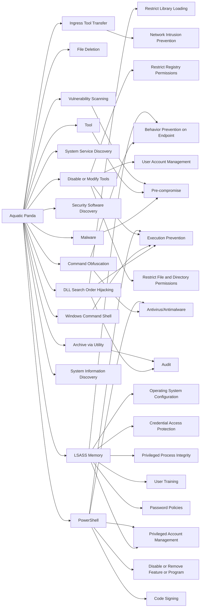

---
tags:
   - groups
---
# Aquatic Panda
## ID:G0143
[Aquatic Panda](groups/G0143) is a suspected China-based threat group with a dual mission of intelligence collection and industrial espionage. Active since at least May 2020, [Aquatic Panda](groups/G0143) has primarily targeted entities in the telecommunications, technology, and government sectors.(Citation: CrowdStrike AQUATIC PANDA December 2021)
## Techniques Used By Group
* [Command Obfuscation](techniques/T1027/010)
* [File Deletion](techniques/T1070/004)
* [DLL Search Order Hijacking](techniques/T1574/001)
* [Ingress Tool Transfer](techniques/T1105)
* [System Service Discovery](techniques/T1007)
* [Malware](techniques/T1588/001)
* [Security Software Discovery](techniques/T1518/001)
* [Windows Command Shell](techniques/T1059/003)
* [Disable or Modify Tools](techniques/T1562/001)
* [Tool](techniques/T1588/002)
* [Vulnerability Scanning](techniques/T1595/002)
* [LSASS Memory](techniques/T1003/001)
* [System Information Discovery](techniques/T1082)
* [Archive via Utility](techniques/T1560/001)
* [PowerShell](techniques/T1059/001)

# Summary of Techniques and Mitigations
