---
tags:
   - groups
---
# HEXANE
## ID:G1001
[HEXANE](/mitre/groups/G1001) is a cyber espionage threat group that has targeted oil & gas, telecommunications, aviation, and internet service provider organizations since at least 2017. Targeted companies have been located in the Middle East and Africa, including Israel, Saudi Arabia, Kuwait, Morocco, and Tunisia. [HEXANE](/mitre/groups/G1001)'s TTPs appear similar to [APT33](/mitre/groups/G0064) and [OilRig](/mitre/groups/G0049) but due to differences in victims and tools it is tracked as a separate entity.(Citation: Dragos Hexane)(Citation: Kaspersky Lyceum October 2021)(Citation: ClearSky Siamesekitten August 2021)(Citation: Accenture Lyceum Targets November 2021)
## Techniques Used By Group
* [System Network Configuration Discovery](/mitre/techniques/T1016)
* [Credentials from Password Stores](/mitre/techniques/T1555)
* [Command Obfuscation](/mitre/techniques/T1027/010)
* [Gather Victim Identity Information](/mitre/techniques/T1589)
* [System Information Discovery](/mitre/techniques/T1082)
* [Domains](/mitre/techniques/T1583/001)
* [Brute Force](/mitre/techniques/T1110)
* [Scheduled Task](/mitre/techniques/T1053/005)
* [Malicious File](/mitre/techniques/T1204/002)
* [Exfiltration to Cloud Storage](/mitre/techniques/T1567/002)
* [Social Media Accounts](/mitre/techniques/T1585/001)
* [Internet Connection Discovery](/mitre/techniques/T1016/001)
* [Windows Management Instrumentation Event Subscription](/mitre/techniques/T1546/003)
* [Local Groups](/mitre/techniques/T1069/001)
* [Remote System Discovery](/mitre/techniques/T1018)
* [Remote Desktop Protocol](/mitre/techniques/T1021/001)
* [Email Accounts](/mitre/techniques/T1586/002)
* [Password Spraying](/mitre/techniques/T1110/003)
* [Bidirectional Communication](/mitre/techniques/T1102/002)
* [Tool](/mitre/techniques/T1588/002)
* [Credentials from Web Browsers](/mitre/techniques/T1555/003)
* [PowerShell](/mitre/techniques/T1059/001)
* [Upload Malware](/mitre/techniques/T1608/001)
* [Email Addresses](/mitre/techniques/T1589/002)
* [Email Accounts](/mitre/techniques/T1585/002)
* [System Owner/User Discovery](/mitre/techniques/T1033)
* [Ingress Tool Transfer](/mitre/techniques/T1105)
* [System Network Connections Discovery](/mitre/techniques/T1049)
* [Process Discovery](/mitre/techniques/T1057)
* [Keylogging](/mitre/techniques/T1056/001)
* [Software Discovery](/mitre/techniques/T1518)
* [Visual Basic](/mitre/techniques/T1059/005)
* [Application Window Discovery](/mitre/techniques/T1010)
* [Identify Roles](/mitre/techniques/T1591/004)
* [DNS Server](/mitre/techniques/T1583/002)
* [Internal Spearphishing](/mitre/techniques/T1534)

# Summary of Techniques and Mitigations

```mermaid
flowchart LR
group[HEXANE] --> T1016[System Network Configuration Discovery]
group[HEXANE] --> T1555[Credentials from Password Stores]
group[HEXANE] --> T1027.010[Command Obfuscation]
group[HEXANE] --> T1589[Gather Victim Identity Information]
group[HEXANE] --> T1082[System Information Discovery]
group[HEXANE] --> T1583.001[Domains]
group[HEXANE] --> T1110[Brute Force]
group[HEXANE] --> T1053.005[Scheduled Task]
group[HEXANE] --> T1204.002[Malicious File]
group[HEXANE] --> T1567.002[Exfiltration to Cloud Storage]
group[HEXANE] --> T1585.001[Social Media Accounts]
group[HEXANE] --> T1016.001[Internet Connection Discovery]
group[HEXANE] --> T1546.003[Windows Management Instrumentation Event Subscription]
group[HEXANE] --> T1069.001[Local Groups]
group[HEXANE] --> T1018[Remote System Discovery]
group[HEXANE] --> T1021.001[Remote Desktop Protocol]
group[HEXANE] --> T1586.002[Email Accounts]
group[HEXANE] --> T1110.003[Password Spraying]
group[HEXANE] --> T1102.002[Bidirectional Communication]
group[HEXANE] --> T1588.002[Tool]
group[HEXANE] --> T1555.003[Credentials from Web Browsers]
group[HEXANE] --> T1059.001[PowerShell]
group[HEXANE] --> T1608.001[Upload Malware]
group[HEXANE] --> T1589.002[Email Addresses]
group[HEXANE] --> T1585.002[Email Accounts]
group[HEXANE] --> T1033[System Owner/User Discovery]
group[HEXANE] --> T1105[Ingress Tool Transfer]
group[HEXANE] --> T1049[System Network Connections Discovery]
group[HEXANE] --> T1057[Process Discovery]
group[HEXANE] --> T1056.001[Keylogging]
group[HEXANE] --> T1518[Software Discovery]
group[HEXANE] --> T1059.005[Visual Basic]
group[HEXANE] --> T1010[Application Window Discovery]
group[HEXANE] --> T1591.004[Identify Roles]
group[HEXANE] --> T1583.002[DNS Server]
group[HEXANE] --> T1534[Internal Spearphishing]
T1555[Credentials from Password Stores] --> M1026[Privileged Account Management]
T1555[Credentials from Password Stores] --> M1051[Update Software]
T1555[Credentials from Password Stores] --> M1027[Password Policies]
T1027.010[Command Obfuscation] --> M1040[Behavior Prevention on Endpoint]
T1027.010[Command Obfuscation] --> M1049[Antivirus/Antimalware]
T1589[Gather Victim Identity Information] --> M1056[Pre-compromise]
T1583.001[Domains] --> M1056[Pre-compromise]
T1110[Brute Force] --> M1018[User Account Management]
T1110[Brute Force] --> M1036[Account Use Policies]
T1110[Brute Force] --> M1032[Multi-factor Authentication]
T1110[Brute Force] --> M1027[Password Policies]
T1053.005[Scheduled Task] --> M1026[Privileged Account Management]
T1053.005[Scheduled Task] --> M1018[User Account Management]
T1053.005[Scheduled Task] --> M1047[Audit]
T1053.005[Scheduled Task] --> M1028[Operating System Configuration]
T1204.002[Malicious File] --> M1038[Execution Prevention]
T1204.002[Malicious File] --> M1040[Behavior Prevention on Endpoint]
T1204.002[Malicious File] --> M1017[User Training]
T1567.002[Exfiltration to Cloud Storage] --> M1021[Restrict Web-Based Content]
T1585.001[Social Media Accounts] --> M1056[Pre-compromise]
T1546.003[Windows Management Instrumentation Event Subscription] --> M1018[User Account Management]
T1546.003[Windows Management Instrumentation Event Subscription] --> M1026[Privileged Account Management]
T1546.003[Windows Management Instrumentation Event Subscription] --> M1040[Behavior Prevention on Endpoint]
T1021.001[Remote Desktop Protocol] --> M1047[Audit]
T1021.001[Remote Desktop Protocol] --> M1035[Limit Access to Resource Over Network]
T1021.001[Remote Desktop Protocol] --> M1030[Network Segmentation]
T1021.001[Remote Desktop Protocol] --> M1028[Operating System Configuration]
T1021.001[Remote Desktop Protocol] --> M1042[Disable or Remove Feature or Program]
T1021.001[Remote Desktop Protocol] --> M1018[User Account Management]
T1021.001[Remote Desktop Protocol] --> M1032[Multi-factor Authentication]
T1021.001[Remote Desktop Protocol] --> M1026[Privileged Account Management]
T1586.002[Email Accounts] --> M1056[Pre-compromise]
T1110.003[Password Spraying] --> M1032[Multi-factor Authentication]
T1110.003[Password Spraying] --> M1027[Password Policies]
T1110.003[Password Spraying] --> M1036[Account Use Policies]
T1102.002[Bidirectional Communication] --> M1021[Restrict Web-Based Content]
T1102.002[Bidirectional Communication] --> M1031[Network Intrusion Prevention]
T1588.002[Tool] --> M1056[Pre-compromise]
T1555.003[Credentials from Web Browsers] --> M1027[Password Policies]
T1059.001[PowerShell] --> M1042[Disable or Remove Feature or Program]
T1059.001[PowerShell] --> M1049[Antivirus/Antimalware]
T1059.001[PowerShell] --> M1045[Code Signing]
T1059.001[PowerShell] --> M1026[Privileged Account Management]
T1059.001[PowerShell] --> M1038[Execution Prevention]
T1608.001[Upload Malware] --> M1056[Pre-compromise]
T1589.002[Email Addresses] --> M1056[Pre-compromise]
T1585.002[Email Accounts] --> M1056[Pre-compromise]
T1105[Ingress Tool Transfer] --> M1031[Network Intrusion Prevention]
T1059.005[Visual Basic] --> M1042[Disable or Remove Feature or Program]
T1059.005[Visual Basic] --> M1049[Antivirus/Antimalware]
T1059.005[Visual Basic] --> M1038[Execution Prevention]
T1059.005[Visual Basic] --> M1040[Behavior Prevention on Endpoint]
T1059.005[Visual Basic] --> M1021[Restrict Web-Based Content]
T1591.004[Identify Roles] --> M1056[Pre-compromise]
T1583.002[DNS Server] --> M1056[Pre-compromise]
```
