---
tags:
   - groups
---
# BITTER
## ID:G1002
[BITTER](/mitre/groups/G1002) is a suspected South Asian cyber espionage threat group that has been active since at least 2013. [BITTER](/mitre/groups/G1002) has targeted government, energy, and engineering organizations in Pakistan, China, Bangladesh, and Saudi Arabia.(Citation: Cisco Talos Bitter Bangladesh May 2022)(Citation: Forcepoint BITTER Pakistan Oct 2016)
## Techniques Used By Group
* [Ingress Tool Transfer](techniques/T1105)
* [Web Protocols](techniques/T1071/001)
* [Tool](techniques/T1588/002)
* [Dynamic Resolution](techniques/T1568)
* [Spearphishing Attachment](techniques/T1566/001)
* [Malicious File](techniques/T1204/002)
* [Encrypted/Encoded File](techniques/T1027/013)
* [Encrypted Channel](techniques/T1573)
* [Exploitation for Privilege Escalation](techniques/T1068)
* [Masquerade Task or Service](techniques/T1036/004)
* [Upload Malware](techniques/T1608/001)
* [Dynamic Data Exchange](techniques/T1559/002)
* [Exploitation for Client Execution](techniques/T1203)
* [Domains](techniques/T1583/001)
* [Scheduled Task](techniques/T1053/005)
* [Non-Application Layer Protocol](techniques/T1095)

# Summary of Techniques and Mitigations

```mermaid
flowchart LR
group[BITTER] --> T1105[Ingress Tool Transfer]
group[BITTER] --> T1071.001[Web Protocols]
group[BITTER] --> T1588.002[Tool]
group[BITTER] --> T1568[Dynamic Resolution]
group[BITTER] --> T1566.001[Spearphishing Attachment]
group[BITTER] --> T1204.002[Malicious File]
group[BITTER] --> T1027.013[Encrypted/Encoded File]
group[BITTER] --> T1573[Encrypted Channel]
group[BITTER] --> T1068[Exploitation for Privilege Escalation]
group[BITTER] --> T1036.004[Masquerade Task or Service]
group[BITTER] --> T1608.001[Upload Malware]
group[BITTER] --> T1559.002[Dynamic Data Exchange]
group[BITTER] --> T1203[Exploitation for Client Execution]
group[BITTER] --> T1583.001[Domains]
group[BITTER] --> T1053.005[Scheduled Task]
group[BITTER] --> T1095[Non-Application Layer Protocol]
T1105[Ingress Tool Transfer] --> M1031[Network Intrusion Prevention]
T1071.001[Web Protocols] --> M1031[Network Intrusion Prevention]
T1588.002[Tool] --> M1056[Pre-compromise]
T1568[Dynamic Resolution] --> M1031[Network Intrusion Prevention]
T1568[Dynamic Resolution] --> M1021[Restrict Web-Based Content]
T1566.001[Spearphishing Attachment] --> M1049[Antivirus/Antimalware]
T1566.001[Spearphishing Attachment] --> M1031[Network Intrusion Prevention]
T1566.001[Spearphishing Attachment] --> M1054[Software Configuration]
T1566.001[Spearphishing Attachment] --> M1017[User Training]
T1566.001[Spearphishing Attachment] --> M1021[Restrict Web-Based Content]
T1204.002[Malicious File] --> M1038[Execution Prevention]
T1204.002[Malicious File] --> M1040[Behavior Prevention on Endpoint]
T1204.002[Malicious File] --> M1017[User Training]
T1027.013[Encrypted/Encoded File] --> M1049[Antivirus/Antimalware]
T1027.013[Encrypted/Encoded File] --> M1040[Behavior Prevention on Endpoint]
T1573[Encrypted Channel] --> M1031[Network Intrusion Prevention]
T1573[Encrypted Channel] --> M1020[SSL/TLS Inspection]
T1068[Exploitation for Privilege Escalation] --> M1051[Update Software]
T1068[Exploitation for Privilege Escalation] --> M1050[Exploit Protection]
T1068[Exploitation for Privilege Escalation] --> M1048[Application Isolation and Sandboxing]
T1068[Exploitation for Privilege Escalation] --> M1019[Threat Intelligence Program]
T1068[Exploitation for Privilege Escalation] --> M1038[Execution Prevention]
T1608.001[Upload Malware] --> M1056[Pre-compromise]
T1559.002[Dynamic Data Exchange] --> M1040[Behavior Prevention on Endpoint]
T1559.002[Dynamic Data Exchange] --> M1048[Application Isolation and Sandboxing]
T1559.002[Dynamic Data Exchange] --> M1054[Software Configuration]
T1559.002[Dynamic Data Exchange] --> M1042[Disable or Remove Feature or Program]
T1203[Exploitation for Client Execution] --> M1050[Exploit Protection]
T1203[Exploitation for Client Execution] --> M1048[Application Isolation and Sandboxing]
T1583.001[Domains] --> M1056[Pre-compromise]
T1053.005[Scheduled Task] --> M1026[Privileged Account Management]
T1053.005[Scheduled Task] --> M1018[User Account Management]
T1053.005[Scheduled Task] --> M1047[Audit]
T1053.005[Scheduled Task] --> M1028[Operating System Configuration]
T1095[Non-Application Layer Protocol] --> M1031[Network Intrusion Prevention]
T1095[Non-Application Layer Protocol] --> M1037[Filter Network Traffic]
T1095[Non-Application Layer Protocol] --> M1030[Network Segmentation]
```
