---
tags:
   - groups
---
# Ember Bear
## ID:G1003
[Ember Bear](groups/G1003) is a suspected Russian state-sponsored cyber espionage group that has been active since at least March 2021. [Ember Bear](groups/G1003) has primarily focused their operations against Ukraine and Georgia, but has also targeted Western European and North American foreign ministries, pharmaceutical companies, and financial sector organizations. Security researchers assess [Ember Bear](groups/G1003) likely conducted the [WhisperGate](software/S0689) destructive wiper attacks against Ukraine in early 2022.(Citation: CrowdStrike Ember Bear Profile March 2022)(Citation: Mandiant UNC2589 March 2022)(Citation: Palo Alto Unit 42 OutSteel SaintBot February 2022 ) 
## Techniques Used By Group
* [Spearphishing Attachment](techniques/T1566/001)
* [Tool](techniques/T1588/002)
* [Code Signing Certificates](techniques/T1588/003)
* [Modify Registry](techniques/T1112)
* [Disable or Modify Tools](techniques/T1562/001)
* [PowerShell](techniques/T1059/001)
* [Control Panel](techniques/T1218/002)
* [Exploitation for Client Execution](techniques/T1203)
* [Obfuscated Files or Information](techniques/T1027)
* [Code Signing](techniques/T1553/002)
* [Software Packing](techniques/T1027/002)
* [Ingress Tool Transfer](techniques/T1105)
* [JavaScript](techniques/T1059/007)
* [Web Service](techniques/T1102)
* [Binary Padding](techniques/T1027/001)
* [Spearphishing Link](techniques/T1566/002)
* [Windows Command Shell](techniques/T1059/003)
* [Command Obfuscation](techniques/T1027/010)
* [Malicious File](techniques/T1204/002)
* [Malicious Link](techniques/T1204/001)

# Summary of Techniques and Mitigations

```mermaid
flowchart LR
group[Ember Bear] --> T1566.001[Spearphishing Attachment]
group[Ember Bear] --> T1588.002[Tool]
group[Ember Bear] --> T1588.003[Code Signing Certificates]
group[Ember Bear] --> T1112[Modify Registry]
group[Ember Bear] --> T1562.001[Disable or Modify Tools]
group[Ember Bear] --> T1059.001[PowerShell]
group[Ember Bear] --> T1218.002[Control Panel]
group[Ember Bear] --> T1203[Exploitation for Client Execution]
group[Ember Bear] --> T1027[Obfuscated Files or Information]
group[Ember Bear] --> T1553.002[Code Signing]
group[Ember Bear] --> T1027.002[Software Packing]
group[Ember Bear] --> T1105[Ingress Tool Transfer]
group[Ember Bear] --> T1059.007[JavaScript]
group[Ember Bear] --> T1102[Web Service]
group[Ember Bear] --> T1027.001[Binary Padding]
group[Ember Bear] --> T1566.002[Spearphishing Link]
group[Ember Bear] --> T1059.003[Windows Command Shell]
group[Ember Bear] --> T1027.010[Command Obfuscation]
group[Ember Bear] --> T1204.002[Malicious File]
group[Ember Bear] --> T1204.001[Malicious Link]
T1566.001[Spearphishing Attachment] --> M1049[Antivirus/Antimalware]
T1566.001[Spearphishing Attachment] --> M1031[Network Intrusion Prevention]
T1566.001[Spearphishing Attachment] --> M1054[Software Configuration]
T1566.001[Spearphishing Attachment] --> M1017[User Training]
T1566.001[Spearphishing Attachment] --> M1021[Restrict Web-Based Content]
T1588.002[Tool] --> M1056[Pre-compromise]
T1588.003[Code Signing Certificates] --> M1056[Pre-compromise]
T1112[Modify Registry] --> M1024[Restrict Registry Permissions]
T1562.001[Disable or Modify Tools] --> M1038[Execution Prevention]
T1562.001[Disable or Modify Tools] --> M1024[Restrict Registry Permissions]
T1562.001[Disable or Modify Tools] --> M1018[User Account Management]
T1562.001[Disable or Modify Tools] --> M1022[Restrict File and Directory Permissions]
T1059.001[PowerShell] --> M1042[Disable or Remove Feature or Program]
T1059.001[PowerShell] --> M1049[Antivirus/Antimalware]
T1059.001[PowerShell] --> M1045[Code Signing]
T1059.001[PowerShell] --> M1026[Privileged Account Management]
T1059.001[PowerShell] --> M1038[Execution Prevention]
T1218.002[Control Panel] --> M1022[Restrict File and Directory Permissions]
T1218.002[Control Panel] --> M1038[Execution Prevention]
T1203[Exploitation for Client Execution] --> M1050[Exploit Protection]
T1203[Exploitation for Client Execution] --> M1048[Application Isolation and Sandboxing]
T1027[Obfuscated Files or Information] --> M1047[Audit]
T1027[Obfuscated Files or Information] --> M1040[Behavior Prevention on Endpoint]
T1027[Obfuscated Files or Information] --> M1017[User Training]
T1027[Obfuscated Files or Information] --> M1049[Antivirus/Antimalware]
T1027.002[Software Packing] --> M1049[Antivirus/Antimalware]
T1105[Ingress Tool Transfer] --> M1031[Network Intrusion Prevention]
T1059.007[JavaScript] --> M1040[Behavior Prevention on Endpoint]
T1059.007[JavaScript] --> M1038[Execution Prevention]
T1059.007[JavaScript] --> M1042[Disable or Remove Feature or Program]
T1059.007[JavaScript] --> M1021[Restrict Web-Based Content]
T1102[Web Service] --> M1031[Network Intrusion Prevention]
T1102[Web Service] --> M1021[Restrict Web-Based Content]
T1566.002[Spearphishing Link] --> M1054[Software Configuration]
T1566.002[Spearphishing Link] --> M1021[Restrict Web-Based Content]
T1566.002[Spearphishing Link] --> M1047[Audit]
T1566.002[Spearphishing Link] --> M1018[User Account Management]
T1566.002[Spearphishing Link] --> M1017[User Training]
T1059.003[Windows Command Shell] --> M1038[Execution Prevention]
T1027.010[Command Obfuscation] --> M1040[Behavior Prevention on Endpoint]
T1027.010[Command Obfuscation] --> M1049[Antivirus/Antimalware]
T1204.002[Malicious File] --> M1038[Execution Prevention]
T1204.002[Malicious File] --> M1040[Behavior Prevention on Endpoint]
T1204.002[Malicious File] --> M1017[User Training]
T1204.001[Malicious Link] --> M1031[Network Intrusion Prevention]
T1204.001[Malicious Link] --> M1017[User Training]
T1204.001[Malicious Link] --> M1021[Restrict Web-Based Content]
```
