---
tags:
   - groups
---
# LAPSUS$
## ID:G1004
[LAPSUS$](/mitre/groups/G1004) is cyber criminal threat group that has been active since at least mid-2021. [LAPSUS$](/mitre/groups/G1004) specializes in large-scale social engineering and extortion operations, including destructive attacks without the use of ransomware. The group has targeted organizations globally, including in the government, manufacturing, higher education, energy, healthcare, technology, telecommunications, and media sectors.(Citation: BBC LAPSUS Apr 2022)(Citation: MSTIC DEV-0537 Mar 2022)(Citation: UNIT 42 LAPSUS Mar 2022)
## Techniques Used By Group
* [Gather Victim Identity Information](/mitre/techniques/T1589)
* [Data from Local System](/mitre/techniques/T1005)
* [Domain Groups](/mitre/techniques/T1069/002)
* [Confluence](/mitre/techniques/T1213/001)
* [Tool](/mitre/techniques/T1588/002)
* [Data Destruction](/mitre/techniques/T1485)
* [Code Repositories](/mitre/techniques/T1213/003)
* [Sharepoint](/mitre/techniques/T1213/002)
* [Virtual Private Server](/mitre/techniques/T1583/003)
* [Identify Roles](/mitre/techniques/T1591/004)
* [Proxy](/mitre/techniques/T1090)
* [Domain Account](/mitre/techniques/T1087/002)
* [External Remote Services](/mitre/techniques/T1133)
* [Valid Accounts](/mitre/techniques/T1078)
* [Impersonation](/mitre/techniques/T1656)
* [Malware](/mitre/techniques/T1588/001)
* [Spearphishing Voice](/mitre/techniques/T1598/004)
* [User Execution](/mitre/techniques/T1204)
* [Chat Messages](/mitre/techniques/T1552/008)
* [Service Stop](/mitre/techniques/T1489)
* [Code Repositories](/mitre/techniques/T1593/003)
* [Cloud Account](/mitre/techniques/T1136/003)
* [Email Forwarding Rule](/mitre/techniques/T1114/003)
* [Business Relationships](/mitre/techniques/T1591/002)
* [Delete Cloud Instance](/mitre/techniques/T1578/003)
* [Credentials from Web Browsers](/mitre/techniques/T1555/003)
* [Account Access Removal](/mitre/techniques/T1531)
* [Credentials](/mitre/techniques/T1589/001)
* [Exploitation for Privilege Escalation](/mitre/techniques/T1068)
* [Multi-Factor Authentication Request Generation](/mitre/techniques/T1621)
* [Additional Cloud Roles](/mitre/techniques/T1098/003)
* [DCSync](/mitre/techniques/T1003/006)
* [Email Accounts](/mitre/techniques/T1586/002)
* [Data from Information Repositories](/mitre/techniques/T1213)
* [Email Addresses](/mitre/techniques/T1589/002)
* [DNS Server](/mitre/techniques/T1584/002)
* [NTDS](/mitre/techniques/T1003/003)
* [Password Managers](/mitre/techniques/T1555/005)
* [Trusted Relationship](/mitre/techniques/T1199)
* [Purchase Technical Data](/mitre/techniques/T1597/002)
* [Create Cloud Instance](/mitre/techniques/T1578/002)
* [Cloud Accounts](/mitre/techniques/T1078/004)
* [Multi-Factor Authentication Interception](/mitre/techniques/T1111)

# Summary of Techniques and Mitigations

```mermaid
flowchart LR
group[LAPSUS$] --> T1589[Gather Victim Identity Information]
group[LAPSUS$] --> T1005[Data from Local System]
group[LAPSUS$] --> T1069.002[Domain Groups]
group[LAPSUS$] --> T1213.001[Confluence]
group[LAPSUS$] --> T1588.002[Tool]
group[LAPSUS$] --> T1485[Data Destruction]
group[LAPSUS$] --> T1213.003[Code Repositories]
group[LAPSUS$] --> T1213.002[Sharepoint]
group[LAPSUS$] --> T1583.003[Virtual Private Server]
group[LAPSUS$] --> T1591.004[Identify Roles]
group[LAPSUS$] --> T1090[Proxy]
group[LAPSUS$] --> T1087.002[Domain Account]
group[LAPSUS$] --> T1133[External Remote Services]
group[LAPSUS$] --> T1078[Valid Accounts]
group[LAPSUS$] --> T1656[Impersonation]
group[LAPSUS$] --> T1588.001[Malware]
group[LAPSUS$] --> T1598.004[Spearphishing Voice]
group[LAPSUS$] --> T1204[User Execution]
group[LAPSUS$] --> T1552.008[Chat Messages]
group[LAPSUS$] --> T1489[Service Stop]
group[LAPSUS$] --> T1593.003[Code Repositories]
group[LAPSUS$] --> T1136.003[Cloud Account]
group[LAPSUS$] --> T1114.003[Email Forwarding Rule]
group[LAPSUS$] --> T1591.002[Business Relationships]
group[LAPSUS$] --> T1578.003[Delete Cloud Instance]
group[LAPSUS$] --> T1555.003[Credentials from Web Browsers]
group[LAPSUS$] --> T1531[Account Access Removal]
group[LAPSUS$] --> T1589.001[Credentials]
group[LAPSUS$] --> T1068[Exploitation for Privilege Escalation]
group[LAPSUS$] --> T1621[Multi-Factor Authentication Request Generation]
group[LAPSUS$] --> T1098.003[Additional Cloud Roles]
group[LAPSUS$] --> T1003.006[DCSync]
group[LAPSUS$] --> T1586.002[Email Accounts]
group[LAPSUS$] --> T1213[Data from Information Repositories]
group[LAPSUS$] --> T1589.002[Email Addresses]
group[LAPSUS$] --> T1584.002[DNS Server]
group[LAPSUS$] --> T1003.003[NTDS]
group[LAPSUS$] --> T1555.005[Password Managers]
group[LAPSUS$] --> T1199[Trusted Relationship]
group[LAPSUS$] --> T1597.002[Purchase Technical Data]
group[LAPSUS$] --> T1578.002[Create Cloud Instance]
group[LAPSUS$] --> T1078.004[Cloud Accounts]
group[LAPSUS$] --> T1111[Multi-Factor Authentication Interception]
T1589[Gather Victim Identity Information] --> M1056[Pre-compromise]
T1005[Data from Local System] --> M1057[Data Loss Prevention]
T1213.001[Confluence] --> M1017[User Training]
T1213.001[Confluence] --> M1047[Audit]
T1213.001[Confluence] --> M1018[User Account Management]
T1588.002[Tool] --> M1056[Pre-compromise]
T1485[Data Destruction] --> M1053[Data Backup]
T1213.003[Code Repositories] --> M1017[User Training]
T1213.003[Code Repositories] --> M1047[Audit]
T1213.003[Code Repositories] --> M1018[User Account Management]
T1213.003[Code Repositories] --> M1032[Multi-factor Authentication]
T1213.002[Sharepoint] --> M1047[Audit]
T1213.002[Sharepoint] --> M1018[User Account Management]
T1213.002[Sharepoint] --> M1017[User Training]
T1583.003[Virtual Private Server] --> M1056[Pre-compromise]
T1591.004[Identify Roles] --> M1056[Pre-compromise]
T1090[Proxy] --> M1037[Filter Network Traffic]
T1090[Proxy] --> M1031[Network Intrusion Prevention]
T1090[Proxy] --> M1020[SSL/TLS Inspection]
T1087.002[Domain Account] --> M1028[Operating System Configuration]
T1133[External Remote Services] --> M1030[Network Segmentation]
T1133[External Remote Services] --> M1042[Disable or Remove Feature or Program]
T1133[External Remote Services] --> M1035[Limit Access to Resource Over Network]
T1133[External Remote Services] --> M1032[Multi-factor Authentication]
T1078[Valid Accounts] --> M1027[Password Policies]
T1078[Valid Accounts] --> M1018[User Account Management]
T1078[Valid Accounts] --> M1026[Privileged Account Management]
T1078[Valid Accounts] --> M1013[Application Developer Guidance]
T1078[Valid Accounts] --> M1017[User Training]
T1078[Valid Accounts] --> M1015[Active Directory Configuration]
T1078[Valid Accounts] --> M1036[Account Use Policies]
T1656[Impersonation] --> M1017[User Training]
T1656[Impersonation] --> M1019[Threat Intelligence Program]
T1588.001[Malware] --> M1056[Pre-compromise]
T1598.004[Spearphishing Voice] --> M1017[User Training]
T1204[User Execution] --> M1017[User Training]
T1204[User Execution] --> M1038[Execution Prevention]
T1204[User Execution] --> M1040[Behavior Prevention on Endpoint]
T1204[User Execution] --> M1021[Restrict Web-Based Content]
T1204[User Execution] --> M1031[Network Intrusion Prevention]
T1552.008[Chat Messages] --> M1047[Audit]
T1552.008[Chat Messages] --> M1017[User Training]
T1489[Service Stop] --> M1030[Network Segmentation]
T1489[Service Stop] --> M1018[User Account Management]
T1489[Service Stop] --> M1024[Restrict Registry Permissions]
T1489[Service Stop] --> M1022[Restrict File and Directory Permissions]
T1593.003[Code Repositories] --> M1013[Application Developer Guidance]
T1593.003[Code Repositories] --> M1047[Audit]
T1136.003[Cloud Account] --> M1030[Network Segmentation]
T1136.003[Cloud Account] --> M1032[Multi-factor Authentication]
T1136.003[Cloud Account] --> M1026[Privileged Account Management]
T1114.003[Email Forwarding Rule] --> M1042[Disable or Remove Feature or Program]
T1114.003[Email Forwarding Rule] --> M1041[Encrypt Sensitive Information]
T1114.003[Email Forwarding Rule] --> M1047[Audit]
T1591.002[Business Relationships] --> M1056[Pre-compromise]
T1578.003[Delete Cloud Instance] --> M1018[User Account Management]
T1578.003[Delete Cloud Instance] --> M1047[Audit]
T1555.003[Credentials from Web Browsers] --> M1027[Password Policies]
T1589.001[Credentials] --> M1056[Pre-compromise]
T1068[Exploitation for Privilege Escalation] --> M1051[Update Software]
T1068[Exploitation for Privilege Escalation] --> M1050[Exploit Protection]
T1068[Exploitation for Privilege Escalation] --> M1048[Application Isolation and Sandboxing]
T1068[Exploitation for Privilege Escalation] --> M1019[Threat Intelligence Program]
T1068[Exploitation for Privilege Escalation] --> M1038[Execution Prevention]
T1621[Multi-Factor Authentication Request Generation] --> M1032[Multi-factor Authentication]
T1621[Multi-Factor Authentication Request Generation] --> M1036[Account Use Policies]
T1621[Multi-Factor Authentication Request Generation] --> M1017[User Training]
T1098.003[Additional Cloud Roles] --> M1026[Privileged Account Management]
T1098.003[Additional Cloud Roles] --> M1032[Multi-factor Authentication]
T1098.003[Additional Cloud Roles] --> M1018[User Account Management]
T1003.006[DCSync] --> M1027[Password Policies]
T1003.006[DCSync] --> M1015[Active Directory Configuration]
T1003.006[DCSync] --> M1026[Privileged Account Management]
T1586.002[Email Accounts] --> M1056[Pre-compromise]
T1213[Data from Information Repositories] --> M1032[Multi-factor Authentication]
T1213[Data from Information Repositories] --> M1017[User Training]
T1213[Data from Information Repositories] --> M1018[User Account Management]
T1213[Data from Information Repositories] --> M1047[Audit]
T1589.002[Email Addresses] --> M1056[Pre-compromise]
T1584.002[DNS Server] --> M1056[Pre-compromise]
T1003.003[NTDS] --> M1027[Password Policies]
T1003.003[NTDS] --> M1026[Privileged Account Management]
T1003.003[NTDS] --> M1017[User Training]
T1003.003[NTDS] --> M1041[Encrypt Sensitive Information]
T1555.005[Password Managers] --> M1051[Update Software]
T1555.005[Password Managers] --> M1054[Software Configuration]
T1555.005[Password Managers] --> M1027[Password Policies]
T1199[Trusted Relationship] --> M1032[Multi-factor Authentication]
T1199[Trusted Relationship] --> M1018[User Account Management]
T1199[Trusted Relationship] --> M1030[Network Segmentation]
T1597.002[Purchase Technical Data] --> M1056[Pre-compromise]
T1578.002[Create Cloud Instance] --> M1047[Audit]
T1578.002[Create Cloud Instance] --> M1018[User Account Management]
T1078.004[Cloud Accounts] --> M1027[Password Policies]
T1078.004[Cloud Accounts] --> M1015[Active Directory Configuration]
T1078.004[Cloud Accounts] --> M1026[Privileged Account Management]
T1078.004[Cloud Accounts] --> M1032[Multi-factor Authentication]
T1078.004[Cloud Accounts] --> M1036[Account Use Policies]
T1078.004[Cloud Accounts] --> M1017[User Training]
T1078.004[Cloud Accounts] --> M1018[User Account Management]
T1111[Multi-Factor Authentication Interception] --> M1017[User Training]
```
