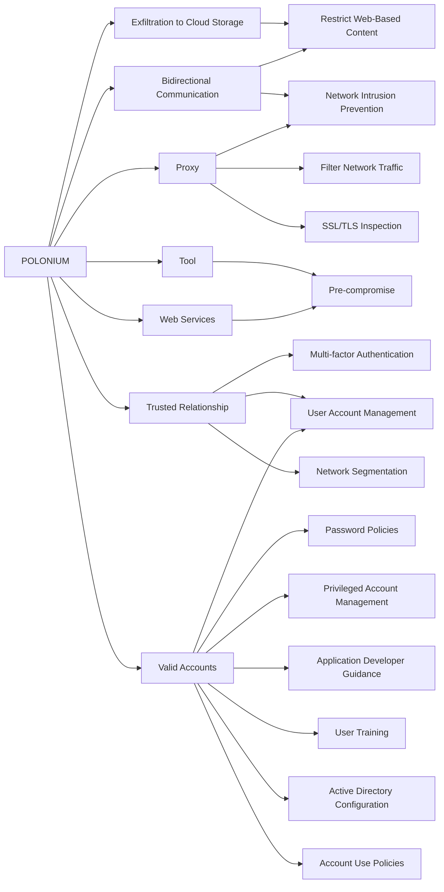

---
tags:
   - groups
---
# POLONIUM
## ID:G1005
[POLONIUM](/mitre/groups/G1005) is a Lebanon-based group that has primarily targeted Israeli organizations, including critical manufacturing, information technology, and defense industry companies, since at least February 2022. Security researchers assess [POLONIUM](/mitre/groups/G1005) has coordinated their operations with multiple actors affiliated with Iran’s Ministry of Intelligence and Security (MOIS), based on victim overlap as well as common techniques and tooling.(Citation: Microsoft POLONIUM June 2022)
## Techniques Used By Group
* [Exfiltration to Cloud Storage](techniques/T1567/002)
* [Bidirectional Communication](techniques/T1102/002)
* [Proxy](techniques/T1090)
* [Tool](techniques/T1588/002)
* [Trusted Relationship](techniques/T1199)
* [Web Services](techniques/T1583/006)
* [Valid Accounts](techniques/T1078)

# Summary of Techniques and Mitigations
