---
tags:
   - groups
---
# Earth Lusca
## ID:G1006
[Earth Lusca](groups/G1006) is a suspected China-based cyber espionage group that has been active since at least April 2019. [Earth Lusca](groups/G1006) has targeted organizations in Australia, China, Hong Kong, Mongolia, Nepal, the Philippines, Taiwan, Thailand, Vietnam, the United Arab Emirates, Nigeria, Germany, France, and the United States. Targets included government institutions, news media outlets, gambling companies, educational institutions, COVID-19 research organizations, telecommunications companies, religious movements banned in China, and cryptocurrency trading platforms; security researchers assess some [Earth Lusca](groups/G1006) operations may be financially motivated.(Citation: TrendMicro EarthLusca 2022)

[Earth Lusca](groups/G1006) has used malware commonly used by other Chinese threat groups, including [APT41](groups/G0096) and the [Winnti Group](groups/G0044) cluster, however security researchers assess [Earth Lusca](groups/G1006)'s techniques and infrastructure are separate.(Citation: TrendMicro EarthLusca 2022)
## Techniques Used By Group
* [Web Services](techniques/T1583/006)
* [Steganography](techniques/T1027/003)
* [Upload Malware](techniques/T1608/001)
* [SSH Authorized Keys](techniques/T1098/004)
* [DCSync](techniques/T1003/006)
* [Visual Basic](techniques/T1059/005)
* [Drive-by Compromise](techniques/T1189)
* [Remote System Discovery](techniques/T1018)
* [Web Services](techniques/T1584/006)
* [JavaScript](techniques/T1059/007)
* [Exploitation of Remote Services](techniques/T1210)
* [Match Legitimate Name or Location](techniques/T1036/005)
* [Deobfuscate/Decode Files or Information](techniques/T1140)
* [Domains](techniques/T1583/001)
* [System Owner/User Discovery](techniques/T1033)
* [Print Processors](techniques/T1547/012)
* [PowerShell](techniques/T1059/001)
* [Python](techniques/T1059/006)
* [Process Discovery](techniques/T1057)
* [Scheduled Task/Job](techniques/T1053)
* [DLL Side-Loading](techniques/T1574/002)
* [Modify Registry](techniques/T1112)
* [Windows Management Instrumentation](techniques/T1047)
* [LSASS Memory](techniques/T1003/001)
* [Mshta](techniques/T1218/005)
* [Domain Trust Discovery](techniques/T1482)
* [Exfiltration to Cloud Storage](techniques/T1567/002)
* [Bypass User Account Control](techniques/T1548/002)
* [Tool](techniques/T1588/002)
* [System Service Discovery](techniques/T1007)
* [Malicious File](techniques/T1204/002)
* [Exploit Public-Facing Application](techniques/T1190)
* [Proxy](techniques/T1090)
* [Obfuscated Files or Information](techniques/T1027)
* [Windows Service](techniques/T1543/003)
* [Spearphishing Link](techniques/T1566/002)
* [Archive via Utility](techniques/T1560/001)
* [Server](techniques/T1583/004)
* [System Network Connections Discovery](techniques/T1049)
* [Vulnerability Scanning](techniques/T1595/002)
* [System Network Configuration Discovery](techniques/T1016)
* [Malware](techniques/T1588/001)
* [Server](techniques/T1584/004)
* [Malicious Link](techniques/T1204/001)

# Summary of Techniques and Mitigations

```mermaid
flowchart LR
group[Earth Lusca] --> T1583.006[Web Services]
group[Earth Lusca] --> T1027.003[Steganography]
group[Earth Lusca] --> T1608.001[Upload Malware]
group[Earth Lusca] --> T1098.004[SSH Authorized Keys]
group[Earth Lusca] --> T1003.006[DCSync]
group[Earth Lusca] --> T1059.005[Visual Basic]
group[Earth Lusca] --> T1189[Drive-by Compromise]
group[Earth Lusca] --> T1018[Remote System Discovery]
group[Earth Lusca] --> T1584.006[Web Services]
group[Earth Lusca] --> T1059.007[JavaScript]
group[Earth Lusca] --> T1210[Exploitation of Remote Services]
group[Earth Lusca] --> T1036.005[Match Legitimate Name or Location]
group[Earth Lusca] --> T1140[Deobfuscate/Decode Files or Information]
group[Earth Lusca] --> T1583.001[Domains]
group[Earth Lusca] --> T1033[System Owner/User Discovery]
group[Earth Lusca] --> T1547.012[Print Processors]
group[Earth Lusca] --> T1059.001[PowerShell]
group[Earth Lusca] --> T1059.006[Python]
group[Earth Lusca] --> T1057[Process Discovery]
group[Earth Lusca] --> T1053[Scheduled Task/Job]
group[Earth Lusca] --> T1574.002[DLL Side-Loading]
group[Earth Lusca] --> T1112[Modify Registry]
group[Earth Lusca] --> T1047[Windows Management Instrumentation]
group[Earth Lusca] --> T1003.001[LSASS Memory]
group[Earth Lusca] --> T1218.005[Mshta]
group[Earth Lusca] --> T1482[Domain Trust Discovery]
group[Earth Lusca] --> T1567.002[Exfiltration to Cloud Storage]
group[Earth Lusca] --> T1548.002[Bypass User Account Control]
group[Earth Lusca] --> T1588.002[Tool]
group[Earth Lusca] --> T1007[System Service Discovery]
group[Earth Lusca] --> T1204.002[Malicious File]
group[Earth Lusca] --> T1190[Exploit Public-Facing Application]
group[Earth Lusca] --> T1090[Proxy]
group[Earth Lusca] --> T1027[Obfuscated Files or Information]
group[Earth Lusca] --> T1543.003[Windows Service]
group[Earth Lusca] --> T1566.002[Spearphishing Link]
group[Earth Lusca] --> T1560.001[Archive via Utility]
group[Earth Lusca] --> T1583.004[Server]
group[Earth Lusca] --> T1049[System Network Connections Discovery]
group[Earth Lusca] --> T1595.002[Vulnerability Scanning]
group[Earth Lusca] --> T1016[System Network Configuration Discovery]
group[Earth Lusca] --> T1588.001[Malware]
group[Earth Lusca] --> T1584.004[Server]
group[Earth Lusca] --> T1204.001[Malicious Link]
T1583.006[Web Services] --> M1056[Pre-compromise]
T1608.001[Upload Malware] --> M1056[Pre-compromise]
T1098.004[SSH Authorized Keys] --> M1018[User Account Management]
T1098.004[SSH Authorized Keys] --> M1022[Restrict File and Directory Permissions]
T1098.004[SSH Authorized Keys] --> M1042[Disable or Remove Feature or Program]
T1003.006[DCSync] --> M1027[Password Policies]
T1003.006[DCSync] --> M1015[Active Directory Configuration]
T1003.006[DCSync] --> M1026[Privileged Account Management]
T1059.005[Visual Basic] --> M1042[Disable or Remove Feature or Program]
T1059.005[Visual Basic] --> M1049[Antivirus/Antimalware]
T1059.005[Visual Basic] --> M1038[Execution Prevention]
T1059.005[Visual Basic] --> M1040[Behavior Prevention on Endpoint]
T1059.005[Visual Basic] --> M1021[Restrict Web-Based Content]
T1189[Drive-by Compromise] --> M1050[Exploit Protection]
T1189[Drive-by Compromise] --> M1051[Update Software]
T1189[Drive-by Compromise] --> M1048[Application Isolation and Sandboxing]
T1189[Drive-by Compromise] --> M1021[Restrict Web-Based Content]
T1584.006[Web Services] --> M1056[Pre-compromise]
T1059.007[JavaScript] --> M1040[Behavior Prevention on Endpoint]
T1059.007[JavaScript] --> M1038[Execution Prevention]
T1059.007[JavaScript] --> M1042[Disable or Remove Feature or Program]
T1059.007[JavaScript] --> M1021[Restrict Web-Based Content]
T1210[Exploitation of Remote Services] --> M1042[Disable or Remove Feature or Program]
T1210[Exploitation of Remote Services] --> M1016[Vulnerability Scanning]
T1210[Exploitation of Remote Services] --> M1050[Exploit Protection]
T1210[Exploitation of Remote Services] --> M1030[Network Segmentation]
T1210[Exploitation of Remote Services] --> M1019[Threat Intelligence Program]
T1210[Exploitation of Remote Services] --> M1048[Application Isolation and Sandboxing]
T1210[Exploitation of Remote Services] --> M1026[Privileged Account Management]
T1210[Exploitation of Remote Services] --> M1051[Update Software]
T1036.005[Match Legitimate Name or Location] --> M1022[Restrict File and Directory Permissions]
T1036.005[Match Legitimate Name or Location] --> M1038[Execution Prevention]
T1036.005[Match Legitimate Name or Location] --> M1045[Code Signing]
T1583.001[Domains] --> M1056[Pre-compromise]
T1547.012[Print Processors] --> M1018[User Account Management]
T1059.001[PowerShell] --> M1042[Disable or Remove Feature or Program]
T1059.001[PowerShell] --> M1049[Antivirus/Antimalware]
T1059.001[PowerShell] --> M1045[Code Signing]
T1059.001[PowerShell] --> M1026[Privileged Account Management]
T1059.001[PowerShell] --> M1038[Execution Prevention]
T1059.006[Python] --> M1047[Audit]
T1059.006[Python] --> M1049[Antivirus/Antimalware]
T1059.006[Python] --> M1033[Limit Software Installation]
T1059.006[Python] --> M1038[Execution Prevention]
T1053[Scheduled Task/Job] --> M1018[User Account Management]
T1053[Scheduled Task/Job] --> M1028[Operating System Configuration]
T1053[Scheduled Task/Job] --> M1022[Restrict File and Directory Permissions]
T1053[Scheduled Task/Job] --> M1026[Privileged Account Management]
T1053[Scheduled Task/Job] --> M1047[Audit]
T1574.002[DLL Side-Loading] --> M1051[Update Software]
T1574.002[DLL Side-Loading] --> M1013[Application Developer Guidance]
T1112[Modify Registry] --> M1024[Restrict Registry Permissions]
T1047[Windows Management Instrumentation] --> M1026[Privileged Account Management]
T1047[Windows Management Instrumentation] --> M1040[Behavior Prevention on Endpoint]
T1047[Windows Management Instrumentation] --> M1018[User Account Management]
T1047[Windows Management Instrumentation] --> M1038[Execution Prevention]
T1003.001[LSASS Memory] --> M1028[Operating System Configuration]
T1003.001[LSASS Memory] --> M1043[Credential Access Protection]
T1003.001[LSASS Memory] --> M1025[Privileged Process Integrity]
T1003.001[LSASS Memory] --> M1026[Privileged Account Management]
T1003.001[LSASS Memory] --> M1017[User Training]
T1003.001[LSASS Memory] --> M1040[Behavior Prevention on Endpoint]
T1003.001[LSASS Memory] --> M1027[Password Policies]
T1218.005[Mshta] --> M1038[Execution Prevention]
T1218.005[Mshta] --> M1042[Disable or Remove Feature or Program]
T1482[Domain Trust Discovery] --> M1047[Audit]
T1482[Domain Trust Discovery] --> M1030[Network Segmentation]
T1567.002[Exfiltration to Cloud Storage] --> M1021[Restrict Web-Based Content]
T1548.002[Bypass User Account Control] --> M1051[Update Software]
T1548.002[Bypass User Account Control] --> M1047[Audit]
T1548.002[Bypass User Account Control] --> M1052[User Account Control]
T1548.002[Bypass User Account Control] --> M1026[Privileged Account Management]
T1588.002[Tool] --> M1056[Pre-compromise]
T1204.002[Malicious File] --> M1038[Execution Prevention]
T1204.002[Malicious File] --> M1040[Behavior Prevention on Endpoint]
T1204.002[Malicious File] --> M1017[User Training]
T1190[Exploit Public-Facing Application] --> M1048[Application Isolation and Sandboxing]
T1190[Exploit Public-Facing Application] --> M1030[Network Segmentation]
T1190[Exploit Public-Facing Application] --> M1016[Vulnerability Scanning]
T1190[Exploit Public-Facing Application] --> M1026[Privileged Account Management]
T1190[Exploit Public-Facing Application] --> M1050[Exploit Protection]
T1190[Exploit Public-Facing Application] --> M1051[Update Software]
T1090[Proxy] --> M1037[Filter Network Traffic]
T1090[Proxy] --> M1031[Network Intrusion Prevention]
T1090[Proxy] --> M1020[SSL/TLS Inspection]
T1027[Obfuscated Files or Information] --> M1047[Audit]
T1027[Obfuscated Files or Information] --> M1040[Behavior Prevention on Endpoint]
T1027[Obfuscated Files or Information] --> M1017[User Training]
T1027[Obfuscated Files or Information] --> M1049[Antivirus/Antimalware]
T1543.003[Windows Service] --> M1040[Behavior Prevention on Endpoint]
T1543.003[Windows Service] --> M1028[Operating System Configuration]
T1543.003[Windows Service] --> M1047[Audit]
T1543.003[Windows Service] --> M1045[Code Signing]
T1543.003[Windows Service] --> M1018[User Account Management]
T1566.002[Spearphishing Link] --> M1054[Software Configuration]
T1566.002[Spearphishing Link] --> M1021[Restrict Web-Based Content]
T1566.002[Spearphishing Link] --> M1047[Audit]
T1566.002[Spearphishing Link] --> M1018[User Account Management]
T1566.002[Spearphishing Link] --> M1017[User Training]
T1560.001[Archive via Utility] --> M1047[Audit]
T1583.004[Server] --> M1056[Pre-compromise]
T1595.002[Vulnerability Scanning] --> M1056[Pre-compromise]
T1588.001[Malware] --> M1056[Pre-compromise]
T1584.004[Server] --> M1056[Pre-compromise]
T1204.001[Malicious Link] --> M1031[Network Intrusion Prevention]
T1204.001[Malicious Link] --> M1017[User Training]
T1204.001[Malicious Link] --> M1021[Restrict Web-Based Content]
```
