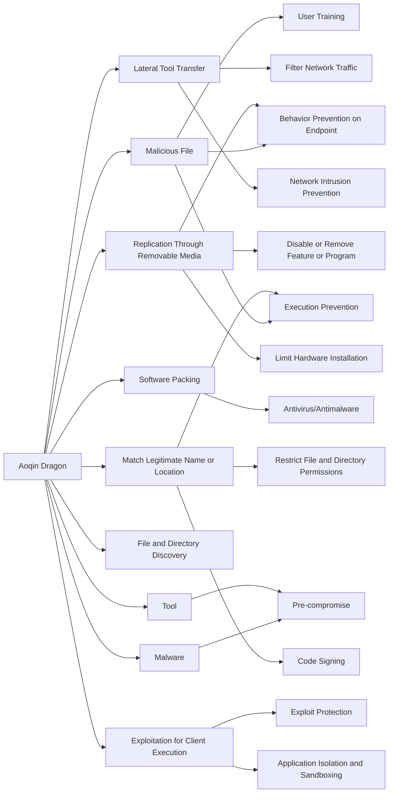

---
tags:
   - groups
---
# Aoqin Dragon
## ID:G1007
[Aoqin Dragon](groups/G1007) is a suspected Chinese cyber espionage threat group that has been active since at least 2013. [Aoqin Dragon](groups/G1007) has primarily targeted government, education, and telecommunication organizations in Australia, Cambodia, Hong Kong, Singapore, and Vietnam. Security researchers noted a potential association between [Aoqin Dragon](groups/G1007) and UNC94, based on malware, infrastructure, and targets.(Citation: SentinelOne Aoqin Dragon June 2022)
## Techniques Used By Group
* [Malicious File](techniques/T1204/002)
* [Lateral Tool Transfer](techniques/T1570)
* [Replication Through Removable Media](techniques/T1091)
* [Software Packing](techniques/T1027/002)
* [Malware](techniques/T1587/001)
* [File and Directory Discovery](techniques/T1083)
* [Match Legitimate Name or Location](techniques/T1036/005)
* [Tool](techniques/T1588/002)
* [Exploitation for Client Execution](techniques/T1203)

# Summary of Techniques and Mitigations
