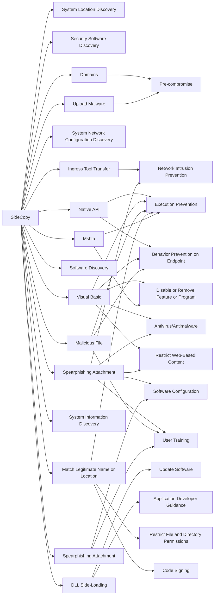

---
tags:
   - groups
---
# SideCopy
## ID:G1008
[SideCopy](groups/G1008) is a Pakistani threat group that has primarily targeted South Asian countries, including Indian and Afghani government personnel, since at least 2019. [SideCopy](groups/G1008)'s name comes from its infection chain that tries to mimic that of [Sidewinder](groups/G0121), a suspected Indian threat group.(Citation: MalwareBytes SideCopy Dec 2021)
## Techniques Used By Group
* [System Location Discovery](techniques/T1614)
* [Security Software Discovery](techniques/T1518/001)
* [Domains](techniques/T1584/001)
* [Ingress Tool Transfer](techniques/T1105)
* [System Network Configuration Discovery](techniques/T1016)
* [Upload Malware](techniques/T1608/001)
* [Native API](techniques/T1106)
* [Visual Basic](techniques/T1059/005)
* [Software Discovery](techniques/T1518)
* [Spearphishing Attachment](techniques/T1566/001)
* [DLL Side-Loading](techniques/T1574/002)
* [Malicious File](techniques/T1204/002)
* [System Information Discovery](techniques/T1082)
* [Spearphishing Attachment](techniques/T1598/002)
* [Match Legitimate Name or Location](techniques/T1036/005)
* [Mshta](techniques/T1218/005)

# Summary of Techniques and Mitigations
