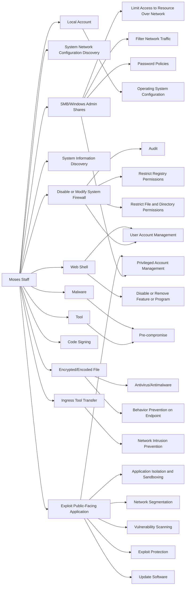

---
tags:
   - groups
---
# Moses Staff
## ID:G1009
[Moses Staff](/mitre/groups/G1009) is a suspected Iranian threat group that has primarily targeted Israeli companies since at least September 2021. [Moses Staff](/mitre/groups/G1009) openly stated their motivation in attacking Israeli companies is to cause damage by leaking stolen sensitive data and encrypting the victim's networks without a ransom demand.(Citation: Checkpoint MosesStaff Nov 2021) 

Security researchers assess [Moses Staff](/mitre/groups/G1009) is politically motivated, and has targeted government, finance, travel, energy, manufacturing, and utility companies outside of Israel as well, including those in Italy, India, Germany, Chile, Turkey, the UAE, and the US.(Citation: Cybereason StrifeWater Feb 2022)
## Techniques Used By Group
* [SMB/Windows Admin Shares](/mitre/techniques/T1021/002)
* [System Network Configuration Discovery](/mitre/techniques/T1016)
* [Local Account](/mitre/techniques/T1087/001)
* [System Information Discovery](/mitre/techniques/T1082)
* [Disable or Modify System Firewall](/mitre/techniques/T1562/004)
* [Tool](/mitre/techniques/T1588/002)
* [Web Shell](/mitre/techniques/T1505/003)
* [Malware](/mitre/techniques/T1587/001)
* [Code Signing](/mitre/techniques/T1553/002)
* [Encrypted/Encoded File](/mitre/techniques/T1027/013)
* [Ingress Tool Transfer](/mitre/techniques/T1105)
* [Exploit Public-Facing Application](/mitre/techniques/T1190)

# Summary of Techniques and Mitigations
