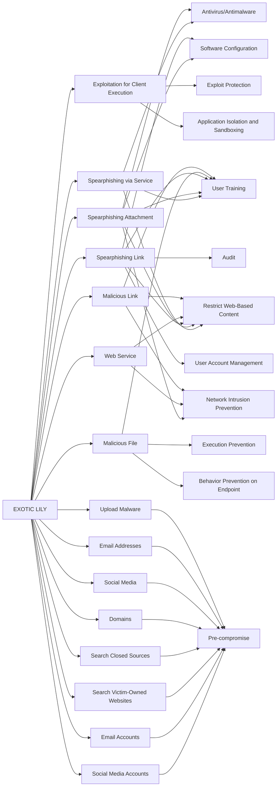

---
tags:
   - groups
---
# EXOTIC LILY
## ID:G1011
[EXOTIC LILY](/mitre/groups/G1011) is a financially motivated group that has been closely linked with [Wizard Spider](/mitre/groups/G0102) and the deployment of ransomware including [Conti](/mitre/software/S0575) and [Diavol](/mitre/software/S0659). [EXOTIC LILY](/mitre/groups/G1011) may be acting as an initial access broker for other malicious actors, and has targeted a wide range of industries including IT, cybersecurity, and healthcare since at least September 2021.(Citation: Google EXOTIC LILY March 2022)
## Techniques Used By Group
* [Spearphishing via Service](/mitre/techniques/T1566/003)
* [Social Media Accounts](/mitre/techniques/T1585/001)
* [Spearphishing Attachment](/mitre/techniques/T1566/001)
* [Exploitation for Client Execution](/mitre/techniques/T1203)
* [Spearphishing Link](/mitre/techniques/T1566/002)
* [Malicious File](/mitre/techniques/T1204/002)
* [Email Accounts](/mitre/techniques/T1585/002)
* [Web Service](/mitre/techniques/T1102)
* [Search Victim-Owned Websites](/mitre/techniques/T1594)
* [Malicious Link](/mitre/techniques/T1204/001)
* [Search Closed Sources](/mitre/techniques/T1597)
* [Domains](/mitre/techniques/T1583/001)
* [Social Media](/mitre/techniques/T1593/001)
* [Email Addresses](/mitre/techniques/T1589/002)
* [Upload Malware](/mitre/techniques/T1608/001)

# Summary of Techniques and Mitigations
