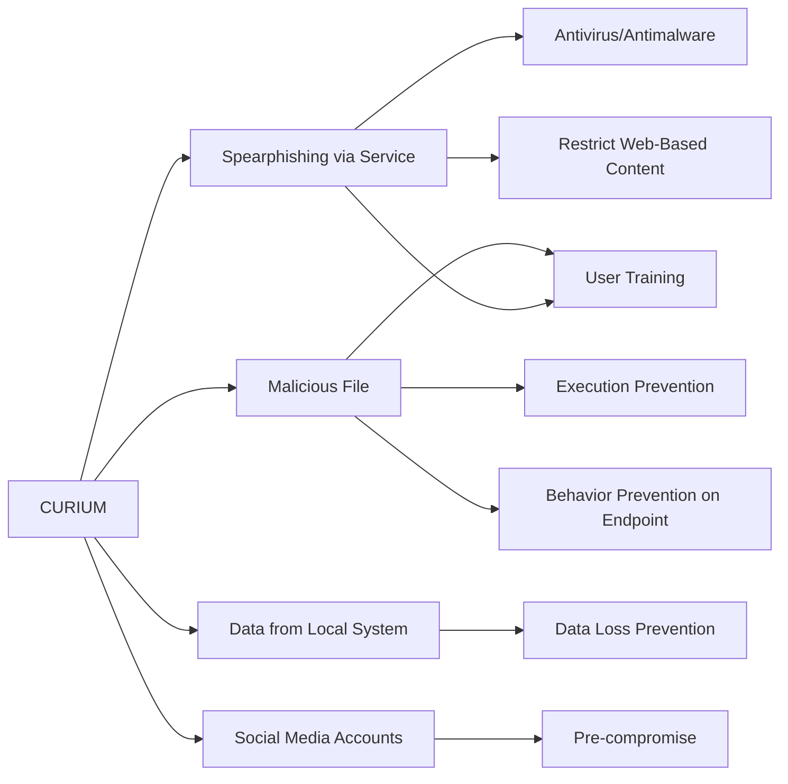

---
tags:
   - groups
---
# CURIUM
## ID:G1012
[CURIUM](/mitre/groups/G1012) is an Iranian threat group first reported in November 2021 that has invested in building a relationship with potential targets via social media over a period of months to establish trust and confidence before sending malware. Security researchers note [CURIUM](/mitre/groups/G1012) has demonstrated great patience and persistence by chatting with potential targets daily and sending benign files to help lower their security consciousness.(Citation: Microsoft Iranian Threat Actor Trends November 2021)
## Techniques Used By Group
* [Spearphishing via Service](/mitre/techniques/T1566/003)
* [Malicious File](/mitre/techniques/T1204/002)
* [Data from Local System](/mitre/techniques/T1005)
* [Social Media Accounts](/mitre/techniques/T1585/001)

# Summary of Techniques and Mitigations
