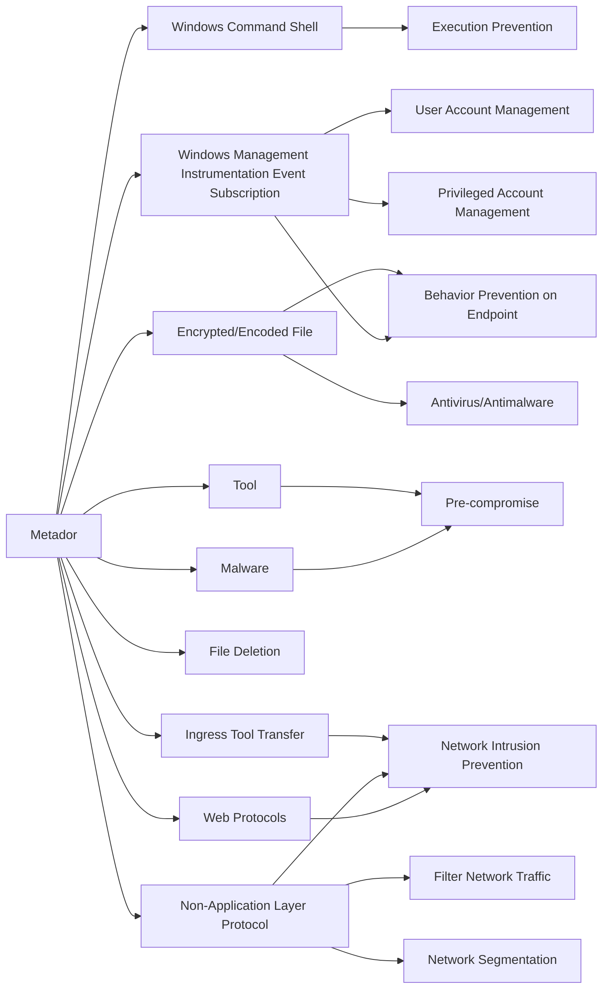

---
tags:
   - groups
---
# Metador
## ID:G1013
[Metador](/mitre/groups/G1013) is a suspected cyber espionage group that was first reported in September 2022. [Metador](/mitre/groups/G1013) has targeted a limited number of telecommunication companies, internet service providers, and universities in the Middle East and Africa. Security researchers named the group [Metador](/mitre/groups/G1013) based on the "I am meta" string in one of the group's malware samples and the expectation of Spanish-language responses from C2 servers.(Citation: SentinelLabs Metador Sept 2022)
## Techniques Used By Group
* [Web Protocols](/mitre/techniques/T1071/001)
* [Windows Command Shell](/mitre/techniques/T1059/003)
* [Malware](/mitre/techniques/T1588/001)
* [Windows Management Instrumentation Event Subscription](/mitre/techniques/T1546/003)
* [Encrypted/Encoded File](/mitre/techniques/T1027/013)
* [File Deletion](/mitre/techniques/T1070/004)
* [Non-Application Layer Protocol](/mitre/techniques/T1095)
* [Tool](/mitre/techniques/T1588/002)
* [Ingress Tool Transfer](/mitre/techniques/T1105)

# Summary of Techniques and Mitigations
