---
tags:
   - groups
---
# LuminousMoth
## ID:G1014
[LuminousMoth](groups/G1014) is a Chinese-speaking cyber espionage group that has been active since at least October 2020. [LuminousMoth](groups/G1014) has targeted high-profile organizations, including government entities, in Myanmar, the Philippines, Thailand, and other parts of Southeast Asia. Some security researchers have concluded there is a connection between [LuminousMoth](groups/G1014) and [Mustang Panda](groups/G0129) based on similar targeting and TTPs, as well as network infrastructure overlaps.(Citation: Kaspersky LuminousMoth July 2021)(Citation: Bitdefender LuminousMoth July 2021)
## Techniques Used By Group
* [Steal Web Session Cookie](techniques/T1539)
* [Exfiltration to Cloud Storage](techniques/T1567/002)
* [Spearphishing Link](techniques/T1566/002)
* [Malware](techniques/T1588/001)
* [Data Transfer Size Limits](techniques/T1030)
* [Hidden Files and Directories](techniques/T1564/001)
* [Upload Malware](techniques/T1608/001)
* [Replication Through Removable Media](techniques/T1091)
* [Exfiltration Over C2 Channel](techniques/T1041)
* [Drive-by Target](techniques/T1608/004)
* [Link Target](techniques/T1608/005)
* [Malware](techniques/T1587/001)
* [Web Protocols](techniques/T1071/001)
* [Ingress Tool Transfer](techniques/T1105)
* [ARP Cache Poisoning](techniques/T1557/002)
* [Tool](techniques/T1588/002)
* [Data from Local System](techniques/T1005)
* [Malicious Link](techniques/T1204/001)
* [DLL Side-Loading](techniques/T1574/002)
* [Registry Run Keys / Startup Folder](techniques/T1547/001)
* [File and Directory Discovery](techniques/T1083)
* [System Owner/User Discovery](techniques/T1033)
* [Archive Collected Data](techniques/T1560)
* [Match Legitimate Name or Location](techniques/T1036/005)
* [Modify Registry](techniques/T1112)
* [Scheduled Task](techniques/T1053/005)
* [Digital Certificates](techniques/T1588/004)
* [Code Signing](techniques/T1553/002)

# Summary of Techniques and Mitigations

```mermaid
flowchart LR
group[LuminousMoth] --> T1539[Steal Web Session Cookie]
group[LuminousMoth] --> T1567.002[Exfiltration to Cloud Storage]
group[LuminousMoth] --> T1566.002[Spearphishing Link]
group[LuminousMoth] --> T1588.001[Malware]
group[LuminousMoth] --> T1030[Data Transfer Size Limits]
group[LuminousMoth] --> T1564.001[Hidden Files and Directories]
group[LuminousMoth] --> T1608.001[Upload Malware]
group[LuminousMoth] --> T1091[Replication Through Removable Media]
group[LuminousMoth] --> T1041[Exfiltration Over C2 Channel]
group[LuminousMoth] --> T1608.004[Drive-by Target]
group[LuminousMoth] --> T1608.005[Link Target]
group[LuminousMoth] --> T1587.001[Malware]
group[LuminousMoth] --> T1071.001[Web Protocols]
group[LuminousMoth] --> T1105[Ingress Tool Transfer]
group[LuminousMoth] --> T1557.002[ARP Cache Poisoning]
group[LuminousMoth] --> T1588.002[Tool]
group[LuminousMoth] --> T1005[Data from Local System]
group[LuminousMoth] --> T1204.001[Malicious Link]
group[LuminousMoth] --> T1574.002[DLL Side-Loading]
group[LuminousMoth] --> T1547.001[Registry Run Keys / Startup Folder]
group[LuminousMoth] --> T1083[File and Directory Discovery]
group[LuminousMoth] --> T1033[System Owner/User Discovery]
group[LuminousMoth] --> T1560[Archive Collected Data]
group[LuminousMoth] --> T1036.005[Match Legitimate Name or Location]
group[LuminousMoth] --> T1112[Modify Registry]
group[LuminousMoth] --> T1053.005[Scheduled Task]
group[LuminousMoth] --> T1588.004[Digital Certificates]
group[LuminousMoth] --> T1553.002[Code Signing]
T1539[Steal Web Session Cookie] --> M1054[Software Configuration]
T1539[Steal Web Session Cookie] --> M1032[Multi-factor Authentication]
T1539[Steal Web Session Cookie] --> M1017[User Training]
T1567.002[Exfiltration to Cloud Storage] --> M1021[Restrict Web-Based Content]
T1566.002[Spearphishing Link] --> M1054[Software Configuration]
T1566.002[Spearphishing Link] --> M1021[Restrict Web-Based Content]
T1566.002[Spearphishing Link] --> M1047[Audit]
T1566.002[Spearphishing Link] --> M1018[User Account Management]
T1566.002[Spearphishing Link] --> M1017[User Training]
T1588.001[Malware] --> M1056[Pre-compromise]
T1030[Data Transfer Size Limits] --> M1031[Network Intrusion Prevention]
T1608.001[Upload Malware] --> M1056[Pre-compromise]
T1091[Replication Through Removable Media] --> M1042[Disable or Remove Feature or Program]
T1091[Replication Through Removable Media] --> M1034[Limit Hardware Installation]
T1091[Replication Through Removable Media] --> M1040[Behavior Prevention on Endpoint]
T1041[Exfiltration Over C2 Channel] --> M1031[Network Intrusion Prevention]
T1041[Exfiltration Over C2 Channel] --> M1057[Data Loss Prevention]
T1608.004[Drive-by Target] --> M1056[Pre-compromise]
T1608.005[Link Target] --> M1056[Pre-compromise]
T1587.001[Malware] --> M1056[Pre-compromise]
T1071.001[Web Protocols] --> M1031[Network Intrusion Prevention]
T1105[Ingress Tool Transfer] --> M1031[Network Intrusion Prevention]
T1557.002[ARP Cache Poisoning] --> M1041[Encrypt Sensitive Information]
T1557.002[ARP Cache Poisoning] --> M1031[Network Intrusion Prevention]
T1557.002[ARP Cache Poisoning] --> M1017[User Training]
T1557.002[ARP Cache Poisoning] --> M1042[Disable or Remove Feature or Program]
T1557.002[ARP Cache Poisoning] --> M1035[Limit Access to Resource Over Network]
T1557.002[ARP Cache Poisoning] --> M1037[Filter Network Traffic]
T1588.002[Tool] --> M1056[Pre-compromise]
T1005[Data from Local System] --> M1057[Data Loss Prevention]
T1204.001[Malicious Link] --> M1031[Network Intrusion Prevention]
T1204.001[Malicious Link] --> M1017[User Training]
T1204.001[Malicious Link] --> M1021[Restrict Web-Based Content]
T1574.002[DLL Side-Loading] --> M1051[Update Software]
T1574.002[DLL Side-Loading] --> M1013[Application Developer Guidance]
T1560[Archive Collected Data] --> M1047[Audit]
T1036.005[Match Legitimate Name or Location] --> M1022[Restrict File and Directory Permissions]
T1036.005[Match Legitimate Name or Location] --> M1038[Execution Prevention]
T1036.005[Match Legitimate Name or Location] --> M1045[Code Signing]
T1112[Modify Registry] --> M1024[Restrict Registry Permissions]
T1053.005[Scheduled Task] --> M1026[Privileged Account Management]
T1053.005[Scheduled Task] --> M1018[User Account Management]
T1053.005[Scheduled Task] --> M1047[Audit]
T1053.005[Scheduled Task] --> M1028[Operating System Configuration]
T1588.004[Digital Certificates] --> M1056[Pre-compromise]
```
